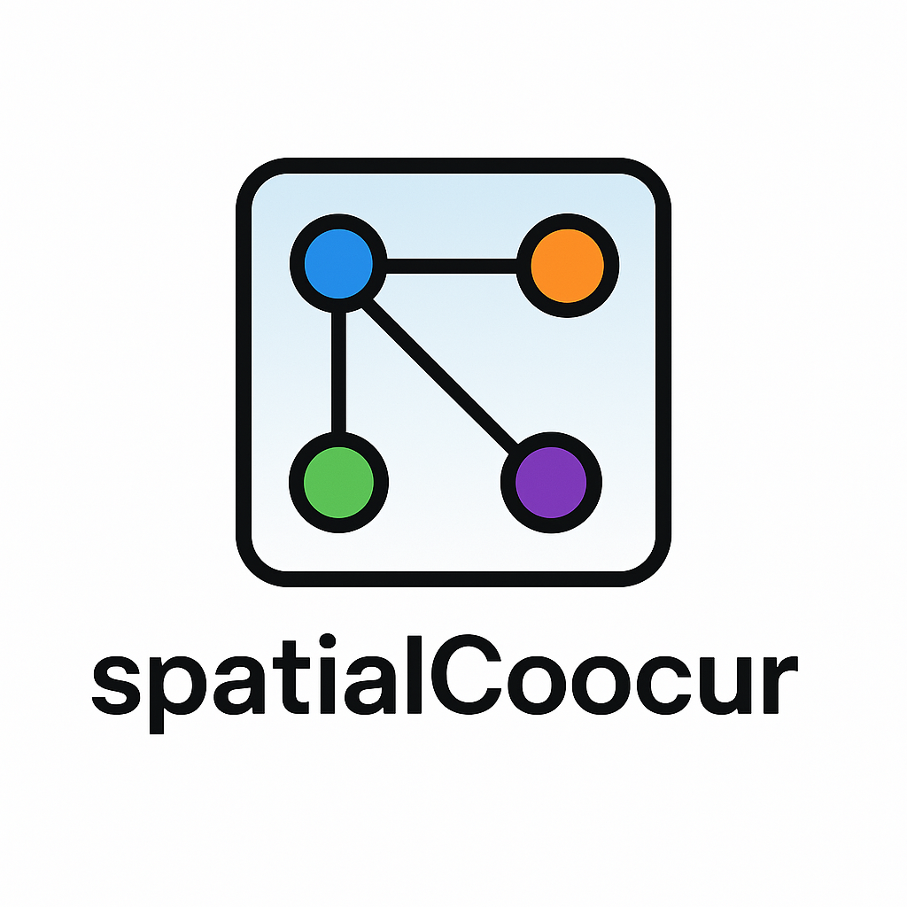

<!-- README.md is generated from README.Rmd. Please edit that file -->

# spatialCooccur 

[](https://github.com/juninamo/spatialCooccur/actions)

`spatialCooccur` is an R package for analyzing spatial co-occurrence and
neighborhood interactions in spatial transcriptomics data. It is built
around Seurat objects and provides tools to compute co-occurrence
enrichment, perform permutation-based tests, and visualize local
interaction scores.

## Installation

You can install the development version from GitHub using:

``` r
# install.packages("devtools")
devtools::install_github("juninamo/spatialCooccur")
```

## Features

- Simulate spatial transcriptomic layouts with `generate_sim()`
- Calculate neighborhood co-occurrence enrichment with
  `nhood_enrichment()`
- Identify local interaction zones using `cooccur_local()`
- Permutation-based z-score estimation
- Works seamlessly with Seurat spatial objects

## Example

``` r
library(spatialCooccur)
library(Seurat)

# Simulate example data
df <- generate_sim(n_cells = 500, n_types = 4, test_type = "circle")
head(df)
```
         x        y   cell_type
1 377.8588 360.6119 cell_type_1
2 494.6044 352.8406 cell_type_1
3 297.0298 418.3650 cell_type_1
4 466.0901 482.6166 cell_type_1
5 280.4463 365.8605 cell_type_1
6 435.5759 501.1522 cell_type_1

``` r
# Compute neighborhood enrichment
res <- nhood_enrichment(df, cluster_key = "cell_type")

# View z-score matrix
res$zscore
```
                   Clustercell_type_1 Clustercell_type_2 Clustercell_type_3 Clustercell_type_4
Clustercell_type_1           7.343866         -2.7481089         -4.1217310          -2.391865
Clustercell_type_2          -1.692481          4.0325430         -3.1048333          -1.817912
Clustercell_type_3          -3.087549         -0.2348799          1.4489565           4.359180
Clustercell_type_4          -3.368478         -0.7879387          0.7223909           5.523156

## License

MIT © Jun Inamo

