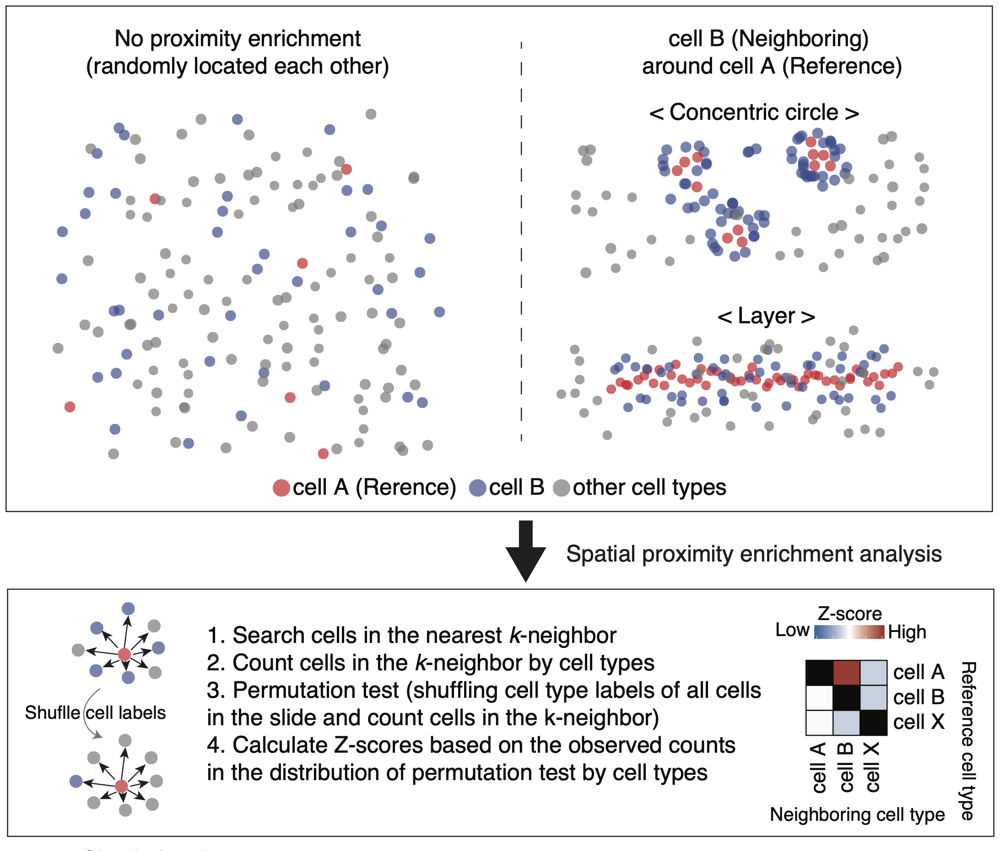
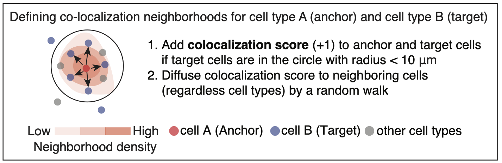

# spatialCooccur 

`spatialCooccur` is an R package for analyzing spatial co-occurrence and
neighborhood interactions in spatial transcriptomics data. It is built
around Seurat objects and provides tools to compute co-occurrence
enrichment, perform permutation-based tests, and visualize local
interaction scores.

## Installation

You can install the development version from GitHub using:

``` r
# install.packages("devtools")
devtools::install_github("juninamo/spatialCooccur")
```

## Features

- Simulate spatial transcriptomic layouts with `generate_sim()`
- Calculate neighborhood co-occurrence enrichment with
  `nhood_enrichment()`
- Identify local interaction zones using `cooccur_local()`
- Works seamlessly with Seurat spatial objects

### 1. Spatial Neighborhood Analysis (SNA)
To simulate spatial transcriptomic data and perform neighborhood enrichment analysis:

```r
df = generate_sim(close_ratio = 1, n_types = 15, max_loc = 800, n_cells = 500, test_type = "circle", distance_param = 20, seed=1234)

# Run neighborhood enrichment analysis
nhood_enrichment_res <- nhood_enrichment(df, cluster_key = "cell_type", neighbors.k = 30, n_perms = 100, seed = 1234, n_jobs = 4)
nhood_enrichment_res$zscore
```

### 2. Spatial Co-localization Score (sCLS)
To compute co-localization scores for cell interactions:

```r
cooccur_local_df <- cooccur_local(df, cluster_x = "cell_type_1", cluster_y = "cell_type_2", neighbors.k = 30, radius = 30)
summary(cooccur_local_df)
```
## Citation 
Jun Inamo, et al. XXX. [*bioRxiv*](https://www.biorxiv.org/XX), doi:[https://doi.org/XX](https://doi.org/XX)

- Study design

<kbd>

</kbd>

&nbsp;&nbsp;

- Spatial Neighborhood Analysis

<kbd>

</kbd>

&nbsp;&nbsp;

- Spatial Co-localization Score

<kbd>

</kbd>

&nbsp;&nbsp;


## Contact
For questions or issues related to this tutorial, please contact;

**Name:** Jun Inamo  
**Email:** jun.inamo@cuanschutz.edu  

The data presented in the paper (spatial transcriptome data from JIA-synovoum) was generated by the [Yomogida lab](https://www.yomogidalab.com/).

## Acknowledgments
This work was supported by the Uehara Memorial Foundation Postdoctoral Fellowship, a Grant-in-Aid for Japan Society for the Promotion of Science Overseas Research Fellows, the Mochida Memorial Foundation for Medical and Pharmaceutical Research (to J.I.), K08DK128544 (K.Y.). 

&nbsp;&nbsp;

## License
This repository is provided under the MIT License.

