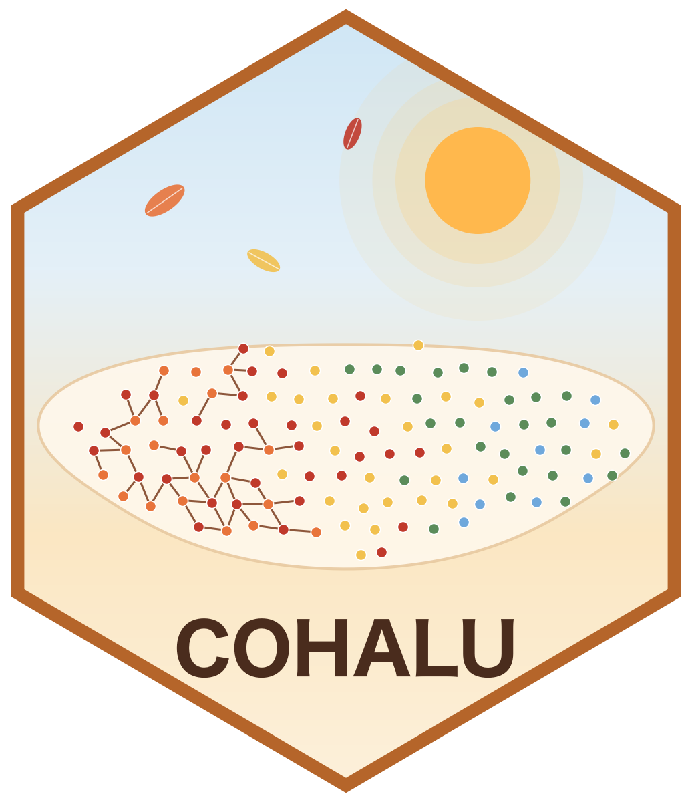
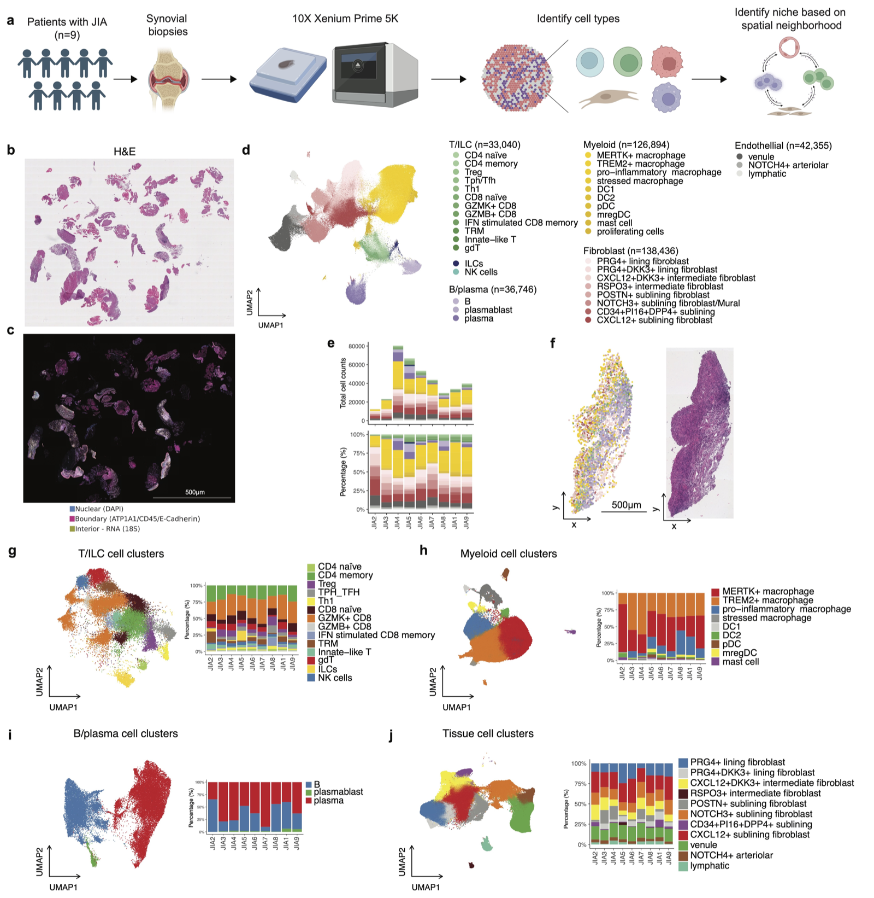
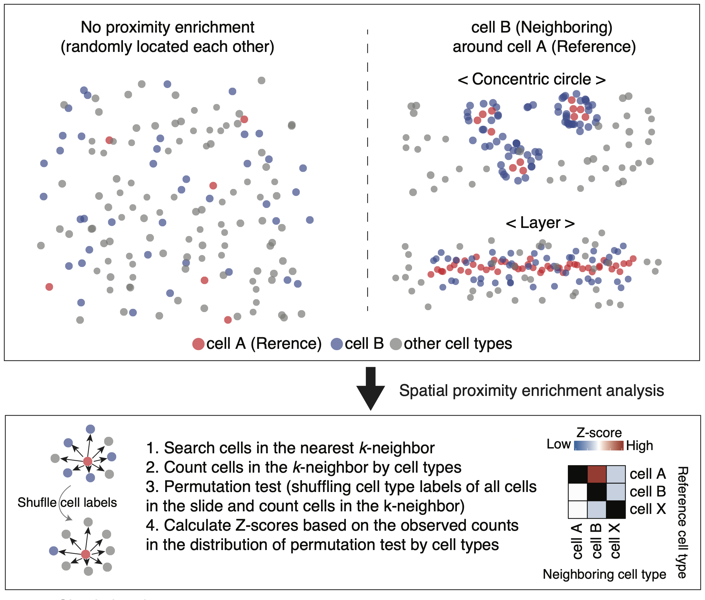
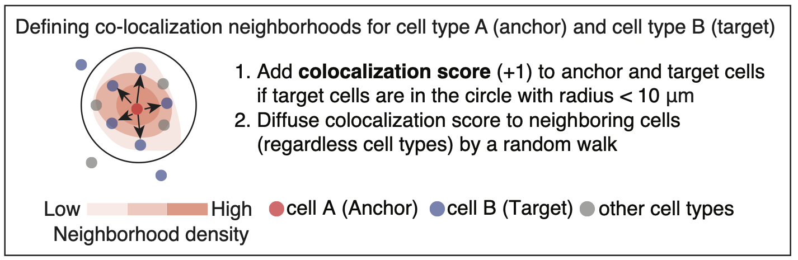

# spatialCooccur 

[](https://doi.org/10.5281/zenodo.17498341)

`spatialCooccur` is an R package for analyzing spatial co-occurrence and
neighborhood interactions in spatial transcriptomics data. It is built
around Seurat objects and provides tools to compute co-occurrence
enrichment, perform permutation-based tests, visualize local
interaction scores, and **compare scores between disease groups** across
multiple samples.

## Installation

You can install the development version from GitHub using:

``` r
# install.packages("devtools")
devtools::install_github("juninamo/spatialCooccur")
```

## Features

**Single-sample analysis**

- Simulate spatial transcriptomic layouts with `generate_sim()`
- Calculate neighborhood co-occurrence enrichment with
  `nhood_enrichment()` (permutation-based z-score)
- Compute radius-based co-occurrence ratio with
  `calc_co_occurrence_for_radius()` / `compute_co_occurrence_ratio()`
- Identify local interaction zones using `cooccur_local()`
- Detect connected interaction spots with `search_interaction_spot()`

**Multi-sample / disease-group comparison**

- Generate multi-sample group-structured simulations with
  `generate_sim_groups()`
- Compute per-sample scores with `nhood_enrichment_per_sample()`,
  `cooccur_ratio_per_sample()`, `cooccur_local_per_sample()`, or
  `interaction_spot_per_sample()` (supports Seurat / list of Seurat /
  data.frame input, image- or patient-level aggregation)
- Test cluster pairs between groups with `compare_groups()` —
  Wilcoxon / Welch's *t* / linear mixed model (`lme4`) / patient-blocked
  permutation
- Visualize with `plot_group_delta_heatmap()`, `plot_pair_boxplot()`,
  `plot_volcano_groups()`

**Works with Seurat spatial objects out of the box.**

**Vignettes**

- `vignette("disease_comparison", "spatialCooccur")` — end-to-end
  disease-group comparison workflow with worked example
- `vignette("algorithms", "spatialCooccur")` — mathematical reference for
  every core function

### 1. Spatial Neighborhood Analysis (SNA)
To simulate spatial transcriptomic data and perform neighborhood enrichment analysis:

```r
df = generate_sim(close_ratio = 1, n_types = 15, max_loc = 800, n_cells = 500, test_type = "circle", distance_param = 20, seed=1234)

# Run neighborhood enrichment analysis
nhood_enrichment_res <- nhood_enrichment(df, cluster_key = "cell_type", neighbors.k = 30, n_perms = 100, seed = 1234, n_jobs = 4)
nhood_enrichment_res$zscore
```

### 2. Spatial Co-localization Score (sCLS)
To compute co-localization scores for cell interactions:

```r
cooccur_local_df <- cooccur_local(df, cluster_x = "cell_type_1", cluster_y = "cell_type_2", neighbors.k = 30, radius = 30)
summary(cooccur_local_df)
```

### 3. Disease-group comparison
To compare a spatial co-occurrence score between disease groups across
multiple samples, compute per-sample scores and then test each cluster
pair. The same `*_per_sample()` + `compare_groups()` pattern works for
neighborhood enrichment z-score, radius-based ratio, local
co-occurrence score, and interaction-spot counts.

```r
# Simulate two groups, 3 samples each
df_groups <- generate_sim_groups(
  n_samples_per_group = 3,
  group_close_ratio = list(disease = 0.8, control = 0.2),
  n_types = 5, n_cells = 400, test_type = "distribute",
  distance_param = 15
)

# Per-sample z-scores (one row per sample x cluster_i x cluster_j)
per_sample <- nhood_enrichment_per_sample(
  df_groups, sample_key = "sample_id", group_key = "group",
  cluster_key = "cell_type", patient_key = "patient",
  neighbors.k = 20, n_perms = 100
)

# Group comparison: method = "wilcox" (default) | "t" | "lmm" | "perm"
# - "lmm"  uses lme4::lmer(value ~ group + (1 | patient))
# - "perm" runs a group-label permutation test, blocked by patient
#          when patient_key is supplied
res <- compare_groups(
  per_sample, value = "zscore",
  method = "wilcox", ref_group = "control"
)
head(res)

# Visualize: per-pair effect heatmap, volcano, and per-sample boxplot
plot_group_delta_heatmap(res)
plot_volcano_groups(res, label_top = 5)
plot_pair_boxplot(
  per_sample, value = "zscore",
  pairs = data.frame(cluster_i = "cell_type_1",
                     cluster_j = "cell_type_2"),
  add_p = TRUE, ref_group = "control"
)
```

See `vignette("disease_comparison", "spatialCooccur")` for the full
workflow, sanity-check heatmaps, and the algorithm description (math)
for each `compare_groups()` method.
<!-- 
## Citation 
Jun Inamo, Roselyn Fierkens, Michael R CLay, Anna Helena Jonsson, Clara Lin, Kari Hayes, Nathan Rogers, Heather Leach, Kentaro Yomogida. Subcellular spatial transcriptomics reveals immune–stromal crosstalk within the synovium of patients with juvenile idiopathic arthritis. [*bioRxiv*](https://www.biorxiv.org/XX), doi:[https://doi.org/XX](https://doi.org/XX)

- Study design and identified cell clusters in JIA-synovium

<kbd>

</kbd>

&nbsp;&nbsp;
-->

- Spatial Neighborhood Analysis

<kbd>

</kbd>

&nbsp;&nbsp;

- Spatial Co-localization Score

<kbd>

</kbd>

&nbsp;&nbsp;

## 📝 Citation 
Jun Inamo, Roselyn Fierkens, Michael R. Clay, Anna Helena Jonsson, Clara Lin, Kari Hayes, Nathan Rogers, Heather Leach, Kentaro Yomogida. Spatial transcriptomics reveals immune–stromal crosstalk within the synovium of patients with juvenile idiopathic arthritis. [*JCI Insight* 2026;11(1):e198074](https://doi.org/10.1172/jci.insight.198074). doi:[10.1172/jci.insight.198074](https://doi.org/10.1172/jci.insight.198074)

## Contact
For questions or issues related to this tutorial, please contact;

**Name:** Jun Inamo  
**Email:** juninamo@keio.jp  
**Affiliation:** Department of Microbiology and Immunology, Keio University School of Medicine

The data presented in the paper (spatial transcriptome data from JIA-synovoum) was generated by the [Yomogida lab](https://www.yomogidalab.com/).

<!-- 
## Acknowledgments
This work was supported by the Uehara Memorial Foundation Postdoctoral Fellowship, a Grant-in-Aid for Japan Society for the Promotion of Science Overseas Research Fellows, the Mochida Memorial Foundation for Medical and Pharmaceutical Research (to J.I.), K08DK128544 (K.Y.). 
-->
&nbsp;&nbsp;

## License
This repository is provided under the MIT License.

