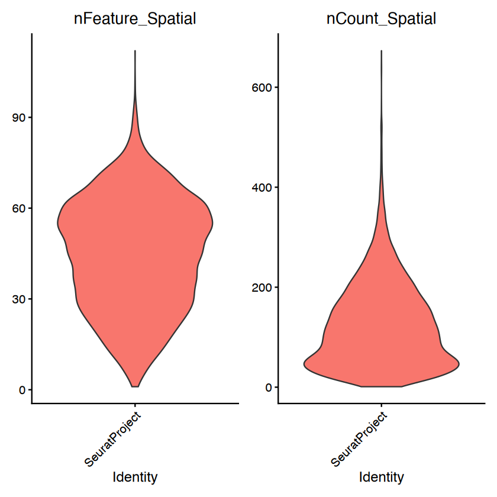
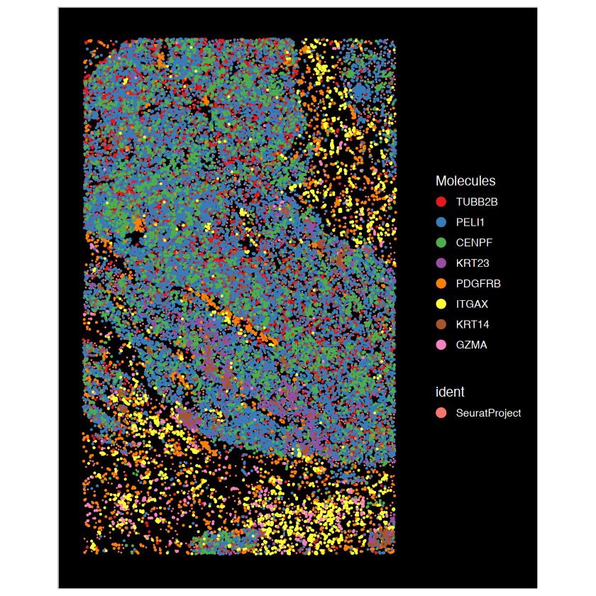
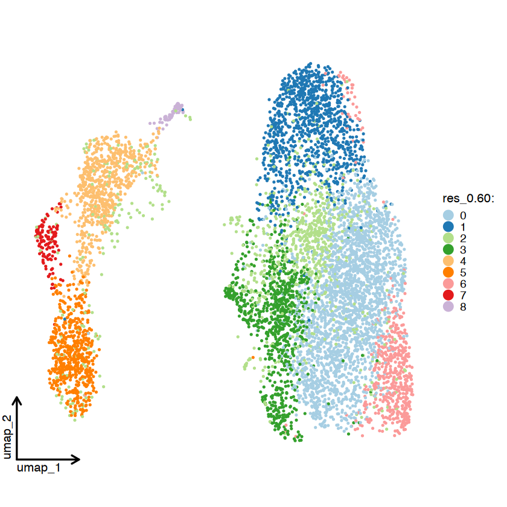
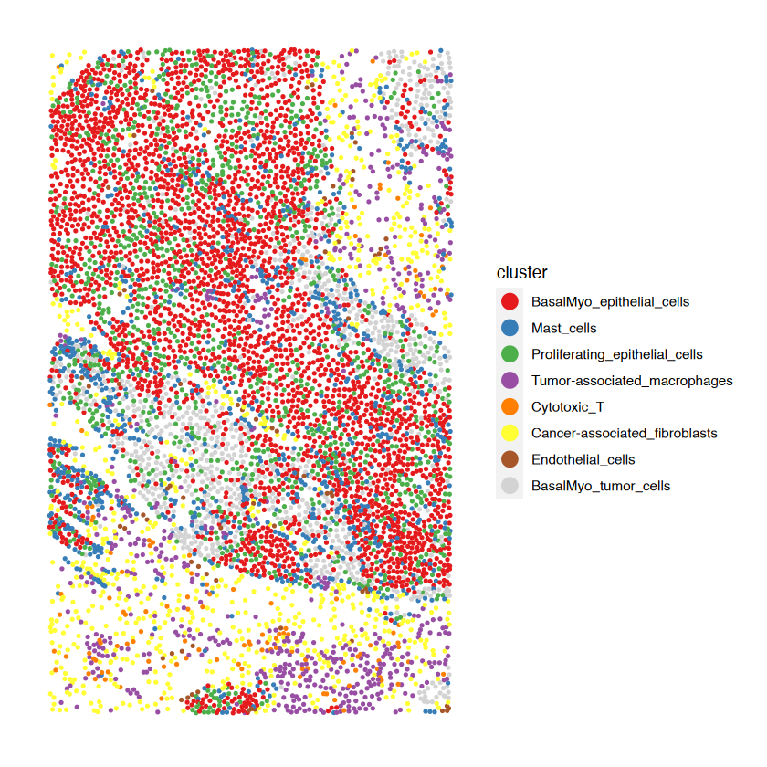
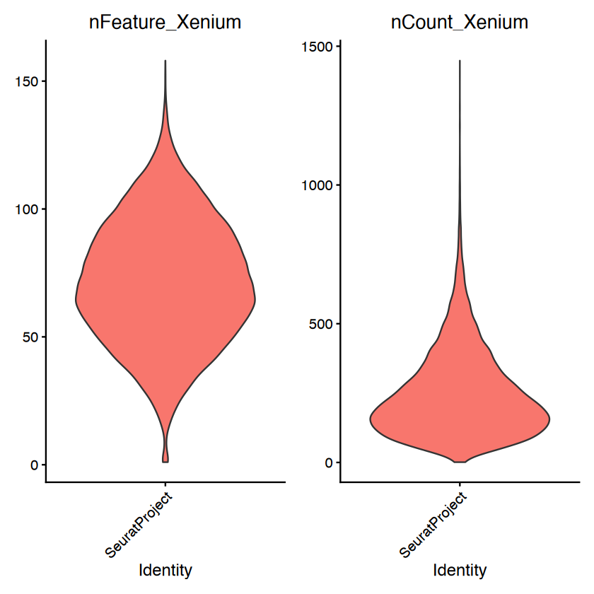
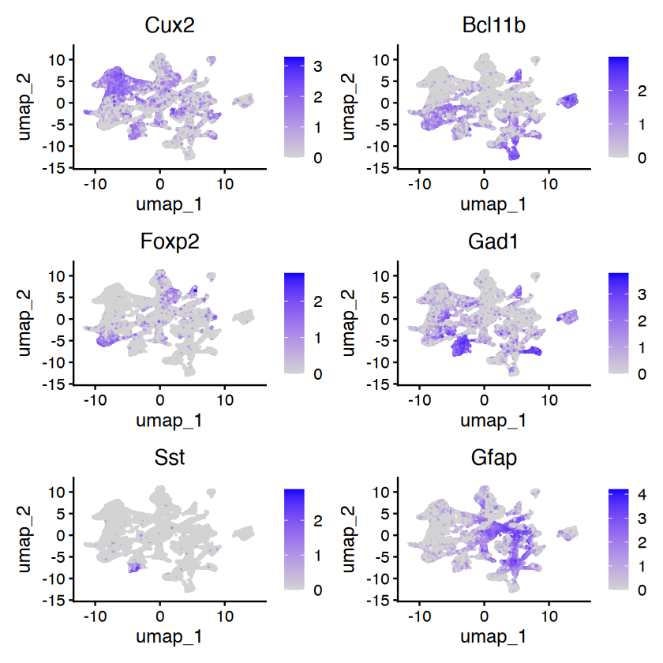
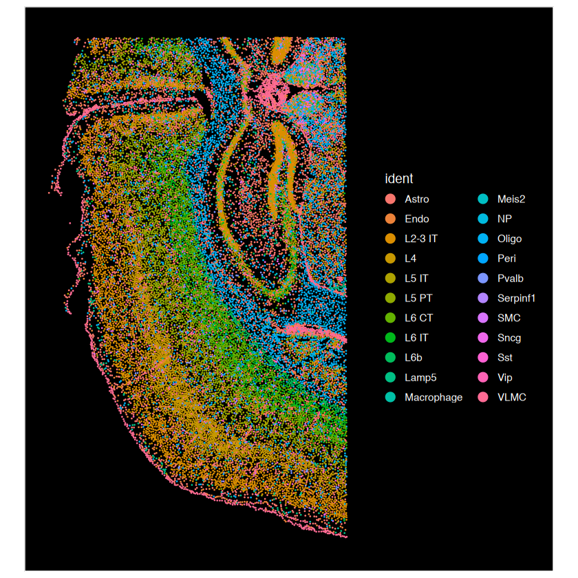
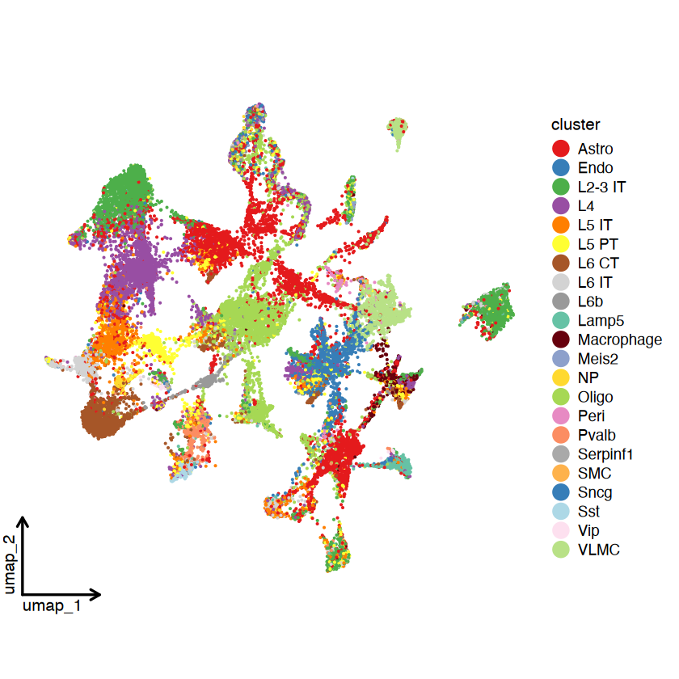
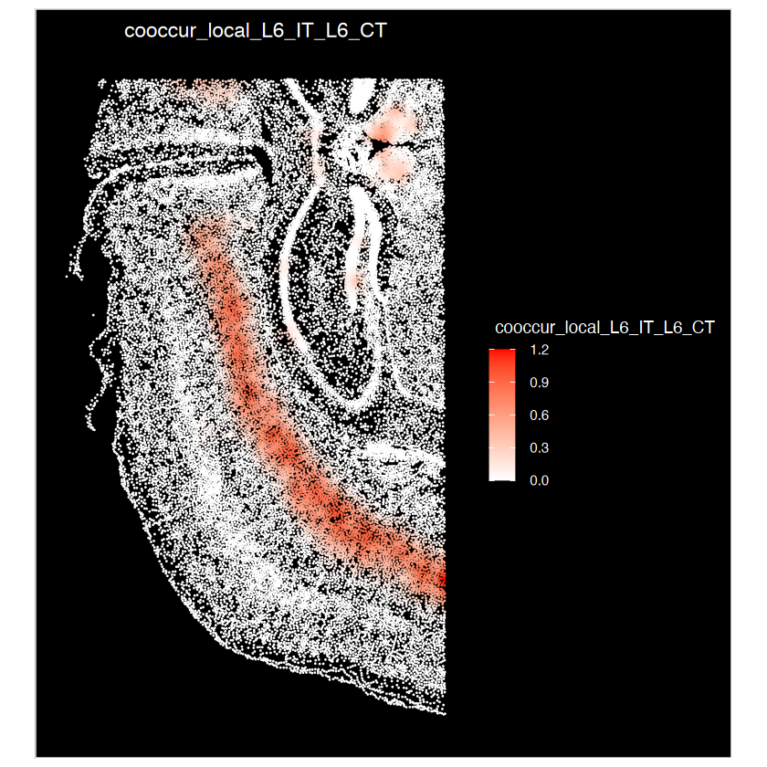

# Tutorial for spatial neighborhood analysis (SNA) & spatial co-localization score (sCLS) using 10X public data

This article is a rendered copy of the Jupyter notebook
[`vignettes/SNA_tutorial_10Xdata.ipynb`](https://github.com/juninamo/spatialCooccur/blob/master/vignettes/SNA_tutorial_10Xdata.ipynb);
download it to run the code yourself.

**Author:**  
**Jun Inamo**  
*Computational Omics and Systems Immunology (COSI) Lab*  
*Division of Rheumatology and Center for Health AI*  
*University of Colorado School of Medicine, CO, USA*  
📧 <jun.inamo@cuanschutz.edu>

``` r

format(Sys.time(), '%d %B, %Y')
```

‘24 September, 2026’

``` r

library(Seurat)
library(magrittr)
library(dplyr)
# devtools::install_github("zhanghao-njmu/SCP")
library(SCP)
library(ggplot2)
library(circlize)
library(ComplexHeatmap)

if (file.exists("../DESCRIPTION")) devtools::load_all("..", quiet = TRUE) else library(spatialCooccur)

BuildSNNSeurat <- function (data.use, k.param = 30, prune.SNN = 1/15, nn.eps = 0) {
  my.knn <- nn2(data = data.use, k = k.param, searchtype = "standard", eps = nn.eps)
  nn.ranked <- my.knn$nn.idx
  
  snn_res <- ComputeSNN(nn_ranked = nn.ranked, prune = prune.SNN)
  rownames(snn_res) <- row.names(data.use)
  colnames(snn_res) <- row.names(data.use)
  return(snn_res)
}
environment(BuildSNNSeurat) <- asNamespace("Seurat")

# folder with the 10x example datasets (set XENIUM_SAMPLE_DIR to override)
data_dir <- Sys.getenv("XENIUM_SAMPLE_DIR", "./../10X_Xenium_sample")
```

## Xenium Human Breast Gene Expression

### Preprocessing & Cell annotation

``` r

path <- paste0(data_dir, "/Xenium_V1_human_Breast_2fov_outs/")
data_name = stringr::str_split(path, "/")[[1]][length(stringr::str_split(path, "/")[[1]])-1]

# Load the Xenium data
data <- ReadXenium(path, outs = c("matrix", "microns"), type = c("centroids", "segmentations"))
## continue the regular LoadXenium
segmentations.data <- list(
  centroids = CreateCentroids(data$centroids),
  segmentation = CreateSegmentation(data$segmentations))
coords <- CreateFOV(
  coords = segmentations.data, 
  type = c("segmentation", "centroids"), 
  molecules = data$microns, 
  assay = "Spatial")
xenium.obj <- CreateSeuratObject(
  counts = data$matrix[["Gene Expression"]], 
  assay = "Spatial")
xenium.obj[["BlankCodeword"]] <- CreateAssayObject(counts = data$matrix[["Unassigned Codeword"]])
xenium.obj[["ControlCodeword"]] <- CreateAssayObject(counts = data$matrix[["Negative Control Codeword"]])
xenium.obj[["ControlProbe"]] <- CreateAssayObject(counts = data$matrix[["Negative Control Probe"]])
xenium.obj[["fov"]] <- coords
rm(data); gc(); gc()
```

|        | used     | (Mb)  | gc trigger | (Mb)   | limit (Mb) | max used | (Mb)   |
|--------|----------|-------|------------|--------|------------|----------|--------|
| Ncells | 12945208 | 691.4 | 19692738   | 1051.8 | NA         | 19692738 | 1051.8 |
| Vcells | 27133329 | 207.1 | 45754539   | 349.1  | 204800     | 45728698 | 348.9  |

A matrix: 2 × 7 of type dbl {.table .dataframe}

|        | used     | (Mb)  | gc trigger | (Mb)   | limit (Mb) | max used | (Mb)   |
|--------|----------|-------|------------|--------|------------|----------|--------|
| Ncells | 12951604 | 691.7 | 19692738   | 1051.8 | NA         | 19692738 | 1051.8 |
| Vcells | 27147639 | 207.2 | 45754539   | 349.1  | 204800     | 45728698 | 348.9  |

A matrix: 2 × 7 of type dbl {.table .dataframe}

``` r

xenium.obj <- subset(xenium.obj, subset = nCount_Spatial > 0)

print(dim(xenium.obj@assays$Spatial$counts))
xenium.obj@assays$Spatial$counts[1:5,1:5]
head(xenium.obj@meta.data)
summary(xenium.obj@meta.data$nCount_Spatial)
summary(xenium.obj@meta.data$nFeature_Spatial)

VlnPlot(xenium.obj, features = c("nFeature_Spatial", "nCount_Spatial"), ncol = 2, pt.size = 0)

ImageDimPlot(xenium.obj, fov = "fov", molecules = c("TUBB2B", "PELI1", "CENPF", "KRT23","PDGFRB","ITGAX","KRT14","GZMA"), nmols = 20000)
```

``` output
[1]  280 7273
```

``` output
5 x 5 sparse Matrix of class "dgCMatrix"
       aaaiikim-1 aaaljapa-1 aabhbgmg-1 aabpgobe-1 aacemgol-1
ABCC11          .          .          .          .          .
ACTA2           1          .          .          .          .
ACTG2           .          .          .          .          .
ADAM9           1          .          2          1          .
ADGRE5          .          .          .          .          .
```

|  | orig.ident | nCount_Spatial | nFeature_Spatial | nCount_BlankCodeword | nFeature_BlankCodeword | nCount_ControlCodeword | nFeature_ControlCodeword | nCount_ControlProbe | nFeature_ControlProbe |
|----|----|----|----|----|----|----|----|----|----|
|  | \<fct\> | \<dbl\> | \<int\> | \<dbl\> | \<int\> | \<dbl\> | \<int\> | \<dbl\> | \<int\> |
| aaaiikim-1 | SeuratProject | 66 | 32 | 0 | 0 | 0 | 0 | 0 | 0 |
| aaaljapa-1 | SeuratProject | 95 | 43 | 0 | 0 | 0 | 0 | 0 | 0 |
| aabhbgmg-1 | SeuratProject | 215 | 74 | 0 | 0 | 0 | 0 | 0 | 0 |
| aabpgobe-1 | SeuratProject | 103 | 42 | 0 | 0 | 0 | 0 | 0 | 0 |
| aacemgol-1 | SeuratProject | 95 | 49 | 0 | 0 | 0 | 0 | 0 | 0 |
| aacnljfi-1 | SeuratProject | 146 | 56 | 0 | 0 | 0 | 0 | 0 | 0 |

A data.frame: 6 × 9 {.table .dataframe}

``` output
   Min. 1st Qu.  Median    Mean 3rd Qu.    Max. 
    1.0    54.0   109.0   123.3   174.0   673.0 
```

``` output
   Min. 1st Qu.  Median    Mean 3rd Qu.    Max. 
   1.00   31.00   46.00   44.66   59.00  112.00 
```





``` r

xenium.obj <- SCTransform(xenium.obj, assay = "Spatial",
                          conserve.memory = TRUE, vst.flavor="v2")
xenium.obj <- RunPCA(xenium.obj, assay = "SCT", verbose = FALSE)
xenium.obj <- FindNeighbors(xenium.obj, 
                     reduction = "pca", 
                     k.param = 30,
                     dims = 1:30)
xenium.obj <- RunUMAP(xenium.obj, 
               reduction = "pca", 
               n.neighbors = 30L,
               min.dist = 0.3,
               dims = 1:30)

print("Clustering...")
snn_pcs <- BuildSNNSeurat(xenium.obj[["pca"]]@cell.embeddings[,1:30], 
                          nn.eps = 0)

resolution_list <- c(0.2, 0.4, 0.6, 0.8, 1.0)
ids_cos <- Reduce(cbind, parallel::mclapply(resolution_list, function(res_use) {
  Seurat:::RunModularityClustering(SNN = snn_pcs, 
                                   modularity = 1, 
                                   resolution = res_use, 
                                   algorithm = 3, 
                                   n.start = 10, 
                                   n.iter = 10, random.seed = 0, print.output = FALSE, 
                                   temp.file.location = NULL, edge.file.name = NULL)    
}, mc.cores = min(16, length(resolution_list))))
ids_cos %<>% data.frame()
colnames(ids_cos) <- sprintf("res_%.2f", resolution_list)

ids_cos$res_0.20 <- as.character(ids_cos$res_0.20)
ids_cos$res_0.40 <- as.character(ids_cos$res_0.40)
ids_cos$res_0.60 <- as.character(ids_cos$res_0.60)
ids_cos$res_0.80 <- as.character(ids_cos$res_0.80)
ids_cos$res_1.00 <- as.character(ids_cos$res_1.00)

rownames(ids_cos) = rownames(xenium.obj@meta.data)
ids_cos <- ids_cos %>%
  dplyr::mutate(across(everything(), ~ factor(.x, levels = sort(unique(.x)))))
xenium.obj <- AddMetaData(xenium.obj, ids_cos)
head(xenium.obj@meta.data)


resolution = "0.60"
Idents(xenium.obj) = xenium.obj@meta.data[,paste0("res_",resolution)]

cluster_col = paste0("res_",resolution)
```

``` output

  |                                                                            
```

``` output

  |                                                                            
```

``` output

  |                                                                            
```

``` output
[1] "Clustering..."
```

|  | orig.ident | nCount_Spatial | nFeature_Spatial | nCount_BlankCodeword | nFeature_BlankCodeword | nCount_ControlCodeword | nFeature_ControlCodeword | nCount_ControlProbe | nFeature_ControlProbe | nCount_SCT | nFeature_SCT | res_0.20 | res_0.40 | res_0.60 | res_0.80 | res_1.00 |
|----|----|----|----|----|----|----|----|----|----|----|----|----|----|----|----|----|
|  | \<fct\> | \<dbl\> | \<int\> | \<dbl\> | \<int\> | \<dbl\> | \<int\> | \<dbl\> | \<int\> | \<dbl\> | \<int\> | \<fct\> | \<fct\> | \<fct\> | \<fct\> | \<fct\> |
| aaaiikim-1 | SeuratProject | 66 | 32 | 0 | 0 | 0 | 0 | 0 | 0 | 112 | 33 | 0 | 0 | 0 | 0 | 2 |
| aaaljapa-1 | SeuratProject | 95 | 43 | 0 | 0 | 0 | 0 | 0 | 0 | 107 | 43 | 0 | 0 | 0 | 0 | 2 |
| aabhbgmg-1 | SeuratProject | 215 | 74 | 0 | 0 | 0 | 0 | 0 | 0 | 139 | 69 | 0 | 0 | 0 | 0 | 2 |
| aabpgobe-1 | SeuratProject | 103 | 42 | 0 | 0 | 0 | 0 | 0 | 0 | 111 | 42 | 0 | 0 | 0 | 0 | 2 |
| aacemgol-1 | SeuratProject | 95 | 49 | 0 | 0 | 0 | 0 | 0 | 0 | 106 | 49 | 0 | 2 | 2 | 0 | 0 |
| aacnljfi-1 | SeuratProject | 146 | 56 | 0 | 0 | 0 | 0 | 0 | 0 | 132 | 56 | 0 | 0 | 0 | 0 | 2 |

A data.frame: 6 × 16 {.table .dataframe}

``` r

g = CellDimPlot(
  srt = xenium.obj, 
  group.by = cluster_col, 
  reduction = "UMAP", theme_use = "theme_blank",
  raster = FALSE,
  stat_plot_size = 3
) 
g 
```



``` r

xenium.obj.markers <- FindAllMarkers(xenium.obj, only.pos = TRUE)
xenium.obj.markers %>%
  group_by(cluster) %>%
  dplyr::slice_max(avg_log2FC, n = 10) %>%
  as.data.frame() 
```

| p_val         | avg_log2FC | pct.1   | pct.2   | p_val_adj     | cluster | gene     |
|---------------|------------|---------|---------|---------------|---------|----------|
| \<dbl\>       | \<dbl\>    | \<dbl\> | \<dbl\> | \<dbl\>       | \<fct\> | \<chr\>  |
| 4.352502e-144 | 1.1070971  | 0.631   | 0.312   | 1.218701e-141 | 0       | TUBB2B   |
| 2.107105e-198 | 1.0848830  | 0.844   | 0.560   | 5.899895e-196 | 0       | CCND1    |
| 7.158840e-12  | 1.0142743  | 0.063   | 0.029   | 2.004475e-09  | 0       | SERHL2   |
| 1.120600e-69  | 0.9176133  | 0.440   | 0.236   | 3.137681e-67  | 0       | TRAF4    |
| 1.399719e-34  | 0.8642718  | 0.254   | 0.137   | 3.919212e-32  | 0       | MYBPC1   |
| 1.514970e-30  | 0.8518701  | 0.227   | 0.122   | 4.241917e-28  | 0       | PTRHD1   |
| 2.436247e-80  | 0.8189955  | 0.584   | 0.349   | 6.821490e-78  | 0       | SLC5A6   |
| 3.880890e-109 | 0.7992065  | 0.784   | 0.553   | 1.086649e-106 | 0       | SEC11C   |
| 8.794545e-198 | 0.7828638  | 0.959   | 0.823   | 2.462473e-195 | 0       | TOMM7    |
| 4.888822e-11  | 0.7782080  | 0.107   | 0.063   | 1.368870e-08  | 0       | DMKN     |
| 0.000000e+00  | 3.0921346  | 0.963   | 0.295   | 0.000000e+00  | 1       | TOP2A    |
| 0.000000e+00  | 2.7563930  | 0.738   | 0.177   | 0.000000e+00  | 1       | CENPF    |
| 0.000000e+00  | 2.7361385  | 0.895   | 0.267   | 0.000000e+00  | 1       | MKI67    |
| 4.390233e-182 | 2.1711490  | 0.484   | 0.127   | 1.229265e-179 | 1       | RTKN2    |
| 1.016200e-139 | 1.9993007  | 0.423   | 0.120   | 2.845361e-137 | 1       | PCLAF    |
| 1.413482e-49  | 0.8819110  | 0.602   | 0.385   | 3.957749e-47  | 1       | TUBB2B   |
| 1.684906e-11  | 0.6981872  | 0.182   | 0.109   | 4.717737e-09  | 1       | FOXC2    |
| 7.656002e-07  | 0.6572381  | 0.102   | 0.061   | 2.143681e-04  | 1       | TCF7     |
| 4.130524e-35  | 0.6302350  | 0.659   | 0.464   | 1.156547e-32  | 1       | EIF4EBP1 |
| 1.323024e-11  | 0.5794848  | 0.275   | 0.186   | 3.704466e-09  | 1       | ANKRD28  |
| 2.613227e-07  | 0.3012463  | 0.806   | 0.711   | 7.317035e-05  | 2       | PELI1    |
| 4.871823e-03  | 0.1489349  | 0.182   | 0.240   | 1.000000e+00  | 2       | HOOK2    |
| 3.526833e-03  | 0.1391945  | 0.066   | 0.098   | 9.875131e-01  | 2       | C6orf132 |
| 4.772797e-04  | 0.1064460  | 0.205   | 0.281   | 1.336383e-01  | 2       | JUP      |
| 4.847743e-218 | 3.5214753  | 0.344   | 0.041   | 1.357368e-215 | 3       | KRT23    |
| 1.256544e-15  | 3.3417568  | 0.033   | 0.006   | 3.518325e-13  | 3       | KRT5     |
| 2.917291e-58  | 2.6703702  | 0.160   | 0.035   | 8.168416e-56  | 3       | KRT14    |
| 1.424424e-14  | 2.4819469  | 0.043   | 0.010   | 3.988388e-12  | 3       | S100A14  |
| 3.007982e-98  | 2.2080897  | 0.299   | 0.072   | 8.422349e-96  | 3       | KLF5     |
| 2.894481e-49  | 2.1529674  | 0.145   | 0.033   | 8.104547e-47  | 3       | MLPH     |
| ⋮             | ⋮          | ⋮       | ⋮       | ⋮             | ⋮       | ⋮        |
| 0.000000e+00  | 2.6406493  | 1.000   | 0.531   | 0.000000e+00  | 6       | SERPINA3 |
| 7.221488e-03  | 1.5727292  | 0.011   | 0.004   | 1.000000e+00  | 6       | ADH1B    |
| 5.709648e-05  | 1.2444034  | 0.038   | 0.015   | 1.598701e-02  | 6       | SPIB     |
| 3.175231e-09  | 0.7713981  | 0.233   | 0.138   | 8.890646e-07  | 6       | DUSP2    |
| 9.700172e-22  | 0.5749230  | 0.690   | 0.478   | 2.716048e-19  | 6       | EIF4EBP1 |
| 5.189238e-22  | 0.5739879  | 0.629   | 0.400   | 1.452987e-19  | 6       | TUBB2B   |
| 5.640017e-15  | 0.5603609  | 0.561   | 0.385   | 1.579205e-12  | 6       | SQLE     |
| 1.246321e-12  | 0.5421208  | 0.457   | 0.301   | 3.489698e-10  | 6       | CDH1     |
| 1.938110e-15  | 0.5207154  | 0.665   | 0.492   | 5.426709e-13  | 6       | BACE2    |
| 3.980188e-16  | 0.5170584  | 0.743   | 0.583   | 1.114453e-13  | 6       | TMEM147  |
| 1.987499e-114 | 6.6590671  | 0.164   | 0.003   | 5.564998e-112 | 7       | PRF1     |
| 1.263723e-229 | 6.2246643  | 0.361   | 0.009   | 3.538425e-227 | 7       | CD247    |
| 0.000000e+00  | 6.2119939  | 0.557   | 0.016   | 0.000000e+00  | 7       | GZMA     |
| 0.000000e+00  | 6.1677046  | 0.836   | 0.030   | 0.000000e+00  | 7       | CD3E     |
| 0.000000e+00  | 6.1522184  | 0.762   | 0.026   | 0.000000e+00  | 7       | TRAC     |
| 8.911910e-64  | 6.1076572  | 0.082   | 0.001   | 2.495335e-61  | 7       | GZMK     |
| 2.931856e-279 | 5.8886220  | 0.582   | 0.022   | 8.209198e-277 | 7       | CCL5     |
| 8.855582e-118 | 5.8731920  | 0.205   | 0.006   | 2.479563e-115 | 7       | NKG7     |
| 5.837061e-53  | 5.8313718  | 0.098   | 0.003   | 1.634377e-50  | 7       | GNLY     |
| 1.270395e-31  | 5.6507995  | 0.074   | 0.003   | 3.557105e-29  | 7       | LTB      |
| 0.000000e+00  | 7.8103947  | 0.826   | 0.008   | 0.000000e+00  | 8       | CLEC14A  |
| 0.000000e+00  | 7.6710819  | 0.899   | 0.016   | 0.000000e+00  | 8       | VWF      |
| 2.212329e-189 | 6.8435615  | 0.275   | 0.003   | 6.194522e-187 | 8       | ESM1     |
| 0.000000e+00  | 6.7893135  | 0.652   | 0.011   | 0.000000e+00  | 8       | MMRN2    |
| 0.000000e+00  | 6.7891992  | 0.696   | 0.012   | 0.000000e+00  | 8       | KDR      |
| 2.349485e-116 | 6.6280555  | 0.174   | 0.002   | 6.578557e-114 | 8       | SOX18    |
| 6.277482e-125 | 6.2772147  | 0.232   | 0.004   | 1.757695e-122 | 8       | NOSTRIN  |
| 1.132348e-201 | 6.2624514  | 0.391   | 0.007   | 3.170575e-199 | 8       | HOXD9    |
| 3.182380e-221 | 6.2249313  | 0.391   | 0.007   | 8.910665e-219 | 8       | ANGPT2   |
| 2.091169e-295 | 6.2098244  | 0.913   | 0.035   | 5.855274e-293 | 8       | CD93     |

A data.frame: 84 × 7 {.table .dataframe}

Cluster annotation: 0 Basal-like epithelial cells / Myoepithelial cells
1 Proliferating epithelial cells 2 Basal/myoepithelial tumor cells 3
Unclassified immune-like cells 4 Inflammatory immune cells (e.g. B cells
/ monocytes) 5 Cancer-associated fibroblasts (CAFs) 6 Macrophages (TAMs)
7 Cytotoxic / Activated T cells 8 Endothelial cells

Clusters are named by marker-gene signatures (the signature with the
highest average scaled expression), so the names do not depend on the
arbitrary cluster numbering.

``` r

table(xenium.obj@meta.data[,cluster_col])
# Annotate clusters with marker signatures rather than fixed cluster numbers,
# so the labels stay correct if clustering changes between package versions.
signatures <- list(
  BasalMyo_epithelial_cells      = c("MYBPC1", "SERHL2", "CCND1", "TRAF4"),
  Proliferating_epithelial_cells = c("TOP2A", "MKI67", "CENPF", "PCLAF"),
  BasalMyo_tumor_cells           = c("KRT5", "KRT14", "KRT23", "KLF5"),
  Luminal_tumor_cells            = c("ESR1", "FOXA1", "GATA3", "KRT8", "CEACAM6"),
  Cytotoxic_T                    = c("CD3E", "PRF1", "GZMA", "TRAC", "CD247", "CD8A"),
  `B_and_plasma_cells`           = c("MS4A1", "CD79A", "MZB1"),
  `Tumor-associated_macrophages` = c("CD163", "C1QA", "CD68", "ITGAX", "LYZ"),
  `Cancer-associated_fibroblasts`= c("POSTN", "LUM", "PDGFRB", "SFRP4", "FBLN1", "DPT", "MMP2"),
  Endothelial_cells              = c("VWF", "CLEC14A", "KDR", "MMRN2"),
  Mast_cells                     = c("CPA3", "TPSAB1", "KIT")
)
feats <- intersect(unique(unlist(signatures)), rownames(xenium.obj))
avg <- as.matrix(AverageExpression(xenium.obj, assays = "SCT", features = feats,
                                   group.by = cluster_col, layer = "data")$SCT)
colnames(avg) <- sub("^g", "", colnames(avg))
avg <- t(scale(t(avg))); avg[is.na(avg)] <- 0          # z-score each gene across clusters
sig_score <- sapply(signatures, function(g) colMeans(avg[intersect(g, rownames(avg)), , drop = FALSE]))
best <- setNames(colnames(sig_score)[max.col(sig_score, ties.method = "first")], rownames(sig_score))
round(sig_score, 2)
best
xenium.obj@meta.data$new_cluster <- unname(best[as.character(xenium.obj@meta.data[, cluster_col])])
table(xenium.obj@meta.data$new_cluster)
cluster_col = "new_cluster"
Idents(xenium.obj) = xenium.obj@meta.data$new_cluster
```

``` output

   0    1    2    3    4    5    6    7    8 
2389 1079  956  854  700  575  529  122   69 
```

|  | BasalMyo_epithelial_cells | Proliferating_epithelial_cells | BasalMyo_tumor_cells | Luminal_tumor_cells | Cytotoxic_T | B_and_plasma_cells | Tumor-associated_macrophages | Cancer-associated_fibroblasts | Endothelial_cells | Mast_cells |
|----|----|----|----|----|----|----|----|----|----|----|
| 0 | 1.46 | -0.09 | -0.25 | -0.03 | -0.37 | -0.28 | -0.48 | -0.62 | -0.34 | 0.04 |
| 1 | 0.63 | 2.57 | -0.10 | 0.15 | -0.37 | -0.30 | -0.48 | -0.60 | -0.34 | 0.08 |
| 2 | -0.01 | -0.10 | -0.01 | -0.11 | -0.35 | -0.33 | -0.40 | -0.50 | -0.33 | 0.07 |
| 3 | 0.88 | -0.05 | 2.59 | 0.24 | -0.37 | -0.51 | -0.45 | -0.60 | -0.34 | 0.38 |
| 4 | -0.84 | -0.62 | -0.51 | 0.00 | -0.26 | 1.36 | -0.02 | 2.29 | -0.30 | -0.22 |
| 5 | -0.99 | -0.65 | -0.49 | 0.15 | -0.21 | -0.18 | 2.59 | 0.00 | -0.34 | 0.28 |
| 6 | 0.83 | -0.08 | -0.21 | 0.26 | -0.37 | -0.28 | -0.48 | -0.64 | -0.35 | -0.30 |
| 7 | -1.16 | -0.51 | -0.55 | 0.36 | 2.66 | 1.22 | 0.14 | 0.23 | -0.32 | 0.28 |
| 8 | -0.81 | -0.47 | -0.46 | -1.02 | -0.35 | -0.69 | -0.42 | 0.45 | 2.67 | -0.62 |

A matrix: 9 × 10 of type dbl {.table .dataframe}

- 0 : ‘BasalMyo_epithelial_cells’
- 1 : ‘Proliferating_epithelial_cells’
- 2 : ‘Mast_cells’
- 3 : ‘BasalMyo_tumor_cells’
- 4 : ‘Cancer-associated_fibroblasts’
- 5 : ‘Tumor-associated_macrophages’
- 6 : ‘BasalMyo_epithelial_cells’
- 7 : ‘Cytotoxic_T’
- 8 : ‘Endothelial_cells’

``` output

     BasalMyo_epithelial_cells           BasalMyo_tumor_cells 
                          2918                            854 
 Cancer-associated_fibroblasts                    Cytotoxic_T 
                           700                            122 
             Endothelial_cells                     Mast_cells 
                            69                            956 
Proliferating_epithelial_cells   Tumor-associated_macrophages 
                          1079                            575 
```

``` r

cluster_COLORS = manual_colors
names(cluster_COLORS) = levels(Idents(xenium.obj))
cluster_COLORS = na.omit(cluster_COLORS)
g = CellDimPlot(
  srt = xenium.obj, 
  group.by = cluster_col, 
  reduction = "UMAP", theme_use = "theme_blank",
  raster = FALSE,
  stat_plot_size = 1
) &
  scale_color_manual(values = cluster_COLORS) &
  guides(color = guide_legend(override.aes = list(size=5,
                                                 alpha = 1),
                             title = "cluster",
                             ncol = 1))
g 
```


``` r

g = ImageDimPlot(xenium.obj,
             fov = "fov", 
             size = 1.2,
             group.by = cluster_col, 
             dark.background = F)  &
  scale_fill_manual(values = cluster_COLORS) &
  guides(fill = guide_legend(override.aes = list(size=5,
                                                 alpha = 1),
                             title = "cluster",
                             ncol = 1))
g 
```



### Spatial neighborhood analysis (SNA, cell type level analysis)

``` r

n_perm = 100
neighbors.k_ = 30 # Number of neighbors to search
seed = 1234

start_time = Sys.time()
xenium.obj <- nhood_enrichment.Seurat(
  xenium.obj,
  cluster_key = cluster_col, 
  neighbors.k = neighbors.k_, 
  connectivity_key = "nn", 
  transformation = TRUE,
  n_perms = n_perm, seed = seed, n_jobs = 4
)
end_time = Sys.time()
print("Elapsed time:")
difftime(end_time, start_time, units = "secs")
```

``` output
[1] "Elapsed time:"
```

``` output
Time difference of 3.642823 secs
```

``` r

res <- xenium.obj@misc[[paste0(cluster_col, "_nhood_enrichment")]]
L <- res$log2_oe; P <- res$padj
dimnames(L) <- dimnames(P) <- lapply(dimnames(L), function(v) gsub("^Cluster", "", v))
TITLE <- paste0("Neighbourhood enrichment, log2 O/E\n", data_name, " (* padj < 0.05, ** padj < 0.01)")
sig_mat <- ifelse(P < 0.01, "**", ifelse(P < 0.05, "*", ""))
heatmap <- Heatmap(L,
                   name = "log2 O/E",
                   col = colorRamp2(c(-1, 0, 1), c("#0072B5FF", "white", "#BC3C29FF")),
                   show_row_names = TRUE, show_column_names = TRUE,
                   cluster_rows = TRUE, cluster_columns = TRUE,
                   column_title = TITLE,
                   rect_gp = gpar(col = "black", lwd = 0.3),
                   cell_fun = function(j, i, x, y, width, height, fill) {
                     if (sig_mat[i, j] != "") grid.text(sig_mat[i, j], x = x, y = y - 0.2 * height,
                                                        gp = gpar(fontsize = 15, col = "black", fontface = "bold"))
                   })
draw(heatmap, merge_legend = TRUE, heatmap_legend_side = "bottom", annotation_legend_side = "bottom")
```


### Spatial co-localization score (sCLA, cell-cell level analysis)

``` r

xenium.obj[["fov"]]$centroids@coords
```

| x          | y         |
|------------|-----------|
| 3.986221   | 342.61966 |
| 6.680080   | 353.63556 |
| 10.924507  | 344.44751 |
| 12.469139  | 326.37842 |
| 13.614200  | 336.31012 |
| 16.602362  | 292.55316 |
| 18.095470  | 307.78577 |
| 7.015532   | 306.04666 |
| 13.646845  | 299.77997 |
| 18.019503  | 317.56729 |
| 4.900125   | 323.01886 |
| 9.570869   | 315.95383 |
| 33.660454  | 169.15588 |
| 118.657547 | 87.02421  |
| 127.557861 | 128.69392 |
| 195.570312 | 259.40088 |
| 185.530029 | 144.04372 |
| 146.584167 | 251.46104 |
| 132.430725 | 92.89492  |
| 123.896126 | 77.43526  |
| 185.468582 | 22.79720  |
| 129.620270 | 85.98190  |
| 35.328915  | 293.49655 |
| 31.849537  | 307.49612 |
| 38.008217  | 302.40729 |
| 26.706833  | 299.92395 |
| 52.746372  | 304.86227 |
| 44.550003  | 317.14578 |
| 43.461903  | 308.18326 |
| 45.321529  | 296.22226 |
| ⋮          | ⋮         |
| 386.5923   | 249.85770 |
| 365.6164   | 268.12885 |
| 665.3920   | 538.91150 |
| 626.8651   | 523.63293 |
| 820.7482   | 151.86137 |
| 830.9116   | 132.43082 |
| 803.0009   | 328.66089 |
| 596.5007   | 72.90670  |
| 1066.7518  | 562.16168 |
| 913.9797   | 339.93573 |
| 1050.9253  | 379.66013 |
| 1032.1899  | 431.91525 |
| 889.4853   | 37.63133  |
| 957.7563   | 111.30595 |
| 1199.3645  | 687.77332 |
| 1052.4490  | 153.09167 |
| 1000.3040  | 116.55745 |
| 1097.8085  | 355.41992 |
| 1139.2590  | 105.91132 |
| 824.4532   | 730.56311 |
| 851.0555   | 730.78180 |
| 827.7892   | 628.86633 |
| 703.7122   | 584.78668 |
| 699.8170   | 591.30750 |
| 623.7773   | 613.40106 |
| 736.5967   | 400.61972 |
| 748.6306   | 400.94659 |
| 780.6490   | 621.38281 |
| 775.7633   | 745.26538 |
| 717.4011   | 406.35110 |

A matrix: 7273 × 2 of type dbl {.table .dataframe}

``` r

cluster_x <- "Cytotoxic_T"
cluster_y <- "Cancer-associated_fibroblasts"
table(Idents(xenium.obj))
radius_ = 30 # Radius to search for neighbors (µm, cell_type_2) around anchor cells (cell_type_1)

start_time = Sys.time()
cooccur_local_df <- cooccur_local.Seurat(
  xenium.obj,
  cluster_key      = cluster_col,
  sample_key       = "fov",
  cluster_x        = cluster_x,
  cluster_y        = cluster_y,
  connectivity_key = "nn",
  neighbors.k      = neighbors.k_, 
  radius           = radius_,
  maxnsteps        = 15
)
end_time = Sys.time()
print("Elapsed time:")
difftime(end_time, start_time, units = "secs")
summary(cooccur_local_df)
```

``` output

     BasalMyo_epithelial_cells                     Mast_cells 
                          2918                            956 
Proliferating_epithelial_cells   Tumor-associated_macrophages 
                          1079                            575 
                   Cytotoxic_T  Cancer-associated_fibroblasts 
                           122                            700 
             Endothelial_cells           BasalMyo_tumor_cells 
                            69                            854 
```

``` output
[1] "Elapsed time:"
```

``` output
Time difference of 2.079798 secs
```

``` output
 cooccur_local_Cytotoxic_T_Cancer-associated_fibroblasts
 Min.   :0.0000000                                      
 1st Qu.:0.0000000                                      
 Median :0.0000773                                      
 Mean   :0.1106833                                      
 3rd Qu.:0.0646834                                      
 Max.   :1.1785277                                      
```

``` r

xenium.obj = AddMetaData(xenium.obj, cooccur_local_df)

g = ImageFeaturePlot(xenium.obj, 
                     features = paste0("cooccur_local_",cluster_x,"_",cluster_y), 
                     #dark.background = F,
                     cols = c("white", "red"))
g
```


## Xenium Mouse Brain

### Preprocessing & Cell annotation

``` r

path <- paste0(data_dir, "/Xenium_V1_FF_Mouse_Brain_Coronal_Subset_CTX_HP_outs/")
data_name = stringr::str_split(path, "/")[[1]][length(stringr::str_split(path, "/")[[1]])-1]

xenium.obj <- LoadXenium(path, fov = "fov")
# remove cells with 0 counts
xenium.obj <- subset(xenium.obj, subset = nCount_Xenium > 0)

VlnPlot(xenium.obj, features = c("nFeature_Xenium", "nCount_Xenium"), ncol = 2, pt.size = 0)
```



``` r

ImageDimPlot(xenium.obj, 
             fov = "fov", 
             size = 0.5,
             molecules = c("Gad1", "Sst", "Pvalb", "Gfap"), nmols = 20000)
```


``` r

xenium.obj <- SCTransform(xenium.obj, assay = "Xenium")
xenium.obj <- RunPCA(xenium.obj, npcs = 30, features = rownames(xenium.obj))
xenium.obj <- RunUMAP(xenium.obj, dims = 1:30)
xenium.obj <- FindNeighbors(xenium.obj, reduction = "pca", dims = 1:30)
xenium.obj <- FindClusters(xenium.obj, resolution = 0.3)
```

``` output
Modularity Optimizer version 1.3.0 by Ludo Waltman and Nees Jan van Eck

Number of nodes: 36553
Number of edges: 1340944

Running Louvain algorithm...
Maximum modularity in 10 random starts: 0.9585
Number of communities: 27
Elapsed time: 7 seconds
```

``` r

cluster_col="seurat_clusters"
g = CellDimPlot(
  srt = xenium.obj, 
  group.by = cluster_col, 
  reduction = "UMAP", theme_use = "theme_blank",
  raster = FALSE,
  stat_plot_size = 3
) 
g 
```


``` r

FeaturePlot(xenium.obj, features = c("Cux2", "Bcl11b", "Foxp2", "Gad1", "Sst", "Gfap"))
```



``` r

ImageDimPlot(xenium.obj, cols = "polychrome", 
             size = 0.75)
```


``` r

library(spacexr)

query.counts <- GetAssayData(xenium.obj, assay = "Xenium", slot = "counts")
coords <- GetTissueCoordinates(xenium.obj[["fov"]], which = "centroids")
rownames(coords) <- coords$cell
coords$cell <- NULL
query <- SpatialRNA(coords, query.counts, colSums(query.counts))
```

``` r

# allen.corted.ref can be downloaded here:
# https://www.dropbox.com/s/cuowvm4vrf65pvq/allen_cortex.rds?dl=1
allen.cortex.ref <- readRDS(paste0(data_dir, "/allen_cortex.rds"))
allen.cortex.ref <- UpdateSeuratObject(allen.cortex.ref)

Idents(allen.cortex.ref) <- "subclass"
# remove CR cells because there aren't enough of them for annotation
allen.cortex.ref <- subset(allen.cortex.ref, subset = subclass != "CR")
counts <- GetAssayData(allen.cortex.ref, assay = "RNA", slot = "counts")
cluster <- as.factor(allen.cortex.ref$subclass)
names(cluster) <- colnames(allen.cortex.ref)
nUMI <- allen.cortex.ref$nCount_RNA
names(nUMI) <- colnames(allen.cortex.ref)
nUMI <- colSums(counts)
levels(cluster) <- gsub("/", "-", levels(cluster))
reference <- Reference(counts, cluster, nUMI)
```

``` r

# run RCTD with many cores
RCTD <- create.RCTD(query, reference, max_cores = 8)
RCTD <- run.RCTD(RCTD, doublet_mode = "doublet")
```

``` output

     Astro       Endo    L2-3 IT         L4      L5 IT      L5 PT      L6 CT 
       368         94        982       1401        880        544        960 
     L6 IT        L6b      Lamp5 Macrophage      Meis2         NP      Oligo 
      1872        358       1122         51         45        362         91 
      Peri      Pvalb   Serpinf1        SMC       Sncg        Sst        Vip 
        32       1337         27         55        125       1741       1728 
      VLMC 
        67 
```

``` output
[1] "gather_results: finished 1000"
[1] "gather_results: finished 2000"
[1] "gather_results: finished 3000"
[1] "gather_results: finished 4000"
[1] "gather_results: finished 5000"
[1] "gather_results: finished 6000"
[1] "gather_results: finished 7000"
[1] "gather_results: finished 8000"
[1] "gather_results: finished 9000"
[1] "gather_results: finished 10000"
[1] "gather_results: finished 11000"
[1] "gather_results: finished 12000"
[1] "gather_results: finished 13000"
[1] "gather_results: finished 14000"
[1] "gather_results: finished 15000"
[1] "gather_results: finished 16000"
[1] "gather_results: finished 17000"
[1] "gather_results: finished 18000"
[1] "gather_results: finished 19000"
[1] "gather_results: finished 20000"
[1] "gather_results: finished 21000"
[1] "gather_results: finished 22000"
[1] "gather_results: finished 23000"
[1] "gather_results: finished 24000"
[1] "gather_results: finished 25000"
[1] "gather_results: finished 26000"
[1] "gather_results: finished 27000"
[1] "gather_results: finished 28000"
[1] "gather_results: finished 29000"
[1] "gather_results: finished 30000"
[1] "gather_results: finished 31000"
```

``` r

annotations.df <- RCTD@results$results_df
annotations <- annotations.df$first_type
names(annotations) <- rownames(annotations.df)
xenium.obj$predicted.celltype <- annotations
keep.cells <- Cells(xenium.obj)[!is.na(xenium.obj$predicted.celltype)]
xenium.obj <- subset(xenium.obj, cells = keep.cells)
```

``` r

cluster_col="predicted.celltype"
Idents(xenium.obj) = xenium.obj@meta.data[,cluster_col]
```

``` r

markers = xenium.obj.markers %>%
  group_by(cluster) %>%
  dplyr::slice_max(avg_log2FC, n = 1) %>%
  as.data.frame() %>%
  pull(gene) %>%
  unique()
marker_COLORS = manual_colors
names(marker_COLORS) = markers
  
ImageDimPlot(xenium.obj, fov = "fov", molecules = markers, nmols = 20000) &
  scale_color_manual(values = marker_COLORS) 
```



``` r

cluster_COLORS = manual_colors
names(cluster_COLORS) = levels(Idents(xenium.obj))
cluster_COLORS = na.omit(cluster_COLORS)
g = CellDimPlot(
  srt = xenium.obj, 
  group.by = cluster_col, 
  reduction = "UMAP", theme_use = "theme_blank",
  raster = FALSE,
  stat_plot_size = 1
) &
  scale_color_manual(values = cluster_COLORS) &
  guides(color = guide_legend(override.aes = list(size=5,
                                                 alpha = 1),
                             title = "cluster",
                             ncol = 1))
g 
```



``` r

g = ImageDimPlot(xenium.obj,
             fov = "fov", 
             size = 0.5,
             group.by = cluster_col)  &
  scale_fill_manual(values = cluster_COLORS)
g 
```


### Spatial neighborhood analysis (SNA, cell type level analysis)

``` r

n_perm = 100
neighbors.k_ = 30 # Number of neighbors to search
seed = 1234

start_time = Sys.time()
xenium.obj <- nhood_enrichment.Seurat(
  xenium.obj,
  cluster_key = cluster_col, 
  neighbors.k = neighbors.k_, 
  connectivity_key = "nn", 
  transformation = TRUE,
  n_perms = n_perm, seed = seed, n_jobs = 4
)
end_time = Sys.time()
print("Elapsed time:")
difftime(end_time, start_time, units = "secs")
```

``` output
[1] "Elapsed time:"
```

``` output
Time difference of 7.805199 secs
```

``` r

res <- xenium.obj@misc[[paste0(cluster_col, "_nhood_enrichment")]]
L <- res$log2_oe; P <- res$padj
dimnames(L) <- dimnames(P) <- lapply(dimnames(L), function(v) gsub("^Cluster", "", v))
TITLE <- paste0("Neighbourhood enrichment, log2 O/E\n", data_name, " (* padj < 0.05, ** padj < 0.01)")
sig_mat <- ifelse(P < 0.01, "**", ifelse(P < 0.05, "*", ""))
heatmap <- Heatmap(L,
                   name = "log2 O/E",
                   col = colorRamp2(c(-1, 0, 1), c("#0072B5FF", "white", "#BC3C29FF")),
                   show_row_names = TRUE, show_column_names = TRUE,
                   cluster_rows = TRUE, cluster_columns = TRUE,
                   column_title = TITLE,
                   rect_gp = gpar(col = "black", lwd = 0.3),
                   cell_fun = function(j, i, x, y, width, height, fill) {
                     if (sig_mat[i, j] != "") grid.text(sig_mat[i, j], x = x, y = y - 0.2 * height,
                                                        gp = gpar(fontsize = 15, col = "black", fontface = "bold"))
                   })
draw(heatmap, merge_legend = TRUE, heatmap_legend_side = "bottom", annotation_legend_side = "bottom")
```


### Spatial co-localization score (sCLA, cell-cell level analysis)

``` r

cluster_x <- "L6 IT"
cluster_y <- "L6 CT"
table(Idents(xenium.obj))
radius_ = 30 # Radius to search for neighbors (µm, cell_type_2) around anchor cells (cell_type_1)

start_time = Sys.time()
cooccur_local_df <- cooccur_local.Seurat(
  xenium.obj,
  cluster_key      = cluster_col,
  sample_key       = "fov",
  cluster_x        = cluster_x,
  cluster_y        = cluster_y,
  connectivity_key = "nn",
  neighbors.k      = neighbors.k_, 
  radius           = radius_,
  maxnsteps        = 15
)
end_time = Sys.time()
print("Elapsed time:")
difftime(end_time, start_time, units = "secs")


colnames(cooccur_local_df) = gsub(" ", "_", colnames(cooccur_local_df))
summary(cooccur_local_df)
```

``` output

     Astro       Endo    L2-3 IT         L4      L5 IT      L5 PT      L6 CT 
      5468       1773       4563       3679       1863       1896       2182 
     L6 IT        L6b      Lamp5 Macrophage      Meis2         NP      Oligo 
      1114        355        521        448         82        277       3892 
      Peri      Pvalb   Serpinf1        SMC       Sncg        Sst        Vip 
       239        604         56         24        351        223        114 
      VLMC 
      1417 
```

``` output
[1] "Elapsed time:"
```

``` output
Time difference of 7.06738 secs
```

``` output
 cooccur_local_L6_IT_L6_CT
 Min.   :0.00000          
 1st Qu.:0.00000          
 Median :0.00000          
 Mean   :0.09290          
 3rd Qu.:0.03948          
 Max.   :1.20254          
```

``` r

xenium.obj = AddMetaData(xenium.obj, cooccur_local_df)

g = ImageFeaturePlot(xenium.obj, 
                     features = gsub(" ", "_", paste0("cooccur_local_",cluster_x,"_",cluster_y)), 
                     #dark.background = F,
                     cols = c("white", "red"))
g
```



``` r

cluster_COLORS_ = cluster_COLORS[cluster_x]
g_x = ImageDimPlot(xenium.obj,
             fov = "fov", 
             size = 0.3,
             group.by = cluster_col)  &
  scale_fill_manual(values = cluster_COLORS_) &
  guides(fill = guide_legend(override.aes = list(size=5,
                                                 alpha = 1),
                             title = "cluster",
                             ncol = 1))
cluster_COLORS_ = cluster_COLORS[cluster_y]
g_y = ImageDimPlot(xenium.obj,
             fov = "fov", 
             size = 0.3,
             group.by = cluster_col)  &
  scale_fill_manual(values = cluster_COLORS_) &
  guides(fill = guide_legend(override.aes = list(size=5,
                                                 alpha = 1),
                             title = "cluster",
                             ncol = 1))
g_x + g_y
```


``` r

sessionInfo()
```

``` output
R version 4.3.2 (2023-10-31)
Platform: aarch64-apple-darwin20 (64-bit)
Running under: macOS 26.3.1

Matrix products: default
BLAS:   /Library/Frameworks/R.framework/Versions/4.3-arm64/Resources/lib/libRblas.0.dylib 
LAPACK: /Library/Frameworks/R.framework/Versions/4.3-arm64/Resources/lib/libRlapack.dylib;  LAPACK version 3.11.0

locale:
[1] en_US.UTF-8/en_US.UTF-8/en_US.UTF-8/C/en_US.UTF-8/en_US.UTF-8

time zone: Asia/Tokyo
tzcode source: internal

attached base packages:
[1] grid      stats     graphics  grDevices utils     datasets  methods  
[8] base     

other attached packages:
 [1] spacexr_2.2.1         spatialCooccur_0.99.3 testthat_3.2.1       
 [4] ComplexHeatmap_2.18.0 circlize_0.4.15       ggplot2_3.4.4        
 [7] SCP_0.5.6             dplyr_1.1.4           magrittr_2.0.3       
[10] Seurat_5.2.1          SeuratObject_5.0.2    sp_2.1-2             

loaded via a namespace (and not attached):
  [1] IRanges_2.36.0                R.methodsS3_1.8.2            
  [3] progress_1.2.3                urlchecker_1.0.1             
  [5] goftest_1.2-3                 Biostrings_2.70.1            
  [7] HDF5Array_1.30.0              vctrs_0.6.5                  
  [9] spatstat.random_3.3-2         digest_0.6.33                
 [11] png_0.1-8                     shape_1.4.6                  
 [13] slingshot_2.10.0              ggrepel_0.9.4                
 [15] IRdisplay_1.1                 deldir_2.0-2                 
 [17] parallelly_1.36.0             magick_2.8.2                 
 [19] MASS_7.3-60                   Signac_1.14.0                
 [21] reshape2_1.4.4                httpuv_1.6.13                
 [23] foreach_1.5.2                 BiocGenerics_0.48.1          
 [25] qvalue_2.34.0                 withr_2.5.2                  
 [27] ggrastr_1.0.2                 ggfun_0.1.3                  
 [29] ellipsis_0.3.2                survival_3.5-7               
 [31] memoise_2.0.1                 proxyC_0.3.4                 
 [33] ggbeeswarm_0.7.2              clusterProfiler_4.10.0       
 [35] gson_0.1.0                    princurve_2.1.6              
 [37] profvis_0.3.8                 tidytree_0.4.6               
 [39] zoo_1.8-12                    GlobalOptions_0.1.2          
 [41] pbapply_1.7-2                 IRkernel_1.3.2               
 [43] R.oo_1.25.0                   prettyunits_1.2.0            
 [45] KEGGREST_1.42.0               promises_1.2.1               
 [47] httr_1.4.7                    globals_0.16.2               
 [49] fitdistrplus_1.1-11           rhdf5filters_1.14.1          
 [51] rhdf5_2.46.1                  rstudioapi_0.15.0            
 [53] miniUI_0.1.1.1                generics_0.1.3               
 [55] DOSE_3.28.2                   base64enc_0.1-3              
 [57] curl_5.2.0                    S4Vectors_0.40.2             
 [59] repr_1.1.6                    zlibbioc_1.48.0              
 [61] ggraph_2.1.0                  polyclip_1.10-6              
 [63] quadprog_1.5-8                GenomeInfoDbData_1.2.11      
 [65] SparseArray_1.2.3             interactiveDisplayBase_1.40.0
 [67] xtable_1.8-4                  stringr_1.5.1                
 [69] desc_1.4.3                    doParallel_1.0.17            
 [71] evaluate_0.23                 S4Arrays_1.2.0               
 [73] BiocFileCache_2.10.1          hms_1.1.3                    
 [75] GenomicRanges_1.54.1          irlba_2.3.5.1                
 [77] colorspace_2.1-0              filelock_1.0.3               
 [79] hdf5r_1.3.8                   ROCR_1.0-11                  
 [81] reticulate_1.35.0             spatstat.data_3.1-4          
 [83] lmtest_0.9-40                 glmGamPoi_1.14.0             
 [85] later_1.3.2                   viridis_0.6.4                
 [87] ggtree_3.10.0                 lattice_0.21-9               
 [89] spatstat.geom_3.3-5           future.apply_1.11.1          
 [91] scattermore_1.2               XML_3.99-0.16                
 [93] shadowtext_0.1.2              cowplot_1.1.2                
 [95] matrixStats_1.2.0             RcppAnnoy_0.0.21             
 [97] pillar_1.11.0                 nlme_3.1-163                 
 [99] iterators_1.0.14              compiler_4.3.2               
[101] RSpectra_0.16-1               stringi_1.8.3                
[103] tensor_1.5                    SummarizedExperiment_1.32.0  
[105] devtools_2.4.5                plyr_1.8.9                   
[107] crayon_1.5.2                  abind_1.4-5                  
[109] gridGraphics_0.5-1            graphlayouts_1.0.2           
[111] bit_4.0.5                     fastmatch_1.1-4              
[113] codetools_0.2-19              GetoptLong_1.0.5             
[115] plotly_4.10.3                 mime_0.12                    
[117] splines_4.3.2                 Rcpp_1.0.11                  
[119] fastDummies_1.7.3             sparseMatrixStats_1.14.0     
[121] dbplyr_2.4.0                  HDO.db_0.99.1                
[123] blob_1.2.4                    clue_0.3-65                  
[125] BiocVersion_3.18.1            pbdZMQ_0.3-10                
[127] fs_1.6.3                      listenv_0.9.0                
[129] DelayedMatrixStats_1.24.0     pkgbuild_1.4.3               
[131] ggplotify_0.1.2               tibble_3.2.1                 
[133] Matrix_1.6-5                  statmod_1.5.0                
[135] tweenr_2.0.2                  pkgconfig_2.0.3              
[137] tools_4.3.2                   cachem_1.0.8                 
[139] R.cache_0.16.0                RSQLite_2.3.4                
[141] viridisLite_0.4.2             DBI_1.2.0                    
[143] fastmap_1.1.1                 scales_1.3.0                 
[145] usethis_2.2.2                 ica_1.0-3                    
[147] Rsamtools_2.18.0              AnnotationHub_3.10.0         
[149] patchwork_1.1.3               BiocManager_1.30.22          
[151] dotCall64_1.1-1               RANN_2.6.1                   
[153] farver_2.1.1                  tidygraph_1.3.0              
[155] scatterpie_0.2.1              yaml_2.3.8                   
[157] MatrixGenerics_1.14.0         cli_3.6.2                    
[159] purrr_1.0.2                   stats4_4.3.2                 
[161] lifecycle_1.0.4               uwot_0.1.16                  
[163] Biobase_2.62.0                arrow_17.0.0.1               
[165] presto_1.0.0                  sessioninfo_1.2.2            
[167] BiocParallel_1.36.0           gtable_0.3.4                 
[169] rjson_0.2.23                  ggridges_0.5.5               
[171] progressr_0.14.0              limma_3.58.1                 
[173] parallel_4.3.2                ape_5.7-1                    
[175] jsonlite_2.0.0                RcppHNSW_0.5.0               
[177] bitops_1.0-7                  bit64_4.0.5                  
[179] assertthat_0.2.1              brio_1.1.4                   
[181] Rtsne_0.17                    yulab.utils_0.1.2            
[183] spatstat.utils_3.1-2          RcppParallel_5.1.7           
[185] GOSemSim_2.28.0               spatstat.univar_3.1-2        
[187] R.utils_2.12.3                lazyeval_0.2.2               
[189] shiny_1.8.0                   htmltools_0.5.7              
[191] enrichplot_1.22.0             GO.db_3.18.0                 
[193] sctransform_0.4.1             rappdirs_0.3.3               
[195] glue_1.6.2                    spam_2.10-0                  
[197] XVector_0.42.0                RCurl_1.98-1.13              
[199] rprojroot_2.0.4               treeio_1.26.0                
[201] gridExtra_2.3                 igraph_1.6.0                 
[203] TrajectoryUtils_1.10.0        R6_2.5.1                     
[205] tidyr_1.3.0                   SingleCellExperiment_1.24.0  
[207] labeling_0.4.3                RcppRoll_0.3.0               
[209] cluster_2.1.4                 pkgload_1.3.3                
[211] Rhdf5lib_1.24.1               aplot_0.2.2                  
[213] GenomeInfoDb_1.38.2           vipor_0.4.7                  
[215] DelayedArray_0.28.0           tidyselect_1.2.0             
[217] ggforce_0.4.1                 xml2_1.3.6                   
[219] AnnotationDbi_1.64.1          future_1.33.1                
[221] moments_0.14.1                munsell_0.5.0                
[223] KernSmooth_2.23-22            data.table_1.16.0            
[225] htmlwidgets_1.6.4             fgsea_1.28.0                 
[227] RColorBrewer_1.1-3            biomaRt_2.58.2               
[229] rlang_1.1.2                   spatstat.sparse_3.1-0        
[231] spatstat.explore_3.3-4        uuid_1.1-1                   
[233] remotes_2.4.2.1               Cairo_1.6-2                  
[235] ggnewscale_0.4.9              beeswarm_0.4.0               
```
