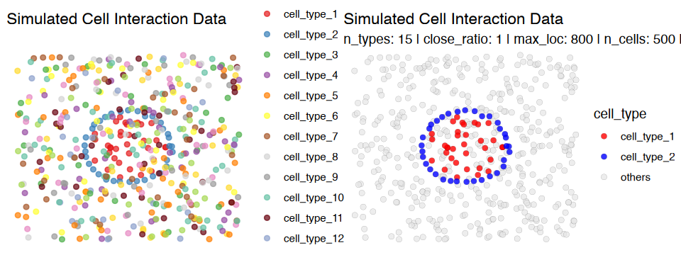
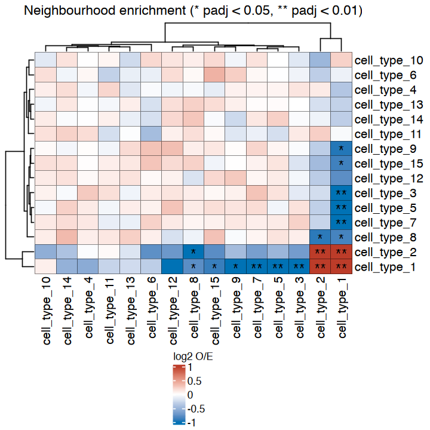
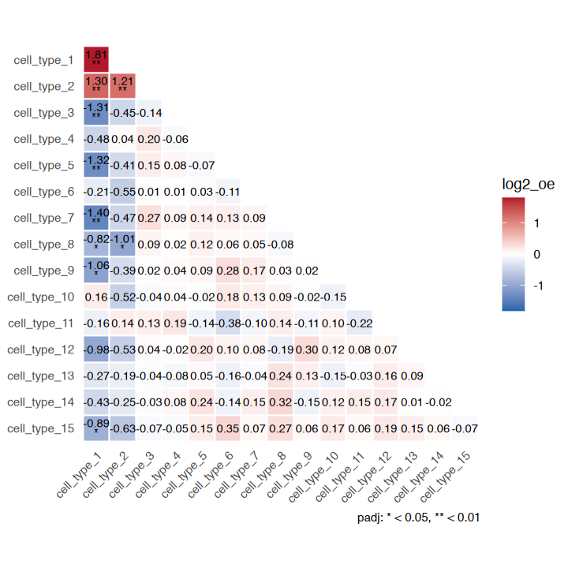
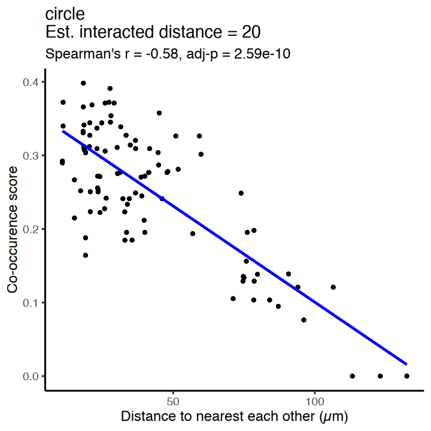
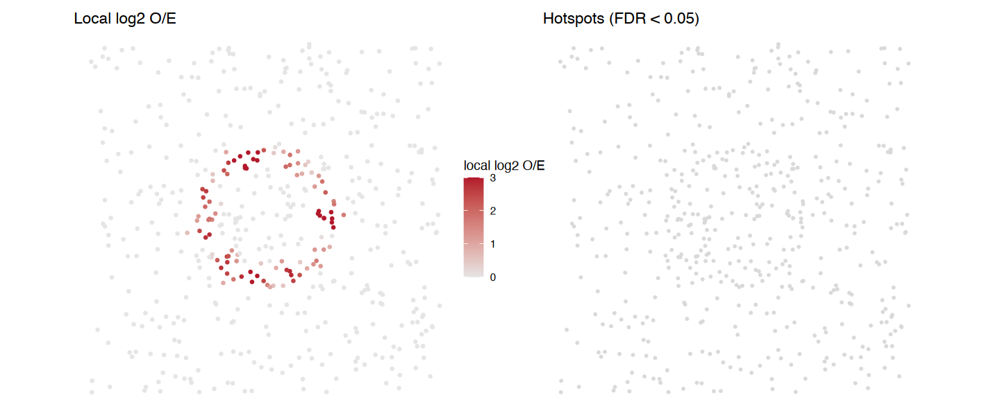

# Tutorial for Spatial Neighborhood Analysis (SNA) & Spatial Co-localization Score (sCLS) Using Simulation Data

This article is a rendered copy of the Jupyter notebook
[`vignettes/SNA_tutorial_simulation.ipynb`](https://github.com/juninamo/cohalu/blob/master/vignettes/SNA_tutorial_simulation.ipynb);
download it to run the code yourself.

**Author:**  
**Jun Inamo**  
*Computational Omics and Systems Immunology (COSI) Lab*  
*Division of Rheumatology and Center for Health AI*  
*University of Colorado School of Medicine, CO, USA*  
📧 <jun.inamo@cuanschutz.edu>

``` r

format(Sys.time(), '%d %B, %Y')
```

‘25 September, 2026’

## Spatial neighborhood analysis (SNA, cell type level analysis)

First generate dummy data where two cell types (cell_type_1 and
cell_type_2 in the “cell_type” column) are close to each other:
cell_type_2 forms a ring around a disk of cell_type_1 (concentric
circles), for a fraction `close_ratio` of the cells.

> **Note (v0.99.2).** Earlier versions shuffled the row and column
> labels independently in the permutation test. That inflated same-type
> z-scores to about +10 and biased different-type z-scores downwards,
> most strongly when there were few cell types (hence the old advice to
> use more than 10 cell types). The permutation now uses one shuffle for
> both, and the z-scores are calibrated under spatial randomness for any
> number of cell types (3 to 25 tested).

``` r

suppressPackageStartupMessages(suppressWarnings({
  if (file.exists("../DESCRIPTION")) devtools::load_all("..", quiet = TRUE) else library(cohalu)
  library(patchwork)
  library(ggplot2)
  library(magrittr)
  library(dplyr)
  library(circlize)
  library(ComplexHeatmap)
  library(ggrastr)
}))
```

``` r

seed=1234
close_ratio=1  # proportion of cell_type_1 and cell_type_2 that are close to each other
n_types=15  # Number of cell types
max_loc=800 # Maximum x and y coordinates in space
n_cells=500  # Number of total cells
test_type="circle" # "line", "circle", "distribute"
distance_param=20  # distance between cell_type_1 and cell_type_2

df = generate_sim(close_ratio = close_ratio, 
                  n_types = n_types,  
                  max_loc = max_loc,
                  n_cells = n_cells,  
                  test_type = test_type,
                  distance_param = distance_param,  
                  seed=seed)
head(df) 
# x and y: coordinates
# cell_type: cell type
```

|     | x        | y        | cell_type   |
|-----|----------|----------|-------------|
|     | \<dbl\>  | \<dbl\>  | \<fct\>     |
| 1   | 355.4030 | 392.7360 | cell_type_1 |
| 2   | 490.8708 | 345.9954 | cell_type_1 |
| 3   | 451.1619 | 308.7717 | cell_type_1 |
| 4   | 501.4539 | 430.0083 | cell_type_1 |
| 5   | 280.3691 | 433.8681 | cell_type_1 |
| 6   | 389.7839 | 506.7382 | cell_type_1 |

A data.frame: 6 × 3 {.table .dataframe}

check the distribution of cell types in the space

``` r

cluster_colors = manual_colors
names(cluster_colors) = paste0("cell_type_",1:n_types)

g1 = ggplot(df, aes(x = x, y = y, color = cell_type)) +
  geom_point(alpha = 0.7) +
  scale_color_manual(values = cluster_colors) +
  theme_void() +
  ggtitle("Simulated Cell Interaction Data")

g2 = ggplot(df %>% dplyr::mutate(cell_type = ifelse(cell_type %in% c("cell_type_1","cell_type_2"),as.character(cell_type),"others")), aes(x = x, y = y, fill = cell_type)) +
  geom_point(data = df %>% dplyr::mutate(cell_type = ifelse(cell_type %in% c("cell_type_1","cell_type_2"),as.character(cell_type),"others")) %>% dplyr::filter(cell_type %in% c("others")),
             alpha = 0.7, size = 2, shape = 21, stroke = 0.05, color = "black") +
  geom_point(data = df %>% dplyr::mutate(cell_type = ifelse(cell_type %in% c("cell_type_1","cell_type_2"),as.character(cell_type),"others")) %>% dplyr::filter(cell_type %in% c("cell_type_1","cell_type_2")),
             alpha = 0.8, size = 2, shape = 21, stroke = 0.05, color = "black") +
  labs(title = "Simulated Cell Interaction Data",
       subtitle = paste("n_types:", n_types, "| close_ratio:", close_ratio, "| max_loc:", max_loc, "| n_cells:", n_cells, "| distance_param:",distance_param)) +
  scale_color_manual(values = c("cell_type_1" = "red", 
                                "cell_type_2" = "blue",
                                "others" = "grey90")) +
  scale_fill_manual(values = c("cell_type_1" = "red", 
                               "cell_type_2" = "blue",
                               "others" = "grey90")) +
  theme_void()

  options(repr.plot.width=8, repr.plot.height=3)
g1|g2
```



Run neighborhood enrichment analysis

``` r

n_perm = 200
neighbors.k_ = 30 # Number of neighbors to search

nhood_res <- nhood_enrichment(
  df,
  cluster_key = "cell_type",
  neighbors.k = neighbors.k_,
  connectivity_key = "nn",
  transformation = FALSE,
  n_perms = n_perm, seed = seed, n_jobs = 4
)
names(nhood_res)   # log2_oe, padj, pvalue, ...
round(nhood_res$log2_oe[1:4, 1:4], 2)
```

1.  ‘zscore’
2.  ‘count’
3.  ‘expected’
4.  ‘log2_oe’
5.  ‘log2_oe_raw’
6.  ‘pvalue’
7.  ‘padj’
8.  ‘padj_bh’
9.  ‘contact’
10. ‘contact_expected’
11. ‘contact_log2_oe’
12. ‘contact_pvalue’
13. ‘contact_padj’
14. ‘dominance’
15. ‘dominance_expected’
16. ‘dominance_log2_oe’
17. ‘dominance_pvalue’
18. ‘dominance_padj’

|  | Clustercell_type_1 | Clustercell_type_2 | Clustercell_type_3 | Clustercell_type_4 |
|----|----|----|----|----|
| Clustercell_type_1 | 1.81 | 1.15 | -1.40 | -0.57 |
| Clustercell_type_2 | 1.45 | 1.21 | -0.68 | -0.02 |
| Clustercell_type_3 | -1.22 | -0.22 | -0.14 | 0.27 |
| Clustercell_type_4 | -0.38 | 0.10 | 0.13 | -0.06 |

A matrix: 4 × 4 of type dbl {.table .dataframe}

How to read the result

- `log2_oe[i, j]`: log2(observed / expected) contacts between cell types
  i and j, **centred on the label shuffles** so that it is 0 without
  interaction for any number of cells. 0 = as chance, +1 = twice, −1 =
  half. This is the effect size to compare between samples.
- `padj[i, j]`: within-sample significance for the unordered pair (i,
  j), adjusted over all K(K + 1)/2 pairs by the **max-T** permutation
  method (family-wise error). Its smallest value is 1 / (n_perms + 1).
  `pvalue` is the unadjusted value for a single pre-specified pair.
- Rows and columns: `log2_oe[i, j]` counts type-j cells among the
  neighbours of type-i cells; it is nearly symmetric. `padj` is
  symmetric (both directions are tested together).

`zscore` is still returned; it grows with the number of cells, so use it
only inside one sample. `plot_nhood_heatmap(nhood_res)` draws the same
heatmap in one line.

``` r

L <- nhood_res$log2_oe; P <- nhood_res$padj
dimnames(L) <- dimnames(P) <- lapply(dimnames(L), function(v) gsub("^Cluster", "", v))
TITLE <- "Neighbourhood enrichment (* padj < 0.05, ** padj < 0.01)"
options(repr.plot.width = 6, repr.plot.height = 6)
sig_mat <- ifelse(P < 0.01, "**", ifelse(P < 0.05, "*", ""))
heatmap <- Heatmap(L,
                   name = "log2 O/E",
                   col = colorRamp2(c(-1, 0, 1), c("#0072B5FF", "white", "#BC3C29FF")),
                   show_row_names = TRUE, show_column_names = TRUE,
                   cluster_rows = TRUE, cluster_columns = TRUE,
                   column_title = TITLE,
                   rect_gp = gpar(col = "black", lwd = 0.3),
                   cell_fun = function(j, i, x, y, width, height, fill) {
                     if (sig_mat[i, j] != "") grid.text(sig_mat[i, j], x = x, y = y - 0.2 * height,
                                                        gp = gpar(fontsize = 15, col = "black", fontface = "bold"))
                   })
draw(heatmap, merge_legend = TRUE, heatmap_legend_side = "bottom", annotation_legend_side = "bottom")

# the same in one line
plot_nhood_heatmap(nhood_res)
```





#### Who surrounds whom? Directional statistics

Every A-B contact is also a B-A contact, so the pair-level `log2_oe` is
(nearly) symmetric and
[`plot_nhood_heatmap()`](https://juninamo.github.io/cohalu/reference/plot_nhood_heatmap.md)
shows the average of both directions. It cannot tell “A is surrounded by
B” from “B is surrounded by A”.
[`nhood_enrichment()`](https://juninamo.github.io/cohalu/reference/nhood_enrichment.md)
also returns two directional statistics, with row = centre cell type and
column = neighbour cell type:

- `contact[i, j]`: share of type-i cells with at least one type-j
  neighbour (how much of population i touches j);
- `dominance[i, j]`: share of type-i cells whose neighbours are at least
  half type j (is the neighbourhood of i dominated by j).

Each comes with `*_expected`, centred `*_log2_oe`, `*_pvalue` and max-T
`*_padj` over all ordered pairs. Below, a rare type A always sits inside
small clusters of an abundant type B: the pair-level heatmap is
symmetric, `dominance` is high only for A as the centre, and `contact`
is high only for B as the centre (A touches B by chance anyway because B
is abundant).

``` r

set.seed(1); n <- 3000
da <- data.frame(x = runif(n, 0, 600), y = runif(n, 0, 600), cell_type = sample(c("B", "O"), n, TRUE, prob = c(0.4, 0.6)))
ctr <- cbind(runif(90, 20, 580), runif(90, 20, 580))                       # 90 A cells ...
da <- rbind(da, data.frame(x = ctr[, 1], y = ctr[, 2], cell_type = "A"),
            data.frame(x = rep(ctr[, 1], each = 6) + rnorm(540, 0, 6),      # ... each inside a cluster of 6 B cells
                       y = rep(ctr[, 2], each = 6) + rnorm(540, 0, 6), cell_type = "B"))
rownames(da) <- paste0("c", seq_len(nrow(da))); da$cell_type <- factor(da$cell_type, levels = c("A", "B", "O"))
ra <- nhood_enrichment(da, cluster_key = "cell_type", neighbors.k = 10, n_perms = 200, seed = 1, n_jobs = 1)
options(repr.plot.width = 15, repr.plot.height = 5)
(plot_nhood_heatmap(ra, limits = c(-1.2, 1.2)) + ggtitle("pair level (symmetric)")) |
  (plot_nhood_heatmap(ra, value = "dominance_log2_oe", limits = c(-1.2, 1.2)) + ggtitle("dominance (row = centre)")) |
  (plot_nhood_heatmap(ra, value = "contact_log2_oe", limits = c(-1.2, 1.2)) + ggtitle("contact (row = centre)"))
```


Run the same analysis for different planted distances (20 new tissues
each). Compare the effect size `log2_oe` and count how often the planted
pair passes `padj < 0.05`; the unrelated pair should stay at 0 and never
pass. In this *circle* design, type-2 cells form a ring at the planted
distance around a disc of type-1 cells. Up to about 50 um the ring lies
within the k-neighbourhood and the pair is enriched; at 75-100 um the
ring keeps the two types apart, so the pair becomes significantly
*depleted* (negative log2 O/E).

``` r

set.seed(seed)
random_seeds <- sample(1000:9999, 20)
n_types_sim <- n_types

# For each planted distance: 20 new tissues; keep the effect size (log2_oe) and the
# max-T adjusted p-value (padj) of the planted pair and of an unrelated pair
accuracy_df_all <- do.call(rbind, lapply(c(5, 10, 20, 30, 40, 50, 75, 100), function(distance_param) {
  do.call(rbind, lapply(random_seeds, function(seed_) {
    df <- generate_sim(close_ratio = close_ratio, n_types = n_types_sim, max_loc = max_loc,
                       n_cells = n_cells, test_type = "circle",
                       distance_param = distance_param, seed = seed_)
    r <- nhood_enrichment(df, cluster_key = "cell_type", neighbors.k = neighbors.k_,
                          connectivity_key = "nn", transformation = FALSE,
                          n_perms = n_perm, seed = seed_, n_jobs = 1)
    L <- r$log2_oe; P <- r$padj
    dimnames(L) <- dimnames(P) <- lapply(dimnames(L), function(v) gsub("^Cluster", "", v))
    data.frame(test_type = "circle", seed = seed_, distance_param = distance_param,
               pair = c("planted (1-2)", "unrelated (3-4)"),
               log2_oe = c(L["cell_type_1", "cell_type_2"], L["cell_type_3", "cell_type_4"]),
               padj = c(P["cell_type_1", "cell_type_2"], P["cell_type_3", "cell_type_4"]))
  }))
}))
head(accuracy_df_all)
```

|     | test_type | seed    | distance_param | pair            | log2_oe    | padj        |
|-----|-----------|---------|----------------|-----------------|------------|-------------|
|     | \<chr\>   | \<int\> | \<dbl\>        | \<chr\>         | \<dbl\>    | \<dbl\>     |
| 1   | circle    | 8451    | 5              | planted (1-2)   | 1.5861553  | 0.004975124 |
| 2   | circle    | 8451    | 5              | unrelated (3-4) | -0.3776475 | 1.000000000 |
| 3   | circle    | 9015    | 5              | planted (1-2)   | 1.6893718  | 0.004975124 |
| 4   | circle    | 9015    | 5              | unrelated (3-4) | 0.2247840  | 1.000000000 |
| 5   | circle    | 8161    | 5              | planted (1-2)   | 1.2075464  | 0.004975124 |
| 6   | circle    | 8161    | 5              | unrelated (3-4) | 0.1226222  | 1.000000000 |

A data.frame: 6 × 6 {.table .dataframe}

``` r

summary_df <- accuracy_df_all %>%
  dplyr::group_by(pair, distance_param) %>%
  dplyr::summarise(median = median(log2_oe),
                   lower_ci = quantile(log2_oe, 0.025), upper_ci = quantile(log2_oe, 0.975),
                   detected = mean(padj < 0.05), .groups = "drop")

options(repr.plot.width = 7, repr.plot.height = 5.5)
ggplot(summary_df, aes(distance_param, median, color = pair)) +
  geom_hline(yintercept = 0, linetype = "dashed") +
  geom_line(linewidth = 1) + geom_errorbar(aes(ymin = lower_ci, ymax = upper_ci), width = 0.05) + geom_point(size = 2) +
  geom_text(data = subset(summary_df, pair == "planted (1-2)"),
            aes(label = scales::percent(detected, accuracy = 1)), vjust = -1.2, size = 3.5, show.legend = FALSE) +
  scale_x_log10(breaks = unique(summary_df$distance_param)) +
  scale_color_manual(values = c("planted (1-2)" = "red", "unrelated (3-4)" = "grey40"), name = NULL) +
  labs(x = "Planted distance (um)", y = "log2 O/E (median and 95% range of 20 tissues)",
       title = "Planted pair (circle design) at different distances",
       subtitle = paste0("labels: tissues with padj < 0.05 (max-T), enriched or depleted\nn_types: ", n_types,
                         " | neighbors.k: ", neighbors.k_, " | n_cells: ", n_cells)) +
  theme_classic(base_size = 12) + theme(legend.position = "bottom")
```


## Spatial co-localization score (sCLA, cell-cell level analysis)

Again we generate dummy data where two cell types (cell_type_1 and
cell_type_2 in “cell_type” cik) are close to each other. Here we assume
that cell_type_1 and cell_type_2 are close to each other (concentric
cicle) by close_ratio.

``` r

seed=1234
close_ratio=1  # proportion of cell_type_1 and cell_type_2 that are close to each other
n_types=10  # Number of cell types
max_loc=800 # Maximum x and y coordinates in space
n_cells=500  # Number of total cells
test_type="circle" # "line", "circle", "distribute"
distance_param = 20  # distance between cell_type_1 and cell_type_2

df = generate_sim(close_ratio = close_ratio, 
                  n_types = n_types,  
                  max_loc = max_loc,
                  n_cells = n_cells,  
                  test_type = test_type,
                  distance_param = distance_param,  
                  seed=seed)
head(df) 
# x and y: coordinates
# cell_type: cell type
```

|     | x        | y        | cell_type   |
|-----|----------|----------|-------------|
|     | \<dbl\>  | \<dbl\>  | \<fct\>     |
| 1   | 445.1298 | 397.7724 | cell_type_1 |
| 2   | 437.2731 | 301.0822 | cell_type_1 |
| 3   | 301.2229 | 365.6020 | cell_type_1 |
| 4   | 335.8962 | 315.8329 | cell_type_1 |
| 5   | 352.9081 | 515.0693 | cell_type_1 |
| 6   | 322.6797 | 325.7101 | cell_type_1 |

A data.frame: 6 × 3 {.table .dataframe}

check the distribution of cell types in the space

``` r

cluster_colors = manual_colors
names(cluster_colors) = paste0("cell_type_",1:n_types)

g1 = ggplot(df, aes(x = x, y = y, color = cell_type)) +
  geom_point(alpha = 0.7) +
  scale_color_manual(values = cluster_colors) +
  theme_void() +
  ggtitle("Simulated Cell Interaction Data")

g2 = ggplot(df %>% dplyr::mutate(cell_type = ifelse(cell_type %in% c("cell_type_1","cell_type_2"),as.character(cell_type),"others")), aes(x = x, y = y, fill = cell_type)) +
  geom_point(data = df %>% dplyr::mutate(cell_type = ifelse(cell_type %in% c("cell_type_1","cell_type_2"),as.character(cell_type),"others")) %>% dplyr::filter(cell_type %in% c("others")),
             alpha = 0.7, size = 2, shape = 21, stroke = 0.05, color = "black") +
  geom_point(data = df %>% dplyr::mutate(cell_type = ifelse(cell_type %in% c("cell_type_1","cell_type_2"),as.character(cell_type),"others")) %>% dplyr::filter(cell_type %in% c("cell_type_1","cell_type_2")),
             alpha = 0.8, size = 2, shape = 21, stroke = 0.05, color = "black") +
  labs(title = "Simulated Cell Interaction Data",
       subtitle = paste("n_types:", n_types, "| close_ratio:", close_ratio, "| max_loc:", max_loc, "| n_cells:", n_cells, "| distance_param:",distance_param)) +
  scale_color_manual(values = c("cell_type_1" = "red", 
                                "cell_type_2" = "blue",
                                "others" = "grey90")) +
  scale_fill_manual(values = c("cell_type_1" = "red", 
                               "cell_type_2" = "blue",
                               "others" = "grey90")) +
  theme_void()

options(repr.plot.width=8, repr.plot.height=4)
g1|g2
```



Run co-localization analysis

``` r

cluster_x <- "cell_type_1"
cluster_y <- "cell_type_2"

radius_ = 30 # Radius to search for neighbors (µm, cell_type_2) around anchor cells (cell_type_1)
neighbors.k_ = 30 # Number of neighbors to search

cooccur_local_df <- cooccur_local(
  df,
  cluster_x        = cluster_x,
  cluster_y        = cluster_y,
  connectivity_key = "nn",
  neighbors.k      = neighbors.k_, 
  radius           = radius_,
  maxnsteps        = 15
)
summary(cooccur_local_df)
```

``` output
 cooccur_local_cell_type_1_cell_type_2
 Min.   :0.001175                     
 1st Qu.:0.037670                     
 Median :0.103213                     
 Mean   :0.102000                     
 3rd Qu.:0.161757                     
 Max.   :0.231130                     
```

Check how the co-localization score is distributed in the space

``` r

g3 = ggplot() +
  geom_point(df %>%
               dplyr::mutate(score = cooccur_local_df$cooccur_local_cell_type_1_cell_type_2) %>%
               dplyr::filter(!(cell_type %in% c("cell_type_1","cell_type_2"))), 
             mapping = aes(x = x, y = y, fill = score),
             alpha = 0.7, size = 2, shape = 21, stroke = 0.05, color = "black") +
  geom_point(df %>%
               dplyr::mutate(score = cooccur_local_df$cooccur_local_cell_type_1_cell_type_2) %>%
               dplyr::filter(cell_type %in% c("cell_type_1","cell_type_2")), 
             mapping = aes(x = x, y = y, fill = score),
             alpha = 0.7, size = 2, shape = 21, stroke = 0.05, color = "black") +
  theme_void() +
  scale_fill_gradient(low = "grey90", high = "red") +
  ggtitle("Simulated Cell Interaction Data")

options(repr.plot.width=12, repr.plot.height=4)
g1 | g2 | g3
```


Check the relationship between the co-localization score and the
distance between cell_type_1 and cell_type_2

``` r

one_cells <- df %>% dplyr::filter(cell_type=="cell_type_1")
two_cells <- df %>% dplyr::filter(cell_type=="cell_type_2")

res <- RANN::nn2(data = one_cells[,1:2], query = two_cells[,1:2], k = 1)
dist_to_nearest <- res$nn.dists[, 1]
two_cells$dist_nearest <- dist_to_nearest

res <- RANN::nn2(data = two_cells[,1:2], query = one_cells[,1:2], k = 1)
dist_to_nearest <- res$nn.dists[, 1]
one_cells$dist_nearest <- dist_to_nearest

coords_df = dplyr::left_join(df %>%
                               dplyr::mutate(score = cooccur_local_df$cooccur_local_cell_type_1_cell_type_2), 
                             rbind(one_cells,two_cells), by = c("x","y","cell_type"))
coef = cor.test(na.omit(coords_df)$score,na.omit(coords_df)$dist_nearest,method = "spearman",use = "pairwise.complete.obs")$estimate
pval = cor.test(na.omit(coords_df)$score,na.omit(coords_df)$dist_nearest,method = "spearman",use = "pairwise.complete.obs")$p.value

options(repr.plot.width=6, repr.plot.height=6)
ggplot(data = coords_df, aes(x = dist_nearest, y = score)) +
  geom_point_rast() +
  geom_smooth(
    method = "lm", se = FALSE, color = "blue"
  ) +
  theme_classic(base_size = 14) +
  labs(
    x = "Distance to nearest each other (µm)",
    y = paste("Co-occurence score"),
    title = paste0(test_type,"\nEst. interacted distance = ", distance_param), 
    subtitle = paste0(
      "Spearman's r = ", round(coef, 2),
      ", adj-p = ", signif(pval, 3)
    )
  )
```


Check the ROC curve and AUC value to evaluate the performance of the
co-localization score

Check the distribution of the co-localization score by cell type

``` r

coords_df %>%
  ggplot(aes(x = cell_type, y = score, fill = cell_type)) +
  geom_violin(width = 1, alpha = 0.7) +
  geom_boxplot(width = 0.1, alpha = 0.7) +
  #geom_jitter(width = 0.1, alpha = 0.7) +
  theme_minimal() +
  labs(
    x = "Cell Type",
    y = "Co-occurence score",
    title = paste0(test_type,"\nEst. interacted distance = ", distance_param)
  )
```


### Where do the two cell types meet? `cooccur_local_oe()`

[`cooccur_local_oe()`](https://juninamo.github.io/cohalu/reference/cooccur_local_oe.md)
counts cluster_x–cluster_y pairs within `radius` of every cell, divides
them by their exact expectation under label shuffling, and smooths
observed and expected pairs with Gaussian weights of width `bandwidth`.
With `n_perms > 0` it also tests every cell (hotspots, BH over cells).
Unlike the mean sCLS below, the section-level value does not grow with
the abundance of the two cell types.

``` r

rownames(df) <- paste0("cell", seq_len(nrow(df)))
lo <- cooccur_local_oe(df, "cell_type_1", "cell_type_2", radius = 30, n_perms = 199, seed = 1)
attr(lo, "section_log2_oe")
d_lo <- cbind(df, lo)
options(repr.plot.width = 12, repr.plot.height = 5)
(ggplot(d_lo, aes(x, y, color = pmin(pmax(local_log2_oe, 0), 3))) + geom_point(size = 0.8) +
   scale_color_gradient(low = "grey90", high = "#B2182B", name = "local log2 O/E") + coord_equal() + theme_void() + ggtitle("Local log2 O/E")) |
(ggplot(d_lo, aes(x, y)) + geom_point(color = "grey85", size = 0.6) + geom_point(data = subset(d_lo, padj < 0.05), color = "#B2182B", size = 0.9) +
   coord_equal() + theme_void() + ggtitle("Hotspots (FDR < 0.05)"))
```

1.99828623708995



``` r

sessionInfo()
```

``` output
R version 4.3.2 (2023-10-31)
Platform: aarch64-apple-darwin20 (64-bit)
Running under: macOS 26.3.1

Matrix products: default
BLAS:   /Library/Frameworks/R.framework/Versions/4.3-arm64/Resources/lib/libRblas.0.dylib 
LAPACK: /Library/Frameworks/R.framework/Versions/4.3-arm64/Resources/lib/libRlapack.dylib;  LAPACK version 3.11.0

locale:
[1] en_US.UTF-8/en_US.UTF-8/en_US.UTF-8/C/en_US.UTF-8/en_US.UTF-8

time zone: Asia/Tokyo
tzcode source: internal

attached base packages:
[1] grid      stats     graphics  grDevices utils     datasets  methods  
[8] base     

other attached packages:
[1] ggrastr_1.0.2         ComplexHeatmap_2.18.0 circlize_0.4.15      
[4] dplyr_1.1.4           magrittr_2.0.3        ggplot2_3.4.4        
[7] patchwork_1.1.3       cohalu_0.99.3         testthat_3.2.1       

loaded via a namespace (and not attached):
  [1] RColorBrewer_1.1-3     shape_1.4.6            rstudioapi_0.15.0     
  [4] jsonlite_2.0.0         magick_2.8.2           ggbeeswarm_0.7.2      
  [7] spatstat.utils_3.1-2   farver_2.1.1           GlobalOptions_0.1.2   
 [10] fs_1.6.3               vctrs_0.6.5            ROCR_1.0-11           
 [13] Cairo_1.6-2            memoise_2.0.1          spatstat.explore_3.3-4
 [16] base64enc_0.1-3        htmltools_0.5.7        usethis_2.2.2         
 [19] sctransform_0.4.1      parallelly_1.36.0      KernSmooth_2.23-22    
 [22] htmlwidgets_1.6.4      desc_1.4.3             ica_1.0-3             
 [25] plyr_1.8.9             plotly_4.10.3          zoo_1.8-12            
 [28] cachem_1.0.8           uuid_1.1-1             igraph_1.6.0          
 [31] iterators_1.0.14       mime_0.12              lifecycle_1.0.4       
 [34] pkgconfig_2.0.3        Matrix_1.6-5           R6_2.5.1              
 [37] fastmap_1.1.1          clue_0.3-65            fitdistrplus_1.1-11   
 [40] future_1.33.1          shiny_1.8.0            digest_0.6.33         
 [43] colorspace_2.1-0       S4Vectors_0.40.2       rprojroot_2.0.4       
 [46] Seurat_5.2.1           tensor_1.5             RSpectra_0.16-1       
 [49] irlba_2.3.5.1          pkgload_1.3.3          labeling_0.4.3        
 [52] progressr_0.14.0       spatstat.sparse_3.1-0  mgcv_1.9-0            
 [55] httr_1.4.7             polyclip_1.10-6        abind_1.4-5           
 [58] compiler_4.3.2         remotes_2.4.2.1        doParallel_1.0.17     
 [61] withr_2.5.2            fastDummies_1.7.3      pkgbuild_1.4.3        
 [64] MASS_7.3-60            sessioninfo_1.2.2      rjson_0.2.23          
 [67] tools_4.3.2            vipor_0.4.7            lmtest_0.9-40         
 [70] beeswarm_0.4.0         httpuv_1.6.13          future.apply_1.11.1   
 [73] goftest_1.2-3          glue_1.6.2             nlme_3.1-163          
 [76] promises_1.2.1         pbdZMQ_0.3-10          Rtsne_0.17            
 [79] cluster_2.1.4          reshape2_1.4.4         generics_0.1.3        
 [82] gtable_0.3.4           spatstat.data_3.1-4    tidyr_1.3.0           
 [85] data.table_1.16.0      sp_2.1-2               BiocGenerics_0.48.1   
 [88] spatstat.geom_3.3-5    RcppAnnoy_0.0.21       foreach_1.5.2         
 [91] ggrepel_0.9.4          RANN_2.6.1             pillar_1.11.0         
 [94] stringr_1.5.1          spam_2.10-0            IRdisplay_1.1         
 [97] RcppHNSW_0.5.0         later_1.3.2            splines_4.3.2         
[100] moments_0.14.1         lattice_0.21-9         survival_3.5-7        
[103] deldir_2.0-2           tidyselect_1.2.0       miniUI_0.1.1.1        
[106] pbapply_1.7-2          gridExtra_2.3          IRanges_2.36.0        
[109] scattermore_1.2        stats4_4.3.2           brio_1.1.4            
[112] devtools_2.4.5         matrixStats_1.2.0      stringi_1.8.3         
[115] lazyeval_0.2.2         evaluate_0.23          codetools_0.2-19      
[118] tibble_3.2.1           cli_3.6.2              uwot_0.1.16           
[121] IRkernel_1.3.2         xtable_1.8-4           reticulate_1.35.0     
[124] repr_1.1.6             munsell_0.5.0          Rcpp_1.0.11           
[127] globals_0.16.2         spatstat.random_3.3-2  png_0.1-8             
[130] spatstat.univar_3.1-2  parallel_4.3.2         ellipsis_0.3.2        
[133] dotCall64_1.1-1        profvis_0.3.8          urlchecker_1.0.1      
[136] listenv_0.9.0          viridisLite_0.4.2      scales_1.3.0          
[139] ggridges_0.5.5         SeuratObject_5.0.2     purrr_1.0.2           
[142] crayon_1.5.2           GetoptLong_1.0.5       rlang_1.1.2           
[145] cowplot_1.1.2         
```
