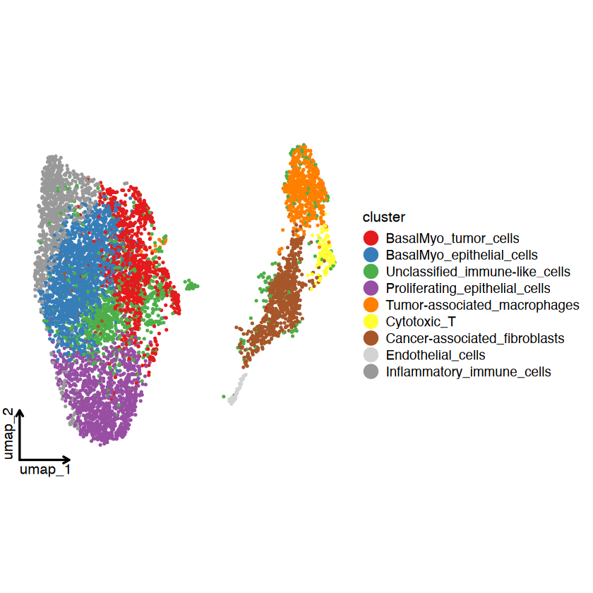
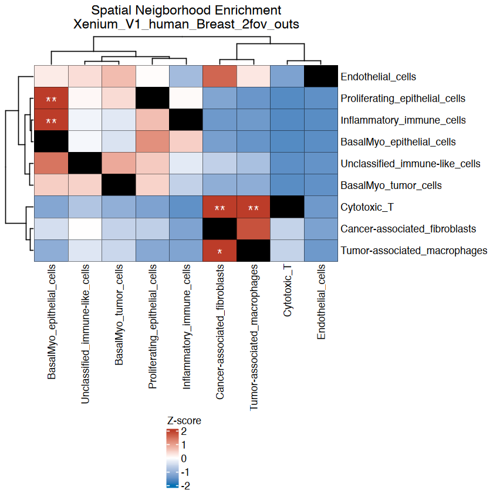
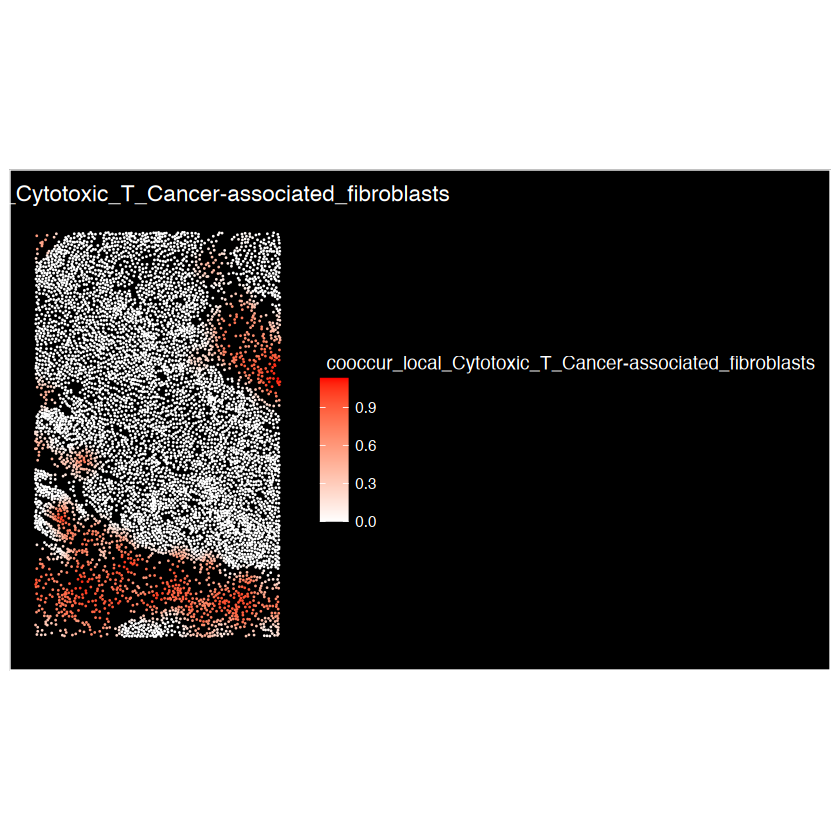
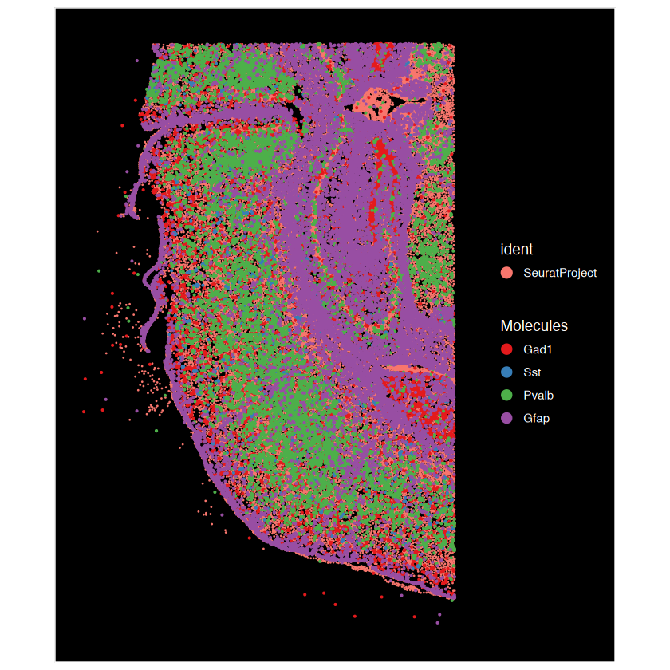
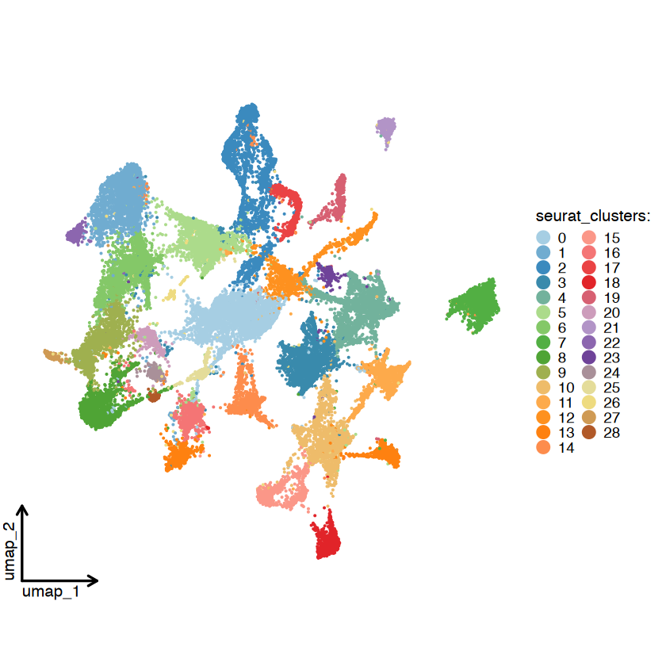
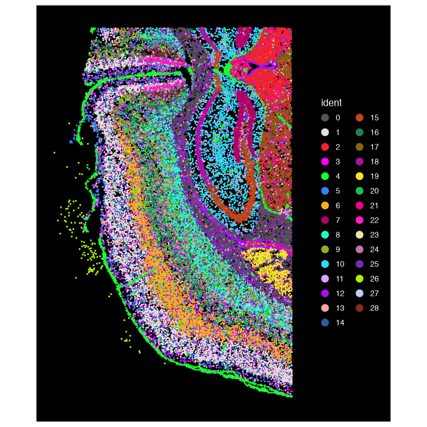
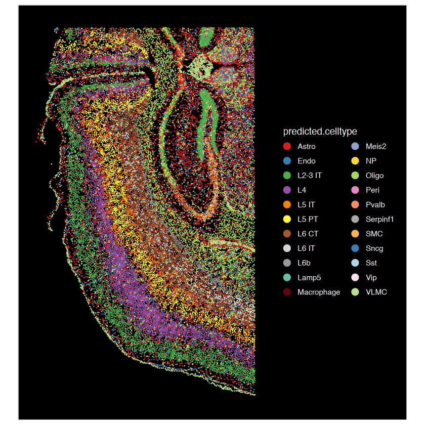
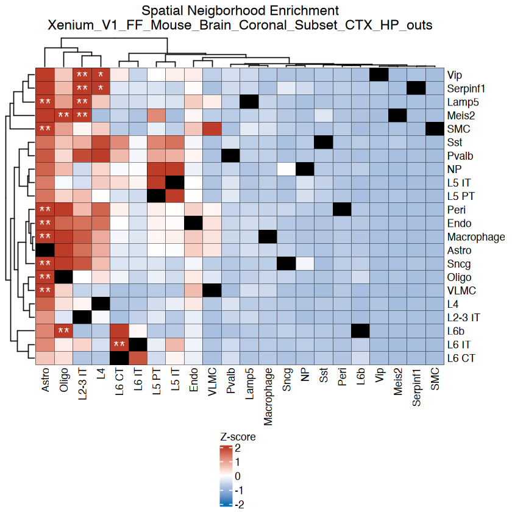
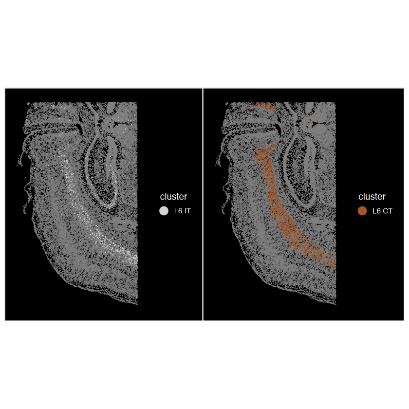

<div class="nb-source">
This article is a rendered copy of the Jupyter notebook [`vignettes/SNA_tutorial_10Xdata.ipynb`](https://github.com/juninamo/spatialCooccur/blob/master/vignettes/SNA_tutorial_10Xdata.ipynb); download it to run the code yourself.
</div>

**Author:**  
**Jun Inamo**  
_Computational Omics and Systems Immunology (COSI) Lab_  
_Division of Rheumatology and Center for Health AI_  
_University of Colorado School of Medicine, CO, USA_  
📧 jun.inamo@cuanschutz.edu

```r
format(Sys.time(), '%d %B, %Y')
```

<div class="nb-output">
'08 October, 2025'
</div>

```r
library(Seurat)
library(magrittr)
library(dplyr)
# devtools::install_github("zhanghao-njmu/SCP")
library(SCP)
library(ggplot2)
library(circlize)
library(ComplexHeatmap)

library(spatialCooccur)

BuildSNNSeurat <- function (data.use, k.param = 30, prune.SNN = 1/15, nn.eps = 0) {
  my.knn <- nn2(data = data.use, k = k.param, searchtype = "standard", eps = nn.eps)
  nn.ranked <- my.knn$nn.idx
  
  snn_res <- ComputeSNN(nn_ranked = nn.ranked, prune = prune.SNN)
  rownames(snn_res) <- row.names(data.use)
  colnames(snn_res) <- row.names(data.use)
  return(snn_res)
}
environment(BuildSNNSeurat) <- asNamespace("Seurat")
```

## Xenium Human Breast Gene Expression


### Preprocessing & Cell annotation

```r
path <- "./../10X_Xenium_sample/Xenium_V1_human_Breast_2fov_outs/"
data_name = stringr::str_split(path, "/")[[1]][length(stringr::str_split(path, "/")[[1]])-1]

# Load the Xenium data
data <- ReadXenium(path, outs = c("matrix", "microns"), type = c("centroids", "segmentations"))
## continue the regular LoadXenium
segmentations.data <- list(
  centroids = CreateCentroids(data$centroids),
  segmentation = CreateSegmentation(data$segmentations))
coords <- CreateFOV(
  coords = segmentations.data, 
  type = c("segmentation", "centroids"), 
  molecules = data$microns, 
  assay = "Spatial")
xenium.obj <- CreateSeuratObject(
  counts = data$matrix[["Gene Expression"]], 
  assay = "Spatial")
xenium.obj[["BlankCodeword"]] <- CreateAssayObject(counts = data$matrix[["Unassigned Codeword"]])
xenium.obj[["ControlCodeword"]] <- CreateAssayObject(counts = data$matrix[["Negative Control Codeword"]])
xenium.obj[["ControlProbe"]] <- CreateAssayObject(counts = data$matrix[["Negative Control Probe"]])
xenium.obj[["fov"]] <- coords
rm(data); gc(); gc()
```

```{.output}
10X data contains more than one type and is being returned as a list containing matrices of each type.
“Feature names cannot have underscores ('_'), replacing with dashes ('-')”
```

<div class="nb-output">
<table class="dataframe">
<caption>A matrix: 2 × 7 of type dbl</caption>
<thead>
	<tr><th></th><th scope=col>used</th><th scope=col>(Mb)</th><th scope=col>gc trigger</th><th scope=col>(Mb)</th><th scope=col>limit (Mb)</th><th scope=col>max used</th><th scope=col>(Mb)</th></tr>
</thead>
<tbody>
	<tr><th scope=row>Ncells</th><td>12451367</td><td>665.0</td><td>19335221</td><td>1032.7</td><td>    NA</td><td>19335221</td><td>1032.7</td></tr>
	<tr><th scope=row>Vcells</th><td>25888734</td><td>197.6</td><td>61951967</td><td> 472.7</td><td>102400</td><td>61951164</td><td> 472.7</td></tr>
</tbody>
</table>
</div>

<div class="nb-output">
<table class="dataframe">
<caption>A matrix: 2 × 7 of type dbl</caption>
<thead>
	<tr><th></th><th scope=col>used</th><th scope=col>(Mb)</th><th scope=col>gc trigger</th><th scope=col>(Mb)</th><th scope=col>limit (Mb)</th><th scope=col>max used</th><th scope=col>(Mb)</th></tr>
</thead>
<tbody>
	<tr><th scope=row>Ncells</th><td>12458662</td><td>665.4</td><td>19335221</td><td>1032.7</td><td>    NA</td><td>19335221</td><td>1032.7</td></tr>
	<tr><th scope=row>Vcells</th><td>25905162</td><td>197.7</td><td>61951967</td><td> 472.7</td><td>102400</td><td>61951164</td><td> 472.7</td></tr>
</tbody>
</table>
</div>

```r
xenium.obj <- subset(xenium.obj, subset = nCount_Spatial > 0)

print(dim(xenium.obj@assays$Spatial$counts))
xenium.obj@assays$Spatial$counts[1:5,1:5]
head(xenium.obj@meta.data)
summary(xenium.obj@meta.data$nCount_Spatial)
summary(xenium.obj@meta.data$nFeature_Spatial)

VlnPlot(xenium.obj, features = c("nFeature_Spatial", "nCount_Spatial"), ncol = 2, pt.size = 0)

ImageDimPlot(xenium.obj, fov = "fov", molecules = c("TUBB2B", "PELI1", "CENPF", "KRT23","PDGFRB","ITGAX","KRT14","GZMA"), nmols = 20000)
```

```{.output}
[1]  280 7273
```

```{.output}
5 x 5 sparse Matrix of class "dgCMatrix"
       aaaiikim-1 aaaljapa-1 aabhbgmg-1 aabpgobe-1 aacemgol-1
ABCC11          .          .          .          .          .
ACTA2           1          .          .          .          .
ACTG2           .          .          .          .          .
ADAM9           1          .          2          1          .
ADGRE5          .          .          .          .          .
```

<div class="nb-output">
<table class="dataframe">
<caption>A data.frame: 6 × 9</caption>
<thead>
	<tr><th></th><th scope=col>orig.ident</th><th scope=col>nCount_Spatial</th><th scope=col>nFeature_Spatial</th><th scope=col>nCount_BlankCodeword</th><th scope=col>nFeature_BlankCodeword</th><th scope=col>nCount_ControlCodeword</th><th scope=col>nFeature_ControlCodeword</th><th scope=col>nCount_ControlProbe</th><th scope=col>nFeature_ControlProbe</th></tr>
	<tr><th></th><th scope=col>&lt;fct&gt;</th><th scope=col>&lt;dbl&gt;</th><th scope=col>&lt;int&gt;</th><th scope=col>&lt;dbl&gt;</th><th scope=col>&lt;int&gt;</th><th scope=col>&lt;dbl&gt;</th><th scope=col>&lt;int&gt;</th><th scope=col>&lt;dbl&gt;</th><th scope=col>&lt;int&gt;</th></tr>
</thead>
<tbody>
	<tr><th scope=row>aaaiikim-1</th><td>SeuratProject</td><td> 66</td><td>32</td><td>0</td><td>0</td><td>0</td><td>0</td><td>0</td><td>0</td></tr>
	<tr><th scope=row>aaaljapa-1</th><td>SeuratProject</td><td> 95</td><td>43</td><td>0</td><td>0</td><td>0</td><td>0</td><td>0</td><td>0</td></tr>
	<tr><th scope=row>aabhbgmg-1</th><td>SeuratProject</td><td>215</td><td>74</td><td>0</td><td>0</td><td>0</td><td>0</td><td>0</td><td>0</td></tr>
	<tr><th scope=row>aabpgobe-1</th><td>SeuratProject</td><td>103</td><td>42</td><td>0</td><td>0</td><td>0</td><td>0</td><td>0</td><td>0</td></tr>
	<tr><th scope=row>aacemgol-1</th><td>SeuratProject</td><td> 95</td><td>49</td><td>0</td><td>0</td><td>0</td><td>0</td><td>0</td><td>0</td></tr>
	<tr><th scope=row>aacnljfi-1</th><td>SeuratProject</td><td>146</td><td>56</td><td>0</td><td>0</td><td>0</td><td>0</td><td>0</td><td>0</td></tr>
</tbody>
</table>
</div>

```{.output}
   Min. 1st Qu.  Median    Mean 3rd Qu.    Max. 
    1.0    54.0   109.0   123.3   174.0   673.0 
```

```{.output}
   Min. 1st Qu.  Median    Mean 3rd Qu.    Max. 
   1.00   31.00   46.00   44.66   59.00  112.00 
```

```{.output}
“Default search for "data" layer in "Spatial" assay yielded no results; utilizing "counts" layer instead.”
```

{width="100%"}

{width="100%"}

```r
xenium.obj <- SCTransform(xenium.obj, assay = "Spatial",
                          conserve.memory = TRUE, vst.flavor="v2")
xenium.obj <- RunPCA(xenium.obj, assay = "SCT", verbose = FALSE)
xenium.obj <- FindNeighbors(xenium.obj, 
                     reduction = "pca", 
                     k.param = 30,
                     dims = 1:30)
xenium.obj <- RunUMAP(xenium.obj, 
               reduction = "pca", 
               n.neighbors = 30L,
               min.dist = 0.3,
               dims = 1:30)

print("Clustering...")
snn_pcs <- BuildSNNSeurat(xenium.obj[["pca"]]@cell.embeddings[,1:30], 
                          nn.eps = 0)

resolution_list <- c(0.2, 0.4, 0.6, 0.8, 1.0)
ids_cos <- Reduce(cbind, parallel::mclapply(resolution_list, function(res_use) {
  Seurat:::RunModularityClustering(SNN = snn_pcs, 
                                   modularity = 1, 
                                   resolution = res_use, 
                                   algorithm = 3, 
                                   n.start = 10, 
                                   n.iter = 10, random.seed = 0, print.output = FALSE, 
                                   temp.file.location = NULL, edge.file.name = NULL)    
}, mc.cores = min(16, length(resolution_list))))
ids_cos %<>% data.frame()
colnames(ids_cos) <- sprintf("res_%.2f", resolution_list)

ids_cos$res_0.20 <- as.character(ids_cos$res_0.20)
ids_cos$res_0.40 <- as.character(ids_cos$res_0.40)
ids_cos$res_0.60 <- as.character(ids_cos$res_0.60)
ids_cos$res_0.80 <- as.character(ids_cos$res_0.80)
ids_cos$res_1.00 <- as.character(ids_cos$res_1.00)

rownames(ids_cos) = rownames(xenium.obj@meta.data)
ids_cos <- ids_cos %>%
  dplyr::mutate(across(everything(), ~ factor(.x, levels = sort(unique(.x)))))
xenium.obj <- AddMetaData(xenium.obj, ids_cos)
head(xenium.obj@meta.data)


resolution = "0.60"
Idents(xenium.obj) = xenium.obj@meta.data[,paste0("res_",resolution)]

cluster_col = paste0("res_",resolution)
```

```{.output}
Running SCTransform on assay: Spatial
Running SCTransform on layer: counts
vst.flavor='v2' set. Using model with fixed slope and excluding poisson genes.
Variance stabilizing transformation of count matrix of size 280 by 7273
Model formula is y ~ log_umi
Get Negative Binomial regression parameters per gene
Using 268 genes, 5000 cells
Found 12 outliers - those will be ignored in fitting/regularization step
Skip calculation of full residual matrix
Will not return corrected UMI because residual type is not set to 'pearson'
Calculating gene attributes
Wall clock passed: Time difference of 1.246651 secs
Setting min_variance based on median UMI:  0.04
Calculating variance for residuals of type pearson for 280 genes
Determine variable features
Setting min_variance based on median UMI:  0.04
Calculating residuals of type pearson for 280 genes
```

```{.output}
Computing corrected UMI count matrix
Centering data matrix
Getting residuals for block 1(of 2) for counts dataset
Getting residuals for block 2(of 2) for counts dataset
Centering data matrix
Finished calculating residuals for counts
Set default assay to SCT
Computing nearest neighbor graph
Computing SNN
“The default method for RunUMAP has changed from calling Python UMAP via reticulate to the R-native UWOT using the cosine metric
To use Python UMAP via reticulate, set umap.method to 'umap-learn' and metric to 'correlation'
This message will be shown once per session”
16:57:00 UMAP embedding parameters a = 0.9922 b = 1.112
16:57:00 Read 7273 rows and found 30 numeric columns
16:57:00 Using Annoy for neighbor search, n_neighbors = 30
16:57:00 Building Annoy index with metric = cosine, n_trees = 50
16:57:00 Writing NN index file to temp file /var/folders/sy/nsv_ry152bl4gmzq0zkv250m0000gn/T//RtmpBuuDKV/file2e025554ddea
16:57:00 Searching Annoy index using 1 thread, search_k = 3000
16:57:02 Annoy recall = 100%
16:57:02 Commencing smooth kNN distance calibration using 1 thread
 with target n_neighbors = 30
16:57:03 Initializing from normalized Laplacian + noise (using RSpectra)
16:57:03 Commencing optimization for 500 epochs, with 322752 positive edges
16:57:10 Optimization finished
```

```{.output}
[1] "Clustering..."
```

<div class="nb-output">
<table class="dataframe">
<caption>A data.frame: 6 × 16</caption>
<thead>
	<tr><th></th><th scope=col>orig.ident</th><th scope=col>nCount_Spatial</th><th scope=col>nFeature_Spatial</th><th scope=col>nCount_BlankCodeword</th><th scope=col>nFeature_BlankCodeword</th><th scope=col>nCount_ControlCodeword</th><th scope=col>nFeature_ControlCodeword</th><th scope=col>nCount_ControlProbe</th><th scope=col>nFeature_ControlProbe</th><th scope=col>nCount_SCT</th><th scope=col>nFeature_SCT</th><th scope=col>res_0.20</th><th scope=col>res_0.40</th><th scope=col>res_0.60</th><th scope=col>res_0.80</th><th scope=col>res_1.00</th></tr>
	<tr><th></th><th scope=col>&lt;fct&gt;</th><th scope=col>&lt;dbl&gt;</th><th scope=col>&lt;int&gt;</th><th scope=col>&lt;dbl&gt;</th><th scope=col>&lt;int&gt;</th><th scope=col>&lt;dbl&gt;</th><th scope=col>&lt;int&gt;</th><th scope=col>&lt;dbl&gt;</th><th scope=col>&lt;int&gt;</th><th scope=col>&lt;dbl&gt;</th><th scope=col>&lt;int&gt;</th><th scope=col>&lt;fct&gt;</th><th scope=col>&lt;fct&gt;</th><th scope=col>&lt;fct&gt;</th><th scope=col>&lt;fct&gt;</th><th scope=col>&lt;fct&gt;</th></tr>
</thead>
<tbody>
	<tr><th scope=row>aaaiikim-1</th><td>SeuratProject</td><td> 66</td><td>32</td><td>0</td><td>0</td><td>0</td><td>0</td><td>0</td><td>0</td><td>112</td><td>33</td><td>0</td><td>2</td><td>2</td><td>2</td><td>1</td></tr>
	<tr><th scope=row>aaaljapa-1</th><td>SeuratProject</td><td> 95</td><td>43</td><td>0</td><td>0</td><td>0</td><td>0</td><td>0</td><td>0</td><td>107</td><td>43</td><td>0</td><td>2</td><td>0</td><td>2</td><td>1</td></tr>
	<tr><th scope=row>aabhbgmg-1</th><td>SeuratProject</td><td>215</td><td>74</td><td>0</td><td>0</td><td>0</td><td>0</td><td>0</td><td>0</td><td>139</td><td>69</td><td>0</td><td>3</td><td>3</td><td>3</td><td>1</td></tr>
	<tr><th scope=row>aabpgobe-1</th><td>SeuratProject</td><td>103</td><td>42</td><td>0</td><td>0</td><td>0</td><td>0</td><td>0</td><td>0</td><td>111</td><td>42</td><td>0</td><td>0</td><td>0</td><td>2</td><td>1</td></tr>
	<tr><th scope=row>aacemgol-1</th><td>SeuratProject</td><td> 95</td><td>49</td><td>0</td><td>0</td><td>0</td><td>0</td><td>0</td><td>0</td><td>106</td><td>49</td><td>0</td><td>3</td><td>3</td><td>3</td><td>3</td></tr>
	<tr><th scope=row>aacnljfi-1</th><td>SeuratProject</td><td>146</td><td>56</td><td>0</td><td>0</td><td>0</td><td>0</td><td>0</td><td>0</td><td>132</td><td>56</td><td>0</td><td>0</td><td>0</td><td>2</td><td>1</td></tr>
</tbody>
</table>
</div>

```r
g = CellDimPlot(
  srt = xenium.obj, 
  group.by = cluster_col, 
  reduction = "UMAP", theme_use = "theme_blank",
  raster = FALSE,
  stat_plot_size = 3
) 
g 
```

```{.output}
“No shared levels found between `names(values)` of the manual scale and the
data's fill values.”
```

{width="100%"}

```r
xenium.obj.markers <- FindAllMarkers(xenium.obj, only.pos = TRUE)
xenium.obj.markers %>%
  group_by(cluster) %>%
  dplyr::slice_max(avg_log2FC, n = 10) %>%
  as.data.frame() 
```

```{.output}
Calculating cluster 0
Calculating cluster 1
Calculating cluster 2
Calculating cluster 3
Calculating cluster 4
Calculating cluster 5
Calculating cluster 6
Calculating cluster 7
Calculating cluster 8
```

<div class="nb-output">
<table class="dataframe">
<caption>A data.frame: 85 × 7</caption>
<thead>
	<tr><th scope=col>p_val</th><th scope=col>avg_log2FC</th><th scope=col>pct.1</th><th scope=col>pct.2</th><th scope=col>p_val_adj</th><th scope=col>cluster</th><th scope=col>gene</th></tr>
	<tr><th scope=col>&lt;dbl&gt;</th><th scope=col>&lt;dbl&gt;</th><th scope=col>&lt;dbl&gt;</th><th scope=col>&lt;dbl&gt;</th><th scope=col>&lt;dbl&gt;</th><th scope=col>&lt;fct&gt;</th><th scope=col>&lt;chr&gt;</th></tr>
</thead>
<tbody>
	<tr><td>2.662899e-144</td><td>1.1679022</td><td>0.672</td><td>0.333</td><td>7.456118e-142</td><td>0</td><td>TUBB2B  </td></tr>
	<tr><td> 9.566100e-58</td><td>1.1014546</td><td>0.297</td><td>0.131</td><td> 2.678508e-55</td><td>0</td><td>CAV1    </td></tr>
	<tr><td> 4.131144e-47</td><td>1.0423056</td><td>0.288</td><td>0.138</td><td> 1.156720e-44</td><td>0</td><td>MYBPC1  </td></tr>
	<tr><td> 1.174734e-09</td><td>0.9748890</td><td>0.065</td><td>0.032</td><td> 3.289254e-07</td><td>0</td><td>SERHL2  </td></tr>
	<tr><td> 5.652455e-83</td><td>0.8908141</td><td>0.614</td><td>0.365</td><td> 1.582687e-80</td><td>0</td><td>SLC5A6  </td></tr>
	<tr><td>5.093635e-147</td><td>0.8779398</td><td>0.862</td><td>0.585</td><td>1.426218e-144</td><td>0</td><td>CCND1   </td></tr>
	<tr><td> 4.594085e-54</td><td>0.8503573</td><td>0.450</td><td>0.255</td><td> 1.286344e-51</td><td>0</td><td>TRAF4   </td></tr>
	<tr><td> 6.618904e-26</td><td>0.8189392</td><td>0.236</td><td>0.131</td><td> 1.853293e-23</td><td>0</td><td>PTRHD1  </td></tr>
	<tr><td>1.403824e-215</td><td>0.7650828</td><td>0.999</td><td>0.890</td><td>3.930707e-213</td><td>0</td><td>AQP1    </td></tr>
	<tr><td> 7.102044e-03</td><td>0.7501358</td><td>0.020</td><td>0.011</td><td> 1.000000e+00</td><td>0</td><td>APOBEC3A</td></tr>
	<tr><td> 0.000000e+00</td><td>3.0765049</td><td>0.955</td><td>0.291</td><td> 0.000000e+00</td><td>1</td><td>TOP2A   </td></tr>
	<tr><td> 0.000000e+00</td><td>2.7393502</td><td>0.719</td><td>0.176</td><td> 0.000000e+00</td><td>1</td><td>CENPF   </td></tr>
	<tr><td> 0.000000e+00</td><td>2.6929152</td><td>0.877</td><td>0.266</td><td> 0.000000e+00</td><td>1</td><td>MKI67   </td></tr>
	<tr><td>1.834973e-179</td><td>2.1395594</td><td>0.475</td><td>0.126</td><td>5.137924e-177</td><td>1</td><td>RTKN2   </td></tr>
	<tr><td>6.780687e-134</td><td>1.9392679</td><td>0.412</td><td>0.119</td><td>1.898592e-131</td><td>1</td><td>PCLAF   </td></tr>
	<tr><td> 3.384295e-47</td><td>0.8499877</td><td>0.593</td><td>0.385</td><td> 9.476026e-45</td><td>1</td><td>TUBB2B  </td></tr>
	<tr><td> 3.258181e-13</td><td>0.7497524</td><td>0.185</td><td>0.108</td><td> 9.122906e-11</td><td>1</td><td>FOXC2   </td></tr>
	<tr><td> 3.059700e-07</td><td>0.6872314</td><td>0.102</td><td>0.060</td><td> 8.567159e-05</td><td>1</td><td>TCF7    </td></tr>
	<tr><td> 6.658867e-33</td><td>0.6227176</td><td>0.644</td><td>0.466</td><td> 1.864483e-30</td><td>1</td><td>EIF4EBP1</td></tr>
	<tr><td> 9.353109e-12</td><td>0.6102920</td><td>0.273</td><td>0.186</td><td> 2.618870e-09</td><td>1</td><td>ANKRD28 </td></tr>
	<tr><td>3.338556e-168</td><td>3.2232114</td><td>0.284</td><td>0.042</td><td>9.347957e-166</td><td>2</td><td>KRT23   </td></tr>
	<tr><td> 1.182827e-14</td><td>3.1600350</td><td>0.029</td><td>0.005</td><td> 3.311916e-12</td><td>2</td><td>KRT5    </td></tr>
	<tr><td> 2.419718e-54</td><td>2.4714986</td><td>0.144</td><td>0.033</td><td> 6.775211e-52</td><td>2</td><td>KRT14   </td></tr>
	<tr><td>1.462371e-127</td><td>2.3292966</td><td>0.301</td><td>0.064</td><td>4.094640e-125</td><td>2</td><td>KLF5    </td></tr>
	<tr><td> 5.715703e-55</td><td>2.2236511</td><td>0.139</td><td>0.030</td><td> 1.600397e-52</td><td>2</td><td>MLPH    </td></tr>
	<tr><td> 1.373781e-11</td><td>2.2141908</td><td>0.037</td><td>0.010</td><td> 3.846588e-09</td><td>2</td><td>S100A14 </td></tr>
	<tr><td>7.226854e-177</td><td>1.7475072</td><td>0.706</td><td>0.299</td><td>2.023519e-174</td><td>2</td><td>KIT     </td></tr>
	<tr><td> 2.408642e-15</td><td>1.7219561</td><td>0.071</td><td>0.025</td><td> 6.744196e-13</td><td>2</td><td>MUC6    </td></tr>
	<tr><td> 2.346541e-20</td><td>1.7013104</td><td>0.102</td><td>0.037</td><td> 6.570315e-18</td><td>2</td><td>CLIC6   </td></tr>
	<tr><td>6.904015e-144</td><td>1.6591053</td><td>0.666</td><td>0.306</td><td>1.933124e-141</td><td>2</td><td>CXCR4   </td></tr>
	<tr><td>⋮</td><td>⋮</td><td>⋮</td><td>⋮</td><td>⋮</td><td>⋮</td><td>⋮</td></tr>
	<tr><td> 0.000000e+00</td><td>5.507074</td><td>0.646</td><td>0.030</td><td> 0.000000e+00</td><td>6</td><td>ITGAX  </td></tr>
	<tr><td>2.314770e-296</td><td>5.191223</td><td>0.293</td><td>0.011</td><td>6.481356e-294</td><td>6</td><td>ITGAM  </td></tr>
	<tr><td> 0.000000e+00</td><td>4.997259</td><td>0.559</td><td>0.031</td><td> 0.000000e+00</td><td>6</td><td>CD163  </td></tr>
	<tr><td> 0.000000e+00</td><td>4.884338</td><td>0.431</td><td>0.019</td><td> 0.000000e+00</td><td>6</td><td>C1QA   </td></tr>
	<tr><td> 0.000000e+00</td><td>4.818968</td><td>0.887</td><td>0.121</td><td> 0.000000e+00</td><td>6</td><td>LYZ    </td></tr>
	<tr><td> 0.000000e+00</td><td>4.620677</td><td>0.521</td><td>0.031</td><td> 0.000000e+00</td><td>6</td><td>IGSF6  </td></tr>
	<tr><td> 0.000000e+00</td><td>4.610779</td><td>0.913</td><td>0.106</td><td> 0.000000e+00</td><td>6</td><td>FCER1G </td></tr>
	<tr><td> 0.000000e+00</td><td>4.573058</td><td>0.530</td><td>0.034</td><td> 0.000000e+00</td><td>6</td><td>FCGR3A </td></tr>
	<tr><td> 0.000000e+00</td><td>4.562829</td><td>0.833</td><td>0.096</td><td> 0.000000e+00</td><td>6</td><td>CD68   </td></tr>
	<tr><td> 0.000000e+00</td><td>4.561834</td><td>0.480</td><td>0.028</td><td> 0.000000e+00</td><td>6</td><td>C1QC   </td></tr>
	<tr><td>3.031048e-133</td><td>6.841716</td><td>0.173</td><td>0.003</td><td>8.486933e-131</td><td>7</td><td>PRF1   </td></tr>
	<tr><td> 0.000000e+00</td><td>6.209282</td><td>0.835</td><td>0.029</td><td> 0.000000e+00</td><td>7</td><td>CD3E   </td></tr>
	<tr><td> 0.000000e+00</td><td>6.203802</td><td>0.551</td><td>0.016</td><td> 0.000000e+00</td><td>7</td><td>GZMA   </td></tr>
	<tr><td> 0.000000e+00</td><td>6.177333</td><td>0.764</td><td>0.025</td><td> 0.000000e+00</td><td>7</td><td>TRAC   </td></tr>
	<tr><td>3.158396e-292</td><td>6.129222</td><td>0.583</td><td>0.022</td><td>8.843508e-290</td><td>7</td><td>CCL5   </td></tr>
	<tr><td>4.485128e-230</td><td>6.106686</td><td>0.354</td><td>0.009</td><td>1.255836e-227</td><td>7</td><td>CD247  </td></tr>
	<tr><td> 3.283038e-61</td><td>6.048701</td><td>0.079</td><td>0.001</td><td> 9.192507e-59</td><td>7</td><td>GZMK   </td></tr>
	<tr><td> 9.214896e-60</td><td>6.023689</td><td>0.102</td><td>0.003</td><td> 2.580171e-57</td><td>7</td><td>GNLY   </td></tr>
	<tr><td>1.057008e-139</td><td>5.877429</td><td>0.244</td><td>0.007</td><td>2.959622e-137</td><td>7</td><td>CD69   </td></tr>
	<tr><td>9.851276e-104</td><td>5.662232</td><td>0.189</td><td>0.006</td><td>2.758357e-101</td><td>7</td><td>NKG7   </td></tr>
	<tr><td> 0.000000e+00</td><td>7.763102</td><td>0.800</td><td>0.008</td><td> 0.000000e+00</td><td>8</td><td>CLEC14A</td></tr>
	<tr><td> 0.000000e+00</td><td>7.715937</td><td>0.900</td><td>0.016</td><td> 0.000000e+00</td><td>8</td><td>VWF    </td></tr>
	<tr><td> 0.000000e+00</td><td>6.768240</td><td>0.686</td><td>0.012</td><td> 0.000000e+00</td><td>8</td><td>KDR    </td></tr>
	<tr><td> 0.000000e+00</td><td>6.740594</td><td>0.629</td><td>0.011</td><td> 0.000000e+00</td><td>8</td><td>MMRN2  </td></tr>
	<tr><td>2.475225e-167</td><td>6.730903</td><td>0.257</td><td>0.003</td><td>6.930631e-165</td><td>8</td><td>ESM1   </td></tr>
	<tr><td>1.157115e-114</td><td>6.607097</td><td>0.171</td><td>0.002</td><td>3.239923e-112</td><td>8</td><td>SOX18  </td></tr>
	<tr><td>2.358859e-121</td><td>6.473595</td><td>0.186</td><td>0.002</td><td>6.604804e-119</td><td>8</td><td>IL3RA  </td></tr>
	<tr><td>1.108004e-198</td><td>6.241493</td><td>0.386</td><td>0.007</td><td>3.102411e-196</td><td>8</td><td>HOXD9  </td></tr>
	<tr><td>1.893055e-291</td><td>6.206150</td><td>0.900</td><td>0.035</td><td>5.300555e-289</td><td>8</td><td>CD93   </td></tr>
	<tr><td>4.691615e-108</td><td>6.159030</td><td>0.214</td><td>0.004</td><td>1.313652e-105</td><td>8</td><td>NOSTRIN</td></tr>
</tbody>
</table>
</div>

Cluster annotation:
0	Basal-like epithelial cells / Myoepithelial cells
1	Proliferating epithelial cells
2	Basal/myoepithelial tumor cells
3	Unclassified immune-like cells
4	Inflammatory immune cells (e.g. B cells / monocytes)
5	Cancer-associated fibroblasts (CAFs)
6	Macrophages (TAMs)
7	Cytotoxic / Activated T cells
8	Endothelial cells

```r
table(xenium.obj@meta.data[,cluster_col])
xenium.obj@meta.data$new_cluster = dplyr::case_when(
  xenium.obj@meta.data[,cluster_col] == "0" ~ "BasalMyo_epithelial_cells",
  xenium.obj@meta.data[,cluster_col] == "1" ~ "Proliferating_epithelial_cells",
  xenium.obj@meta.data[,cluster_col] == "2" ~ "BasalMyo_tumor_cells",
  xenium.obj@meta.data[,cluster_col] == "3" ~ "Unclassified_immune-like_cells",
  xenium.obj@meta.data[,cluster_col] == "4" ~ "Inflammatory_immune_cells",
  xenium.obj@meta.data[,cluster_col] == "5" ~ "Cancer-associated_fibroblasts",
  xenium.obj@meta.data[,cluster_col] == "6" ~ "Tumor-associated_macrophages",
  xenium.obj@meta.data[,cluster_col] == "7" ~ "Cytotoxic_T",
  xenium.obj@meta.data[,cluster_col] == "8" ~ "Endothelial_cells"
)
table(xenium.obj@meta.data$new_cluster)
cluster_col = "new_cluster"
Idents(xenium.obj) = xenium.obj@meta.data$new_cluster
```

```{.output}

   0    1    2    3    4    5    6    7    8 
1794 1125 1060  906  827  754  610  127   70 
```

```{.output}

     BasalMyo_epithelial_cells           BasalMyo_tumor_cells 
                          1794                           1060 
 Cancer-associated_fibroblasts                    Cytotoxic_T 
                           754                            127 
             Endothelial_cells      Inflammatory_immune_cells 
                            70                            827 
Proliferating_epithelial_cells   Tumor-associated_macrophages 
                          1125                            610 
Unclassified_immune-like_cells 
                           906 
```

```r
cluster_COLORS = manual_colors
names(cluster_COLORS) = levels(Idents(xenium.obj))
cluster_COLORS = na.omit(cluster_COLORS)
g = CellDimPlot(
  srt = xenium.obj, 
  group.by = cluster_col, 
  reduction = "UMAP", theme_use = "theme_blank",
  raster = FALSE,
  stat_plot_size = 1
) &
  scale_color_manual(values = cluster_COLORS) &
  guides(color = guide_legend(override.aes = list(size=5,
                                                 alpha = 1),
                             title = "cluster",
                             ncol = 1))
g 
```

```{.output}
Scale for colour is already present.
Adding another scale for colour, which will replace the existing scale.
“No shared levels found between `names(values)` of the manual scale and the
data's fill values.”
```

{width="100%"}

```r
g = ImageDimPlot(xenium.obj,
             fov = "fov", 
             size = 1.2,
             group.by = cluster_col, 
             dark.background = F)  &
  scale_fill_manual(values = cluster_COLORS) &
  guides(fill = guide_legend(override.aes = list(size=5,
                                                 alpha = 1),
                             title = "cluster",
                             ncol = 1))
g 
```

{width="100%"}

### Spatial neighborhood analysis (SNA, cell type level analysis)

```r
n_perm = 100
neighbors.k_ = 30 # Number of neighbors to search
seed = 1234

start_time = Sys.time()
xenium.obj <- nhood_enrichment.Seurat(
  xenium.obj,
  cluster_key = cluster_col, 
  neighbors.k = neighbors.k_, 
  connectivity_key = "nn", 
  transformation = TRUE,
  n_perms = n_perm, seed = seed, n_jobs = 4
)
end_time = Sys.time()
print("Elapsed time:")
difftime(end_time, start_time, units = "secs")
```

```{.output}
[1] "Elapsed time:"
```

```{.output}
Time difference of 8.454405 secs
```

```r
mat = xenium.obj@misc[[paste0(cluster_col,"_nhood_enrichment")]]$zscore
colnames(mat) = gsub("^Cluster","",colnames(mat))
rownames(mat) = gsub("^Cluster","",rownames(mat))

pval_mat <- 1 - pnorm(mat)
fdr_vec <- p.adjust(as.vector(pval_mat), method = "BH")
fdr_mat <- matrix(fdr_vec, nrow=nrow(mat), ncol=ncol(mat),
                  dimnames = dimnames(mat))
sig_mat <- ifelse(fdr_mat < 0.05, "**", ifelse(fdr_mat > 0.05 & fdr_mat < 0.1, "*", ""))

common_names <- intersect(rownames(mat), colnames(mat))
for (nm in common_names) {
  mat[nm, nm] <- NA
  sig_mat[nm, nm] <- ""
}

heatmap <- Heatmap(mat,
                   name = "Z-score",
                   col = colorRamp2(c(-2, 0, 2), c("#0072B5FF", "white", "#BC3C29FF")), 
                   show_row_names = TRUE, 
                   show_column_names = TRUE,  
                   cluster_rows = TRUE,  
                   cluster_columns = TRUE,  
                   #show_column_dend = FALSE,
                   #show_row_dend = FALSE,
                   row_title = "",  
                   column_title = paste0("Spatial Neigborhood Enrichment\n",data_name),
                   rect_gp = gpar(col = "black", lwd = 0.3),
                   na_col = "black",         
                   column_names_gp = grid::gpar(fontsize = 10),
                   row_names_gp = grid::gpar(fontsize = 10),

                   cell_fun = function(j, i, x, y, width, height, fill) {
                     if(sig_mat[i, j] == "**") {
                       grid.text("**", 
                                 x = x,
                                 y = y - 0.2 * height,  
                                 gp = gpar(fontsize = 15, col = "white", fontface = "bold"))
                     }
                     if(sig_mat[i, j] == "*") {
                       grid.text("*", 
                                 x = x,
                                 y = y - 0.2 * height, 
                                 gp = gpar(fontsize = 15, col = "white", fontface = "bold"))
                     }
                   }
)


draw(heatmap, 
     merge_legend = TRUE,
     heatmap_legend_side = "bottom", 
     annotation_legend_side = "bottom")
```

{width="100%"}

### Spatial co-localization score (sCLA, cell-cell level analysis)

```r
xenium.obj[["fov"]]$centroids@coords
```

<div class="nb-output">
<table class="dataframe">
<caption>A matrix: 7273 × 2 of type dbl</caption>
<thead>
	<tr><th scope=col>x</th><th scope=col>y</th></tr>
</thead>
<tbody>
	<tr><td>  3.986221</td><td>342.61966</td></tr>
	<tr><td>  6.680080</td><td>353.63556</td></tr>
	<tr><td> 10.924507</td><td>344.44751</td></tr>
	<tr><td> 12.469139</td><td>326.37842</td></tr>
	<tr><td> 13.614200</td><td>336.31012</td></tr>
	<tr><td> 16.602362</td><td>292.55316</td></tr>
	<tr><td> 18.095470</td><td>307.78577</td></tr>
	<tr><td>  7.015532</td><td>306.04666</td></tr>
	<tr><td> 13.646845</td><td>299.77997</td></tr>
	<tr><td> 18.019503</td><td>317.56729</td></tr>
	<tr><td>  4.900125</td><td>323.01886</td></tr>
	<tr><td>  9.570869</td><td>315.95383</td></tr>
	<tr><td> 33.660454</td><td>169.15588</td></tr>
	<tr><td>118.657547</td><td> 87.02421</td></tr>
	<tr><td>127.557861</td><td>128.69392</td></tr>
	<tr><td>195.570312</td><td>259.40088</td></tr>
	<tr><td>185.530029</td><td>144.04372</td></tr>
	<tr><td>146.584167</td><td>251.46104</td></tr>
	<tr><td>132.430725</td><td> 92.89492</td></tr>
	<tr><td>123.896126</td><td> 77.43526</td></tr>
	<tr><td>185.468582</td><td> 22.79720</td></tr>
	<tr><td>129.620270</td><td> 85.98190</td></tr>
	<tr><td> 35.328915</td><td>293.49655</td></tr>
	<tr><td> 31.849537</td><td>307.49612</td></tr>
	<tr><td> 38.008217</td><td>302.40729</td></tr>
	<tr><td> 26.706833</td><td>299.92395</td></tr>
	<tr><td> 52.746372</td><td>304.86227</td></tr>
	<tr><td> 44.550003</td><td>317.14578</td></tr>
	<tr><td> 43.461903</td><td>308.18326</td></tr>
	<tr><td> 45.321529</td><td>296.22226</td></tr>
	<tr><td>⋮</td><td>⋮</td></tr>
	<tr><td> 386.5923</td><td>249.85770</td></tr>
	<tr><td> 365.6164</td><td>268.12885</td></tr>
	<tr><td> 665.3920</td><td>538.91150</td></tr>
	<tr><td> 626.8651</td><td>523.63293</td></tr>
	<tr><td> 820.7482</td><td>151.86137</td></tr>
	<tr><td> 830.9116</td><td>132.43082</td></tr>
	<tr><td> 803.0009</td><td>328.66089</td></tr>
	<tr><td> 596.5007</td><td> 72.90670</td></tr>
	<tr><td>1066.7518</td><td>562.16168</td></tr>
	<tr><td> 913.9797</td><td>339.93573</td></tr>
	<tr><td>1050.9253</td><td>379.66013</td></tr>
	<tr><td>1032.1899</td><td>431.91525</td></tr>
	<tr><td> 889.4853</td><td> 37.63133</td></tr>
	<tr><td> 957.7563</td><td>111.30595</td></tr>
	<tr><td>1199.3645</td><td>687.77332</td></tr>
	<tr><td>1052.4490</td><td>153.09167</td></tr>
	<tr><td>1000.3040</td><td>116.55745</td></tr>
	<tr><td>1097.8085</td><td>355.41992</td></tr>
	<tr><td>1139.2590</td><td>105.91132</td></tr>
	<tr><td> 824.4532</td><td>730.56311</td></tr>
	<tr><td> 851.0555</td><td>730.78180</td></tr>
	<tr><td> 827.7892</td><td>628.86633</td></tr>
	<tr><td> 703.7122</td><td>584.78668</td></tr>
	<tr><td> 699.8170</td><td>591.30750</td></tr>
	<tr><td> 623.7773</td><td>613.40106</td></tr>
	<tr><td> 736.5967</td><td>400.61972</td></tr>
	<tr><td> 748.6306</td><td>400.94659</td></tr>
	<tr><td> 780.6490</td><td>621.38281</td></tr>
	<tr><td> 775.7633</td><td>745.26538</td></tr>
	<tr><td> 717.4011</td><td>406.35110</td></tr>
</tbody>
</table>
</div>

```r
cluster_x <- "Cytotoxic_T"
cluster_y <- "Cancer-associated_fibroblasts"
table(Idents(xenium.obj))
radius_ = 30 # Radius to search for neighbors (µm, cell_type_2) around anchor cells (cell_type_1)

start_time = Sys.time()
cooccur_local_df <- cooccur_local.Seurat(
  xenium.obj,
  cluster_key      = cluster_col,
  sample_key       = "fov",
  cluster_x        = cluster_x,
  cluster_y        = cluster_y,
  connectivity_key = "nn",
  neighbors.k      = neighbors.k_, 
  radius           = radius_,
  maxnsteps        = 15
)
end_time = Sys.time()
print("Elapsed time:")
difftime(end_time, start_time, units = "secs")
summary(cooccur_local_df)
```

```{.output}

          BasalMyo_tumor_cells      BasalMyo_epithelial_cells 
                          1060                           1794 
Unclassified_immune-like_cells Proliferating_epithelial_cells 
                           906                           1125 
  Tumor-associated_macrophages                    Cytotoxic_T 
                           610                            127 
 Cancer-associated_fibroblasts              Endothelial_cells 
                           754                             70 
     Inflammatory_immune_cells 
                           827 
```

```{.output}
stopping after 4 steps
```

```{.output}
[1] "Elapsed time:"
```

```{.output}
Time difference of 2.116352 secs
```

```{.output}
 cooccur_local_Cytotoxic_T_Cancer-associated_fibroblasts
 Min.   :0.00000                                        
 1st Qu.:0.00000                                        
 Median :0.00000                                        
 Mean   :0.11811                                        
 3rd Qu.:0.03125                                        
 Max.   :1.13205                                        
```

```r
xenium.obj = AddMetaData(xenium.obj, cooccur_local_df)

g = ImageFeaturePlot(xenium.obj, 
                     features = paste0("cooccur_local_",cluster_x,"_",cluster_y), 
                     #dark.background = F,
                     cols = c("white", "red"))
g
```

```{.output}
“No FOV associated with assay 'SCT', using global default FOV”
```

{width="100%"}

## Xenium Mouse Brain

### Preprocessing & Cell annotation

```r
path <- "./../10X_Xenium_sample/Xenium_V1_FF_Mouse_Brain_Coronal_Subset_CTX_HP_outs/"
data_name = stringr::str_split(path, "/")[[1]][length(stringr::str_split(path, "/")[[1]])-1]

xenium.obj <- LoadXenium(path, fov = "fov")
# remove cells with 0 counts
xenium.obj <- subset(xenium.obj, subset = nCount_Xenium > 0)

VlnPlot(xenium.obj, features = c("nFeature_Xenium", "nCount_Xenium"), ncol = 2, pt.size = 0)
```

```{.output}
10X data contains more than one type and is being returned as a list containing matrices of each type.
“Feature names cannot have underscores ('_'), replacing with dashes ('-')”
“Default search for "data" layer in "Xenium" assay yielded no results; utilizing "counts" layer instead.”
```

{width="100%"}

```r
ImageDimPlot(xenium.obj, 
             fov = "fov", 
             size = 0.5,
             molecules = c("Gad1", "Sst", "Pvalb", "Gfap"), nmols = 20000)
```

{width="100%"}

```r
xenium.obj <- SCTransform(xenium.obj, assay = "Xenium")
xenium.obj <- RunPCA(xenium.obj, npcs = 30, features = rownames(xenium.obj))
xenium.obj <- RunUMAP(xenium.obj, dims = 1:30)
xenium.obj <- FindNeighbors(xenium.obj, reduction = "pca", dims = 1:30)
xenium.obj <- FindClusters(xenium.obj, resolution = 0.3)
```

```{.output}
Running SCTransform on assay: Xenium
Running SCTransform on layer: counts
vst.flavor='v2' set. Using model with fixed slope and excluding poisson genes.
Variance stabilizing transformation of count matrix of size 248 by 36553
Model formula is y ~ log_umi
Get Negative Binomial regression parameters per gene
Using 248 genes, 5000 cells
Second step: Get residuals using fitted parameters for 248 genes
Computing corrected count matrix for 248 genes
Calculating gene attributes
Wall clock passed: Time difference of 1.898056 secs
Determine variable features
Centering data matrix
Getting residuals for block 1(of 8) for counts dataset
Getting residuals for block 2(of 8) for counts dataset
Getting residuals for block 3(of 8) for counts dataset
Getting residuals for block 4(of 8) for counts dataset
Getting residuals for block 5(of 8) for counts dataset
Getting residuals for block 6(of 8) for counts dataset
Getting residuals for block 7(of 8) for counts dataset
Getting residuals for block 8(of 8) for counts dataset
Centering data matrix
Finished calculating residuals for counts
Set default assay to SCT
PC_ 1 
Positive:  Slc17a7, Nrn1, Epha4, Neurod6, Nwd2, Gad1, Cpne4, Rasgrf2, Rims3, Lamp5 
Negative:  Igf2, Dcn, Fmod, Slc13a4, Fn1, Aldh1a2, Col1a1, Ly6a, Cldn5, Spp1 
PC_ 2 
Positive:  Slc17a7, Fn1, Igf2, Nrn1, Cldn5, Epha4, Neurod6, Ly6a, Dcn, Rasgrf2 
Negative:  Gjc3, Opalin, Sox10, Gfap, Clmn, Vwc2l, Zfp536, Sema6a, Gpr17, Gng12 
PC_ 3 
Positive:  Cldn5, Ly6a, Adgrl4, Fn1, Pecam1, Acvrl1, Kdr, Cd93, Pglyrp1, Sox17 
Negative:  Slc13a4, Igf2, Dcn, Fmod, Aldh1a2, Nwd2, Col1a1, Vat1l, Calb2, Spp1 
PC_ 4 
Positive:  Nwd2, Calb2, Slc17a6, Necab2, Syt6, Vat1l, Nrp2, Sncg, Cpne4, Cldn5 
Negative:  Slc17a7, Dkk3, Cabp7, Neurod6, 2010300C02Rik, Arc, Epha4, Igfbp4, Bcl11b, Fmod 
PC_ 5 
Positive:  Gad1, Pvalb, Gad2, Rab3b, Opalin, Gjc3, Dpy19l1, Cdh13, Sox10, Garnl3 
Negative:  Cabp7, Gfap, Aqp4, Laptm5, Ntsr2, Trem2, Siglech, Acsbg1, Cd53, Slc39a12 
16:58:08 UMAP embedding parameters a = 0.9922 b = 1.112
16:58:08 Read 36553 rows and found 30 numeric columns
16:58:08 Using Annoy for neighbor search, n_neighbors = 30
16:58:08 Building Annoy index with metric = cosine, n_trees = 50
16:58:12 Writing NN index file to temp file /var/folders/sy/nsv_ry152bl4gmzq0zkv250m0000gn/T//RtmpBuuDKV/file2e022174c969
16:58:12 Searching Annoy index using 1 thread, search_k = 3000
16:58:21 Annoy recall = 100%
16:58:22 Commencing smooth kNN distance calibration using 1 thread
 with target n_neighbors = 30
16:58:23 Initializing from normalized Laplacian + noise (using RSpectra)
16:58:24 Commencing optimization for 200 epochs, with 1669238 positive edges
16:58:38 Optimization finished
Computing nearest neighbor graph
Computing SNN
```

```{.output}
Modularity Optimizer version 1.3.0 by Ludo Waltman and Nees Jan van Eck

Number of nodes: 36553
Number of edges: 1341724

Running Louvain algorithm...
Maximum modularity in 10 random starts: 0.9586
Number of communities: 29
Elapsed time: 5 seconds
```

```r
cluster_col="seurat_clusters"
g = CellDimPlot(
  srt = xenium.obj, 
  group.by = cluster_col, 
  reduction = "UMAP", theme_use = "theme_blank",
  raster = FALSE,
  stat_plot_size = 3
) 
g 
```

```{.output}
“No shared levels found between `names(values)` of the manual scale and the
data's fill values.”
```

{width="100%"}

```r
FeaturePlot(xenium.obj, features = c("Cux2", "Bcl11b", "Foxp2", "Gad1", "Sst", "Gfap"))
```

{width="100%"}

```r
ImageDimPlot(xenium.obj, cols = "polychrome", 
             size = 0.75)
```

```{.output}
“No FOV associated with assay 'SCT', using global default FOV”
```

{width="100%"}

```r
library(spacexr)

query.counts <- GetAssayData(xenium.obj, assay = "Xenium", slot = "counts")
coords <- GetTissueCoordinates(xenium.obj[["fov"]], which = "centroids")
rownames(coords) <- coords$cell
coords$cell <- NULL
query <- SpatialRNA(coords, query.counts, colSums(query.counts))
```

```{.output}
“The `slot` argument of `GetAssayData()` is deprecated as of SeuratObject 5.0.0.
ℹ Please use the `layer` argument instead.”
```

```r
# allen.corted.ref can be downloaded here:
# https://www.dropbox.com/s/cuowvm4vrf65pvq/allen_cortex.rds?dl=1
allen.cortex.ref <- readRDS("./../10X_Xenium_sample/allen_cortex.rds")
allen.cortex.ref <- UpdateSeuratObject(allen.cortex.ref)

Idents(allen.cortex.ref) <- "subclass"
# remove CR cells because there aren't enough of them for annotation
allen.cortex.ref <- subset(allen.cortex.ref, subset = subclass != "CR")
counts <- GetAssayData(allen.cortex.ref, assay = "RNA", slot = "counts")
cluster <- as.factor(allen.cortex.ref$subclass)
names(cluster) <- colnames(allen.cortex.ref)
nUMI <- allen.cortex.ref$nCount_RNA
names(nUMI) <- colnames(allen.cortex.ref)
nUMI <- colSums(counts)
levels(cluster) <- gsub("/", "-", levels(cluster))
reference <- Reference(counts, cluster, nUMI)
```

```{.output}
Validating object structure
Updating object slots
Ensuring keys are in the proper structure
“Assay RNA changing from Assay to Assay”
Ensuring keys are in the proper structure
Ensuring feature names don't have underscores or pipes
Updating slots in RNA
Validating object structure for Assay ‘RNA’
Object representation is consistent with the most current Seurat version
```

```r
# run RCTD with many cores
RCTD <- create.RCTD(query, reference, max_cores = 8)
RCTD <- run.RCTD(RCTD, doublet_mode = "doublet")
```

```{.output}
Begin: process_cell_type_info
process_cell_type_info: number of cells in reference: 14242
process_cell_type_info: number of genes in reference: 34617
```

```{.output}

     Astro       Endo    L2-3 IT         L4      L5 IT      L5 PT      L6 CT 
       368         94        982       1401        880        544        960 
     L6 IT        L6b      Lamp5 Macrophage      Meis2         NP      Oligo 
      1872        358       1122         51         45        362         91 
      Peri      Pvalb   Serpinf1        SMC       Sncg        Sst        Vip 
        32       1337         27         55        125       1741       1728 
      VLMC 
        67 
```

```{.output}
End: process_cell_type_info
create.RCTD: getting regression differentially expressed genes: 
get_de_genes: Astro found DE genes: 9
get_de_genes: Endo found DE genes: 15
get_de_genes: L2-3 IT found DE genes: 7
get_de_genes: L4 found DE genes: 13
get_de_genes: L5 IT found DE genes: 8
get_de_genes: L5 PT found DE genes: 4
get_de_genes: L6 CT found DE genes: 11
get_de_genes: L6 IT found DE genes: 8
get_de_genes: L6b found DE genes: 11
get_de_genes: Lamp5 found DE genes: 9
get_de_genes: Macrophage found DE genes: 11
get_de_genes: Meis2 found DE genes: 12
get_de_genes: NP found DE genes: 10
get_de_genes: Oligo found DE genes: 7
get_de_genes: Peri found DE genes: 10
get_de_genes: Pvalb found DE genes: 7
get_de_genes: Serpinf1 found DE genes: 9
get_de_genes: SMC found DE genes: 13
get_de_genes: Sncg found DE genes: 12
get_de_genes: Sst found DE genes: 10
get_de_genes: Vip found DE genes: 10
get_de_genes: VLMC found DE genes: 13
get_de_genes: total DE genes: 122
create.RCTD: getting platform effect normalization differentially expressed genes: 
get_de_genes: Astro found DE genes: 16
get_de_genes: Endo found DE genes: 20
get_de_genes: L2-3 IT found DE genes: 15
get_de_genes: L4 found DE genes: 23
get_de_genes: L5 IT found DE genes: 16
get_de_genes: L5 PT found DE genes: 11
get_de_genes: L6 CT found DE genes: 19
get_de_genes: L6 IT found DE genes: 17
get_de_genes: L6b found DE genes: 14
get_de_genes: Lamp5 found DE genes: 15
get_de_genes: Macrophage found DE genes: 11
get_de_genes: Meis2 found DE genes: 16
get_de_genes: NP found DE genes: 17
get_de_genes: Oligo found DE genes: 12
get_de_genes: Peri found DE genes: 13
get_de_genes: Pvalb found DE genes: 12
get_de_genes: Serpinf1 found DE genes: 16
get_de_genes: SMC found DE genes: 17
get_de_genes: Sncg found DE genes: 19
get_de_genes: Sst found DE genes: 13
get_de_genes: Vip found DE genes: 17
get_de_genes: VLMC found DE genes: 16
get_de_genes: total DE genes: 154
fitBulk: decomposing bulk
chooseSigma: using initial Q_mat with sigma =  1
Likelihood value: 149571.609725169
Sigma value:  0.84
Likelihood value: 148159.897969503
Sigma value:  0.7
Likelihood value: 147678.589123498
Sigma value:  0.7
```

```{.output}
[1] "gather_results: finished 1000"
[1] "gather_results: finished 2000"
[1] "gather_results: finished 3000"
[1] "gather_results: finished 4000"
[1] "gather_results: finished 5000"
[1] "gather_results: finished 6000"
[1] "gather_results: finished 7000"
[1] "gather_results: finished 8000"
[1] "gather_results: finished 9000"
[1] "gather_results: finished 10000"
[1] "gather_results: finished 11000"
[1] "gather_results: finished 12000"
[1] "gather_results: finished 13000"
[1] "gather_results: finished 14000"
[1] "gather_results: finished 15000"
[1] "gather_results: finished 16000"
[1] "gather_results: finished 17000"
[1] "gather_results: finished 18000"
[1] "gather_results: finished 19000"
[1] "gather_results: finished 20000"
[1] "gather_results: finished 21000"
[1] "gather_results: finished 22000"
[1] "gather_results: finished 23000"
[1] "gather_results: finished 24000"
[1] "gather_results: finished 25000"
[1] "gather_results: finished 26000"
[1] "gather_results: finished 27000"
[1] "gather_results: finished 28000"
[1] "gather_results: finished 29000"
[1] "gather_results: finished 30000"
[1] "gather_results: finished 31000"
```

```r
annotations.df <- RCTD@results$results_df
annotations <- annotations.df$first_type
names(annotations) <- rownames(annotations.df)
xenium.obj$predicted.celltype <- annotations
keep.cells <- Cells(xenium.obj)[!is.na(xenium.obj$predicted.celltype)]
xenium.obj <- subset(xenium.obj, cells = keep.cells)
```

```r
cluster_col="predicted.celltype"
Idents(xenium.obj) = xenium.obj@meta.data[,cluster_col]
```

```r
markers = xenium.obj.markers %>%
  group_by(cluster) %>%
  dplyr::slice_max(avg_log2FC, n = 1) %>%
  as.data.frame() %>%
  pull(gene) %>%
  unique()
marker_COLORS = manual_colors
names(marker_COLORS) = markers
  
ImageDimPlot(xenium.obj, fov = "fov", molecules = markers, nmols = 20000) &
  scale_color_manual(values = marker_COLORS) 
```

```{.output}
“No shared levels found between `names(values)` of the manual scale and the
data's colour values.”
```

{width="100%"}

```r
cluster_COLORS = manual_colors
names(cluster_COLORS) = levels(Idents(xenium.obj))
cluster_COLORS = na.omit(cluster_COLORS)
g = CellDimPlot(
  srt = xenium.obj, 
  group.by = cluster_col, 
  reduction = "UMAP", theme_use = "theme_blank",
  raster = FALSE,
  stat_plot_size = 1
) &
  scale_color_manual(values = cluster_COLORS) &
  guides(color = guide_legend(override.aes = list(size=5,
                                                 alpha = 1),
                             title = "cluster",
                             ncol = 1))
g 
```

```{.output}
Scale for colour is already present.
Adding another scale for colour, which will replace the existing scale.
“No shared levels found between `names(values)` of the manual scale and the
data's fill values.”
```

{width="100%"}

```r
g = ImageDimPlot(xenium.obj,
             fov = "fov", 
             size = 0.5,
             group.by = cluster_col)  &
  scale_fill_manual(values = cluster_COLORS)
g 
```

{width="100%"}

### Spatial neighborhood analysis (SNA, cell type level analysis)

```r
n_perm = 100
neighbors.k_ = 30 # Number of neighbors to search
seed = 1234

start_time = Sys.time()
xenium.obj <- nhood_enrichment.Seurat(
  xenium.obj,
  cluster_key = cluster_col, 
  neighbors.k = neighbors.k_, 
  connectivity_key = "nn", 
  transformation = TRUE,
  n_perms = n_perm, seed = seed, n_jobs = 4
)
end_time = Sys.time()
print("Elapsed time:")
difftime(end_time, start_time, units = "secs")
```

```{.output}
[1] "Elapsed time:"
```

```{.output}
Time difference of 38.82865 secs
```

```r
mat = xenium.obj@misc[[paste0(cluster_col,"_nhood_enrichment")]]$zscore
colnames(mat) = gsub("^Cluster","",colnames(mat))
rownames(mat) = gsub("^Cluster","",rownames(mat))

pval_mat <- 1 - pnorm(mat)
fdr_vec <- p.adjust(as.vector(pval_mat), method = "BH")
fdr_mat <- matrix(fdr_vec, nrow=nrow(mat), ncol=ncol(mat),
                  dimnames = dimnames(mat))
sig_mat <- ifelse(fdr_mat < 0.05, "**", ifelse(fdr_mat > 0.05 & fdr_mat < 0.1, "*", ""))

common_names <- intersect(rownames(mat), colnames(mat))
for (nm in common_names) {
  mat[nm, nm] <- NA
  sig_mat[nm, nm] <- ""
}

heatmap <- Heatmap(mat,
                   name = "Z-score",
                   col = colorRamp2(c(-2, 0, 2), c("#0072B5FF", "white", "#BC3C29FF")), 
                   show_row_names = TRUE, 
                   show_column_names = TRUE,  
                   cluster_rows = TRUE,  
                   cluster_columns = TRUE,  
                   #show_column_dend = FALSE,
                   #show_row_dend = FALSE,
                   row_title = "",  
                   column_title = paste0("Spatial Neigborhood Enrichment\n",data_name),
                   rect_gp = gpar(col = "black", lwd = 0.3),
                   na_col = "black",          
                   column_names_gp = grid::gpar(fontsize = 10),
                   row_names_gp = grid::gpar(fontsize = 10),
                   cell_fun = function(j, i, x, y, width, height, fill) {
                     if(sig_mat[i, j] == "**") {
                       grid.text("**", 
                                 x = x,
                                 y = y - 0.2 * height,  
                                 gp = gpar(fontsize = 15, col = "white", fontface = "bold"))
                     }
                     if(sig_mat[i, j] == "*") {
                       grid.text("*", 
                                 x = x,
                                 y = y - 0.2 * height, 
                                 gp = gpar(fontsize = 15, col = "white", fontface = "bold"))
                     }
                   }
)

draw(heatmap, 
     merge_legend = TRUE,
     heatmap_legend_side = "bottom", 
     annotation_legend_side = "bottom")
```

{width="100%"}

### Spatial co-localization score (sCLA, cell-cell level analysis)

```r
cluster_x <- "L6 IT"
cluster_y <- "L6 CT"
table(Idents(xenium.obj))
radius_ = 30 # Radius to search for neighbors (µm, cell_type_2) around anchor cells (cell_type_1)

start_time = Sys.time()
cooccur_local_df <- cooccur_local.Seurat(
  xenium.obj,
  cluster_key      = cluster_col,
  sample_key       = "fov",
  cluster_x        = cluster_x,
  cluster_y        = cluster_y,
  connectivity_key = "nn",
  neighbors.k      = neighbors.k_, 
  radius           = radius_,
  maxnsteps        = 15
)
end_time = Sys.time()
print("Elapsed time:")
difftime(end_time, start_time, units = "secs")


colnames(cooccur_local_df) = gsub(" ", "_", colnames(cooccur_local_df))
summary(cooccur_local_df)
```

```{.output}

     Astro       Endo    L2-3 IT         L4      L5 IT      L5 PT      L6 CT 
      5468       1773       4563       3679       1863       1896       2182 
     L6 IT        L6b      Lamp5 Macrophage      Meis2         NP      Oligo 
      1114        355        521        448         82        277       3892 
      Peri      Pvalb   Serpinf1        SMC       Sncg        Sst        Vip 
       239        604         56         24        351        223        114 
      VLMC 
      1417 
```

```{.output}
stopping after 4 steps
```

```{.output}
[1] "Elapsed time:"
```

```{.output}
Time difference of 8.313207 secs
```

```{.output}
 cooccur_local_L6_IT_L6_CT
 Min.   :0.0000           
 1st Qu.:0.0000           
 Median :0.0000           
 Mean   :0.0929           
 3rd Qu.:0.0000           
 Max.   :1.0787           
```

```r
xenium.obj = AddMetaData(xenium.obj, cooccur_local_df)

g = ImageFeaturePlot(xenium.obj, 
                     features = gsub(" ", "_", paste0("cooccur_local_",cluster_x,"_",cluster_y)), 
                     #dark.background = F,
                     cols = c("white", "red"))
g
```

```{.output}
“No FOV associated with assay 'SCT', using global default FOV”
```

{width="100%"}

```r
cluster_COLORS_ = cluster_COLORS[cluster_x]
g_x = ImageDimPlot(xenium.obj,
             fov = "fov", 
             size = 0.3,
             group.by = cluster_col)  &
  scale_fill_manual(values = cluster_COLORS_) &
  guides(fill = guide_legend(override.aes = list(size=5,
                                                 alpha = 1),
                             title = "cluster",
                             ncol = 1))
cluster_COLORS_ = cluster_COLORS[cluster_y]
g_y = ImageDimPlot(xenium.obj,
             fov = "fov", 
             size = 0.3,
             group.by = cluster_col)  &
  scale_fill_manual(values = cluster_COLORS_) &
  guides(fill = guide_legend(override.aes = list(size=5,
                                                 alpha = 1),
                             title = "cluster",
                             ncol = 1))
g_x + g_y
```

{width="100%"}

```r
sessionInfo()
```

```{.output}
R version 4.3.2 (2023-10-31)
Platform: aarch64-apple-darwin20 (64-bit)
Running under: macOS 15.6

Matrix products: default
BLAS:   /Library/Frameworks/R.framework/Versions/4.3-arm64/Resources/lib/libRblas.0.dylib 
LAPACK: /Library/Frameworks/R.framework/Versions/4.3-arm64/Resources/lib/libRlapack.dylib;  LAPACK version 3.11.0

locale:
[1] en_US.UTF-8/en_US.UTF-8/en_US.UTF-8/C/en_US.UTF-8/en_US.UTF-8

time zone: Asia/Tokyo
tzcode source: internal

attached base packages:
[1] grid      stats     graphics  grDevices utils     datasets  methods  
[8] base     

other attached packages:
 [1] spacexr_2.2.1         spatialCooccur_0.1.0  ComplexHeatmap_2.18.0
 [4] circlize_0.4.15       ggplot2_3.5.2         SCP_0.5.6            
 [7] dplyr_1.1.4           magrittr_2.0.3        Seurat_5.0.1         
[10] SeuratObject_5.0.2    sp_2.1-3             

loaded via a namespace (and not attached):
  [1] fs_1.6.3                      matrixStats_1.5.0            
  [3] spatstat.sparse_3.0-3         bitops_1.0-7                 
  [5] enrichplot_1.22.0             HDO.db_0.99.1                
  [7] httr_1.4.7                    RColorBrewer_1.1-3           
  [9] doParallel_1.0.17             repr_1.1.6                   
 [11] tools_4.3.2                   sctransform_0.4.1            
 [13] utf8_1.2.4                    R6_2.5.1                     
 [15] HDF5Array_1.30.0              lazyeval_0.2.2               
 [17] uwot_0.1.16                   rhdf5filters_1.14.1          
 [19] GetoptLong_1.0.5              withr_3.0.0                  
 [21] prettyunits_1.2.0             gridExtra_2.3                
 [23] progressr_0.14.0              cli_3.6.2                    
 [25] Biobase_2.62.0                Cairo_1.6-2                  
 [27] spatstat.explore_3.2-6        fastDummies_1.7.3            
 [29] scatterpie_0.2.1              labeling_0.4.3               
 [31] spatstat.data_3.0-4           ggridges_0.5.4               
 [33] pbapply_1.7-2                 slingshot_2.10.0             
 [35] Rsamtools_2.18.0              yulab.utils_0.1.4            
 [37] pbdZMQ_0.3-11                 gson_0.1.0                   
 [39] DOSE_3.28.2                   R.utils_2.12.3               
 [41] parallelly_1.36.0             limma_3.58.1                 
 [43] RSQLite_2.3.5                 gridGraphics_0.5-1           
 [45] generics_0.1.3                shape_1.4.6                  
 [47] ica_1.0-3                     spatstat.random_3.2-2        
 [49] GO.db_3.18.0                  Matrix_1.6-5                 
 [51] ggbeeswarm_0.7.2              fansi_1.0.6                  
 [53] S4Vectors_0.40.2              abind_1.4-5                  
 [55] R.methodsS3_1.8.2             lifecycle_1.0.4              
 [57] yaml_2.3.8                    SummarizedExperiment_1.32.0  
 [59] glmGamPoi_1.14.3              rhdf5_2.46.1                 
 [61] qvalue_2.34.0                 SparseArray_1.2.4            
 [63] BiocFileCache_2.10.1          Rtsne_0.17                   
 [65] blob_1.2.4                    promises_1.2.1               
 [67] crayon_1.5.2                  miniUI_0.1.1.1               
 [69] lattice_0.22-5                cowplot_1.1.3                
 [71] KEGGREST_1.42.0               magick_2.8.2                 
 [73] pillar_1.9.0                  fgsea_1.28.0                 
 [75] GenomicRanges_1.54.1          rjson_0.2.21                 
 [77] future.apply_1.11.1           codetools_0.2-19             
 [79] fastmatch_1.1-4               leiden_0.4.3.1               
 [81] glue_1.7.0                    ggfun_0.1.4                  
 [83] data.table_1.15.0             treeio_1.26.0                
 [85] vctrs_0.6.5                   png_0.1-8                    
 [87] spam_2.10-0                   gtable_0.3.4                 
 [89] cachem_1.0.8                  princurve_2.1.6              
 [91] Signac_1.12.0                 S4Arrays_1.2.0               
 [93] mime_0.12                     tidygraph_1.3.1              
 [95] survival_3.5-7                SingleCellExperiment_1.24.0  
 [97] RcppRoll_0.3.0                iterators_1.0.14             
 [99] statmod_1.5.0                 interactiveDisplayBase_1.40.0
[101] ellipsis_0.3.2                fitdistrplus_1.1-11          
[103] ROCR_1.0-11                   nlme_3.1-164                 
[105] ggtree_3.10.0                 bit64_4.0.5                  
[107] progress_1.2.3                filelock_1.0.3               
[109] RcppAnnoy_0.0.22              GenomeInfoDb_1.38.6          
[111] R.cache_0.16.0                irlba_2.3.5.1                
[113] vipor_0.4.7                   KernSmooth_2.23-22           
[115] colorspace_2.1-0              BiocGenerics_0.48.1          
[117] DBI_1.2.1                     ggrastr_1.0.2                
[119] tidyselect_1.2.1              moments_0.14.1               
[121] proxyC_0.3.4                  bit_4.0.5                    
[123] compiler_4.3.2                curl_5.2.0                   
[125] xml2_1.3.6                    DelayedArray_0.28.0          
[127] plotly_4.10.4                 shadowtext_0.1.3             
[129] scales_1.3.0                  lmtest_0.9-40                
[131] quadprog_1.5-8                rappdirs_0.3.3               
[133] stringr_1.5.1                 digest_0.6.35                
[135] goftest_1.2-3                 presto_1.0.0                 
[137] spatstat.utils_3.1-2          XVector_0.42.0               
[139] htmltools_0.5.8.1             pkgconfig_2.0.3              
[141] base64enc_0.1-3               sparseMatrixStats_1.14.0     
[143] MatrixGenerics_1.14.0         dbplyr_2.4.0                 
[145] fastmap_1.1.1                 rlang_1.1.6                  
[147] GlobalOptions_0.1.2           htmlwidgets_1.6.4            
[149] DelayedMatrixStats_1.24.0     shiny_1.8.0                  
[151] farver_2.1.1                  zoo_1.8-12                   
[153] jsonlite_1.8.8                BiocParallel_1.36.0          
[155] GOSemSim_2.28.1               R.oo_1.26.0                  
[157] RCurl_1.98-1.14               ggplotify_0.1.2              
[159] GenomeInfoDbData_1.2.11       dotCall64_1.1-1              
[161] patchwork_1.2.0               Rhdf5lib_1.24.2              
[163] IRkernel_1.3.2                munsell_0.5.1                
[165] Rcpp_1.0.12                   TrajectoryUtils_1.10.1       
[167] ggnewscale_0.4.10             ape_5.7-1                    
[169] viridis_0.6.5                 reticulate_1.39.0            
[171] stringi_1.8.3                 ggraph_2.1.0                 
[173] zlibbioc_1.48.0               MASS_7.3-60.0.1              
[175] AnnotationHub_3.10.0          plyr_1.8.9                   
[177] parallel_4.3.2                listenv_0.9.1                
[179] ggrepel_0.9.5                 deldir_2.0-2                 
[181] Biostrings_2.70.2             graphlayouts_1.1.0           
[183] IRdisplay_1.1                 splines_4.3.2                
[185] tensor_1.5                    hms_1.1.3                    
[187] igraph_2.0.1.1                uuid_1.2-0                   
[189] spatstat.geom_3.2-8           RcppHNSW_0.6.0               
[191] reshape2_1.4.4                biomaRt_2.58.2               
[193] stats4_4.3.2                  BiocVersion_3.18.1           
[195] XML_3.99-0.16.1               evaluate_0.23                
[197] RcppParallel_5.1.7            BiocManager_1.30.22          
[199] foreach_1.5.2                 tweenr_2.0.2                 
[201] httpuv_1.6.14                 RANN_2.6.1                   
[203] tidyr_1.3.1                   purrr_1.0.2                  
[205] polyclip_1.10-6               future_1.33.1                
[207] clue_0.3-65                   scattermore_1.2              
[209] ggforce_0.4.1                 xtable_1.8-4                 
[211] tidytree_0.4.6                RSpectra_0.16-1              
[213] later_1.3.2                   viridisLite_0.4.2            
[215] tibble_3.2.1                  aplot_0.2.2                  
[217] clusterProfiler_4.10.0        beeswarm_0.4.0               
[219] memoise_2.0.1                 AnnotationDbi_1.64.1         
[221] IRanges_2.36.0                cluster_2.1.6                
[223] globals_0.16.2               
```
