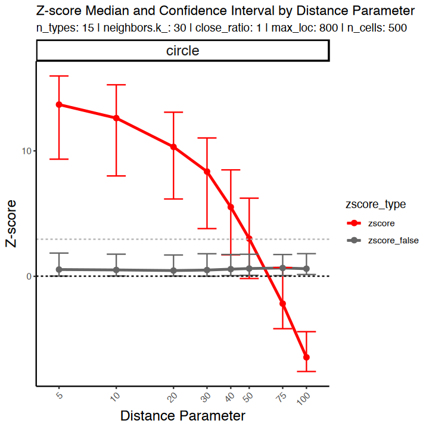
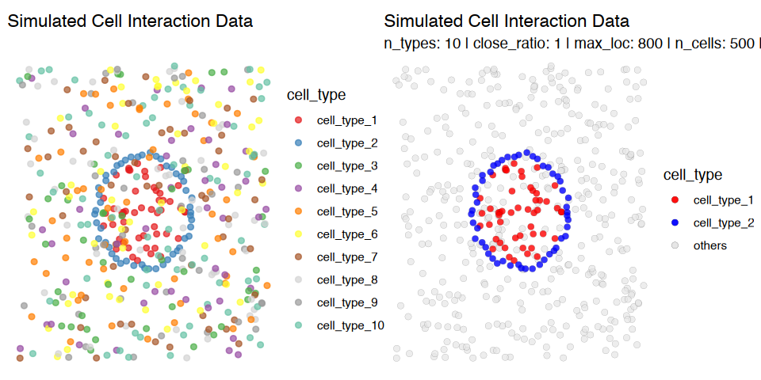
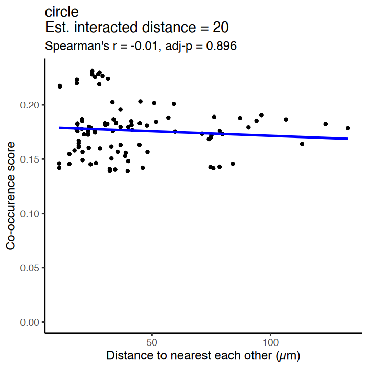

<div class="nb-source">
This article is a rendered copy of the Jupyter notebook [`vignettes/SNA_tutorial_simulation.ipynb`](https://github.com/juninamo/spatialCooccur/blob/master/vignettes/SNA_tutorial_simulation.ipynb); download it to run the code yourself.
</div>

**Author:**  
**Jun Inamo**  
_Computational Omics and Systems Immunology (COSI) Lab_  
_Division of Rheumatology and Center for Health AI_  
_University of Colorado School of Medicine, CO, USA_  
📧 jun.inamo@cuanschutz.edu

```r
format(Sys.time(), '%d %B, %Y')
```

<div class="nb-output">
'24 September, 2026'
</div>

## Spatial neighborhood analysis (SNA, cell type level analysis)

First generate dummy data where two cell types (cell_type_1 and cell_type_2 in the "cell_type" column) are close to each other: cell_type_2 forms a ring around a disk of cell_type_1 (concentric circles), for a fraction `close_ratio` of the cells.

> **Note (v0.99.2).** Earlier versions shuffled the row and column labels independently in the permutation test. That inflated same-type z-scores to about +10 and biased different-type z-scores downwards, most strongly when there were few cell types (hence the old advice to use more than 10 cell types). The permutation now uses one shuffle for both, and the z-scores are calibrated under spatial randomness for any number of cell types (3 to 25 tested).

```r
suppressPackageStartupMessages(suppressWarnings({
  if (file.exists("../DESCRIPTION")) devtools::load_all("..", quiet = TRUE) else library(spatialCooccur)
  library(patchwork)
  library(ggplot2)
  library(magrittr)
  library(dplyr)
  library(circlize)
  library(ComplexHeatmap)
  library(ggrastr)
}))
```

```r
seed=1234
close_ratio=1  # proportion of cell_type_1 and cell_type_2 that are close to each other
n_types=15  # Number of cell types
max_loc=800 # Maximum x and y coordinates in space
n_cells=500  # Number of total cells
test_type="circle" # "line", "circle", "distribute"
distance_param=20  # distance between cell_type_1 and cell_type_2

df = generate_sim(close_ratio = close_ratio, 
                  n_types = n_types,  
                  max_loc = max_loc,
                  n_cells = n_cells,  
                  test_type = test_type,
                  distance_param = distance_param,  
                  seed=seed)
head(df) 
# x and y: coordinates
# cell_type: cell type
```

<div class="nb-output">
<table class="dataframe">
<caption>A data.frame: 6 × 3</caption>
<thead>
	<tr><th></th><th scope=col>x</th><th scope=col>y</th><th scope=col>cell_type</th></tr>
	<tr><th></th><th scope=col>&lt;dbl&gt;</th><th scope=col>&lt;dbl&gt;</th><th scope=col>&lt;fct&gt;</th></tr>
</thead>
<tbody>
	<tr><th scope=row>1</th><td>355.4030</td><td>392.7360</td><td>cell_type_1</td></tr>
	<tr><th scope=row>2</th><td>490.8708</td><td>345.9954</td><td>cell_type_1</td></tr>
	<tr><th scope=row>3</th><td>451.1619</td><td>308.7717</td><td>cell_type_1</td></tr>
	<tr><th scope=row>4</th><td>501.4539</td><td>430.0083</td><td>cell_type_1</td></tr>
	<tr><th scope=row>5</th><td>280.3691</td><td>433.8681</td><td>cell_type_1</td></tr>
	<tr><th scope=row>6</th><td>389.7839</td><td>506.7382</td><td>cell_type_1</td></tr>
</tbody>
</table>
</div>

check the distribution of cell types in the space

```r
cluster_colors = manual_colors
names(cluster_colors) = paste0("cell_type_",1:n_types)

g1 = ggplot(df, aes(x = x, y = y, color = cell_type)) +
  geom_point(alpha = 0.7) +
  scale_color_manual(values = cluster_colors) +
  theme_void() +
  ggtitle("Simulated Cell Interaction Data")

g2 = ggplot(df %>% dplyr::mutate(cell_type = ifelse(cell_type %in% c("cell_type_1","cell_type_2"),as.character(cell_type),"others")), aes(x = x, y = y, fill = cell_type)) +
  geom_point(data = df %>% dplyr::mutate(cell_type = ifelse(cell_type %in% c("cell_type_1","cell_type_2"),as.character(cell_type),"others")) %>% dplyr::filter(cell_type %in% c("others")),
             alpha = 0.7, size = 2, shape = 21, stroke = 0.05, color = "black") +
  geom_point(data = df %>% dplyr::mutate(cell_type = ifelse(cell_type %in% c("cell_type_1","cell_type_2"),as.character(cell_type),"others")) %>% dplyr::filter(cell_type %in% c("cell_type_1","cell_type_2")),
             alpha = 0.8, size = 2, shape = 21, stroke = 0.05, color = "black") +
  labs(title = "Simulated Cell Interaction Data",
       subtitle = paste("n_types:", n_types, "| close_ratio:", close_ratio, "| max_loc:", max_loc, "| n_cells:", n_cells, "| distance_param:",distance_param)) +
  scale_color_manual(values = c("cell_type_1" = "red", 
                                "cell_type_2" = "blue",
                                "others" = "grey90")) +
  scale_fill_manual(values = c("cell_type_1" = "red", 
                               "cell_type_2" = "blue",
                               "others" = "grey90")) +
  theme_void()

  options(repr.plot.width=8, repr.plot.height=3)
g1|g2
```

{width="100%"}

Run neighborhood enrichment analysis

```r
n_perm = 200
neighbors.k_ = 30 # Number of neighbors to search

nhood_res <- nhood_enrichment(
  df,
  cluster_key = "cell_type",
  neighbors.k = neighbors.k_,
  connectivity_key = "nn",
  transformation = TRUE,
  n_perms = n_perm, seed = seed, n_jobs = 4
)
names(nhood_res)   # log2_oe, padj, pvalue, ...
round(nhood_res$log2_oe[1:4, 1:4], 2)
```

<div class="nb-output">
<style>
.list-inline {list-style: none; margin:0; padding: 0}
.list-inline>li {display: inline-block}
.list-inline>li:not(:last-child)::after {content: "\00b7"; padding: 0 .5ex}
</style>
<ol class=list-inline><li>'zscore'</li><li>'count'</li><li>'expected'</li><li>'log2_oe'</li><li>'log2_oe_raw'</li><li>'pvalue'</li><li>'padj'</li><li>'padj_bh'</li></ol>
</div>

<div class="nb-output">
<table class="dataframe">
<caption>A matrix: 4 × 4 of type dbl</caption>
<thead>
	<tr><th></th><th scope=col>Clustercell_type_1</th><th scope=col>Clustercell_type_2</th><th scope=col>Clustercell_type_3</th><th scope=col>Clustercell_type_4</th></tr>
</thead>
<tbody>
	<tr><th scope=row>Clustercell_type_1</th><td> 1.65</td><td> 0.96</td><td>-1.55</td><td>-0.80</td></tr>
	<tr><th scope=row>Clustercell_type_2</th><td> 1.32</td><td> 1.07</td><td>-0.82</td><td>-0.18</td></tr>
	<tr><th scope=row>Clustercell_type_3</th><td>-1.34</td><td>-0.27</td><td> 0.00</td><td> 0.34</td></tr>
	<tr><th scope=row>Clustercell_type_4</th><td>-0.51</td><td>-0.01</td><td> 0.14</td><td>-0.07</td></tr>
</tbody>
</table>
</div>

How to read the result

* `log2_oe[i, j]`: log2(observed / expected) contacts between cell types i and j, **centred on the label shuffles** so that it is 0 without interaction for any number of cells. 0 = as chance, +1 = twice, −1 = half. This is the effect size to compare between samples.
* `padj[i, j]`: within-sample significance for the unordered pair (i, j), adjusted over all K(K + 1)/2 pairs by the **max-T** permutation method (family-wise error). Its smallest value is 1 / (n_perms + 1). `pvalue` is the unadjusted value for a single pre-specified pair.
* Rows and columns: `log2_oe[i, j]` counts type-j cells among the neighbours of type-i cells; it is nearly symmetric. `padj` is symmetric (both directions are tested together).

`zscore` is still returned; it grows with the number of cells, so use it only inside one sample. `plot_nhood_heatmap(nhood_res)` draws the same heatmap in one line.

```r
L <- nhood_res$log2_oe; P <- nhood_res$padj
dimnames(L) <- dimnames(P) <- lapply(dimnames(L), function(v) gsub("^Cluster", "", v))
TITLE <- "Neighbourhood enrichment (* padj < 0.05, ** padj < 0.01)"
options(repr.plot.width = 6, repr.plot.height = 6)
sig_mat <- ifelse(P < 0.01, "**", ifelse(P < 0.05, "*", ""))
heatmap <- Heatmap(L,
                   name = "log2 O/E",
                   col = colorRamp2(c(-1, 0, 1), c("#0072B5FF", "white", "#BC3C29FF")),
                   show_row_names = TRUE, show_column_names = TRUE,
                   cluster_rows = TRUE, cluster_columns = TRUE,
                   column_title = TITLE,
                   rect_gp = gpar(col = "black", lwd = 0.3),
                   cell_fun = function(j, i, x, y, width, height, fill) {
                     if (sig_mat[i, j] != "") grid.text(sig_mat[i, j], x = x, y = y - 0.2 * height,
                                                        gp = gpar(fontsize = 15, col = "black", fontface = "bold"))
                   })
draw(heatmap, merge_legend = TRUE, heatmap_legend_side = "bottom", annotation_legend_side = "bottom")

# the same in one line
plot_nhood_heatmap(nhood_res)
```

{width="100%"}

{width="100%"}

Run the same analysis with different distance parameters

```r
set.seed(seed)
random_seeds <- sample(1000:9999, 20)
n_types_sim <- n_types

accuracy_df_all <- do.call(rbind, lapply(c(5, 10, 20, 30, 40, 50, 75, 100), function(distance_param) {
  do.call(rbind, lapply(random_seeds, function(seed_) {
    # a new tissue for every seed
    df <- generate_sim(close_ratio = close_ratio, n_types = n_types_sim, max_loc = max_loc,
                       n_cells = n_cells, test_type = "circle",
                       distance_param = distance_param, seed = seed_)
    z <- nhood_enrichment(df, cluster_key = "cell_type", neighbors.k = neighbors.k_,
                          connectivity_key = "nn", transformation = TRUE,
                          n_perms = n_perm, seed = seed_, n_jobs = 1)$zscore
    dimnames(z) <- lapply(dimnames(z), function(v) gsub("^Cluster", "", v))
    data.frame(test_type = "circle", seed = seed_, distance_param = distance_param,
               zscore = z["cell_type_1", "cell_type_2"],        # planted pair
               zscore_false = z["cell_type_3", "cell_type_4"])  # unrelated pair
  }))
}))
accuracy_df_all$n_types <- n_types_sim
accuracy_df_all$neighbors.k_ <- neighbors.k_
head(accuracy_df_all)
```

<div class="nb-output">
<table class="dataframe">
<caption>A data.frame: 6 × 7</caption>
<thead>
	<tr><th></th><th scope=col>test_type</th><th scope=col>seed</th><th scope=col>distance_param</th><th scope=col>zscore</th><th scope=col>zscore_false</th><th scope=col>n_types</th><th scope=col>neighbors.k_</th></tr>
	<tr><th></th><th scope=col>&lt;chr&gt;</th><th scope=col>&lt;int&gt;</th><th scope=col>&lt;dbl&gt;</th><th scope=col>&lt;dbl&gt;</th><th scope=col>&lt;dbl&gt;</th><th scope=col>&lt;dbl&gt;</th><th scope=col>&lt;dbl&gt;</th></tr>
</thead>
<tbody>
	<tr><th scope=row>1</th><td>circle</td><td>8451</td><td>5</td><td>14.520796</td><td>-1.76518826</td><td>15</td><td>30</td></tr>
	<tr><th scope=row>2</th><td>circle</td><td>9015</td><td>5</td><td>13.357590</td><td> 1.39006821</td><td>15</td><td>30</td></tr>
	<tr><th scope=row>3</th><td>circle</td><td>8161</td><td>5</td><td> 8.586912</td><td> 0.60730654</td><td>15</td><td>30</td></tr>
	<tr><th scope=row>4</th><td>circle</td><td>9085</td><td>5</td><td>14.766955</td><td> 1.51380353</td><td>15</td><td>30</td></tr>
	<tr><th scope=row>5</th><td>circle</td><td>8268</td><td>5</td><td>14.253751</td><td> 0.06186447</td><td>15</td><td>30</td></tr>
	<tr><th scope=row>6</th><td>circle</td><td>1622</td><td>5</td><td>15.785288</td><td>-0.42544077</td><td>15</td><td>30</td></tr>
</tbody>
</table>
</div>

```r
summary_df <- accuracy_df_all %>%
  dplyr::mutate(zscore_false = abs(zscore_false)) %>%
  tidyr::pivot_longer(cols = c(zscore, zscore_false), names_to = "zscore_type", values_to = "zscore") %>%
  dplyr::group_by(zscore_type, test_type, distance_param) %>%
  dplyr::summarise(
    median_zscore = median(zscore),
    lower_ci = quantile(zscore, 0.025),
    upper_ci = quantile(zscore, 0.975)
  ) %>%
  dplyr::ungroup()

options(repr.plot.width=6, repr.plot.height=6)
ggplot(summary_df, aes(x = distance_param, y = median_zscore, color = zscore_type)) +
  geom_line(size = 1) + 
  geom_errorbar(aes(ymin = lower_ci, ymax = upper_ci), width = 0.1) + 
  geom_point(size = 2) + 
  facet_wrap(test_type ~ .) + 
  labs(
    x = "Distance Parameter",
    y = "Z-score",
    title = "Z-score Median and Confidence Interval by Distance Parameter",
    subtitle = paste("n_types:", n_types, "| neighbors.k_:", neighbors.k_, "| close_ratio:", close_ratio, "| max_loc:", max_loc, "| n_cells:", n_cells)
  ) +
  scale_x_log10(breaks = c(unique(summary_df$distance_param))) + 
  scale_color_manual(values = c("zscore" = "red", "zscore_false" = "grey40")) +  
  geom_hline(yintercept = 0, linetype = "dashed") +  
  #geom_hline(yintercept = 1.96, linetype = "dashed", color = "grey70") +  
  geom_hline(yintercept = abs(qnorm((0.05/2/n_types),F)), linetype = "dashed", color = "grey70") + 
  theme_classic() +
  theme(
    strip.text = element_text(size = 14, face = "bold"), 
    axis.title = element_text(size = 14),
    axis.text.x = element_text(size = 9, angle = 45, hjust = 1)
  )
```

```{.output}
`summarise()` has grouped output by 'zscore_type', 'test_type'. You can
override using the `.groups` argument.
```

```{.output}
“Using `size` aesthetic for lines was deprecated in ggplot2 3.4.0.
ℹ Please use `linewidth` instead.”
```

{width="100%"}

## Spatial co-localization score (sCLA, cell-cell level analysis)

Again we generate dummy data where two cell types (cell_type_1 and cell_type_2 in "cell_type" cik) are close to each other. Here we assume that cell_type_1 and cell_type_2 are close to each other (concentric cicle) by close_ratio.

```r
seed=1234
close_ratio=1  # proportion of cell_type_1 and cell_type_2 that are close to each other
n_types=10  # Number of cell types
max_loc=800 # Maximum x and y coordinates in space
n_cells=500  # Number of total cells
test_type="circle" # "line", "circle", "distribute"
distance_param = 20  # distance between cell_type_1 and cell_type_2

df = generate_sim(close_ratio = close_ratio, 
                  n_types = n_types,  
                  max_loc = max_loc,
                  n_cells = n_cells,  
                  test_type = test_type,
                  distance_param = distance_param,  
                  seed=seed)
head(df) 
# x and y: coordinates
# cell_type: cell type
```

<div class="nb-output">
<table class="dataframe">
<caption>A data.frame: 6 × 3</caption>
<thead>
	<tr><th></th><th scope=col>x</th><th scope=col>y</th><th scope=col>cell_type</th></tr>
	<tr><th></th><th scope=col>&lt;dbl&gt;</th><th scope=col>&lt;dbl&gt;</th><th scope=col>&lt;fct&gt;</th></tr>
</thead>
<tbody>
	<tr><th scope=row>1</th><td>445.1298</td><td>397.7724</td><td>cell_type_1</td></tr>
	<tr><th scope=row>2</th><td>437.2731</td><td>301.0822</td><td>cell_type_1</td></tr>
	<tr><th scope=row>3</th><td>301.2229</td><td>365.6020</td><td>cell_type_1</td></tr>
	<tr><th scope=row>4</th><td>335.8962</td><td>315.8329</td><td>cell_type_1</td></tr>
	<tr><th scope=row>5</th><td>352.9081</td><td>515.0693</td><td>cell_type_1</td></tr>
	<tr><th scope=row>6</th><td>322.6797</td><td>325.7101</td><td>cell_type_1</td></tr>
</tbody>
</table>
</div>

check the distribution of cell types in the space

```r
cluster_colors = manual_colors
names(cluster_colors) = paste0("cell_type_",1:n_types)

g1 = ggplot(df, aes(x = x, y = y, color = cell_type)) +
  geom_point(alpha = 0.7) +
  scale_color_manual(values = cluster_colors) +
  theme_void() +
  ggtitle("Simulated Cell Interaction Data")

g2 = ggplot(df %>% dplyr::mutate(cell_type = ifelse(cell_type %in% c("cell_type_1","cell_type_2"),as.character(cell_type),"others")), aes(x = x, y = y, fill = cell_type)) +
  geom_point(data = df %>% dplyr::mutate(cell_type = ifelse(cell_type %in% c("cell_type_1","cell_type_2"),as.character(cell_type),"others")) %>% dplyr::filter(cell_type %in% c("others")),
             alpha = 0.7, size = 2, shape = 21, stroke = 0.05, color = "black") +
  geom_point(data = df %>% dplyr::mutate(cell_type = ifelse(cell_type %in% c("cell_type_1","cell_type_2"),as.character(cell_type),"others")) %>% dplyr::filter(cell_type %in% c("cell_type_1","cell_type_2")),
             alpha = 0.8, size = 2, shape = 21, stroke = 0.05, color = "black") +
  labs(title = "Simulated Cell Interaction Data",
       subtitle = paste("n_types:", n_types, "| close_ratio:", close_ratio, "| max_loc:", max_loc, "| n_cells:", n_cells, "| distance_param:",distance_param)) +
  scale_color_manual(values = c("cell_type_1" = "red", 
                                "cell_type_2" = "blue",
                                "others" = "grey90")) +
  scale_fill_manual(values = c("cell_type_1" = "red", 
                               "cell_type_2" = "blue",
                               "others" = "grey90")) +
  theme_void()

options(repr.plot.width=8, repr.plot.height=4)
g1|g2
```

{width="100%"}

Run co-localization analysis

```r
cluster_x <- "cell_type_1"
cluster_y <- "cell_type_2"

radius_ = 30 # Radius to search for neighbors (µm, cell_type_2) around anchor cells (cell_type_1)
neighbors.k_ = 30 # Number of neighbors to search

cooccur_local_df <- cooccur_local(
  df,
  cluster_x        = cluster_x,
  cluster_y        = cluster_y,
  connectivity_key = "nn",
  neighbors.k      = neighbors.k_, 
  radius           = radius_,
  maxnsteps        = 15
)
summary(cooccur_local_df)
```

```{.output}
 cooccur_local_cell_type_1_cell_type_2
 Min.   :0.001175                     
 1st Qu.:0.037670                     
 Median :0.103213                     
 Mean   :0.102000                     
 3rd Qu.:0.161757                     
 Max.   :0.231130                     
```

Check how the co-localization score is distributed in the space

```r
g3 = ggplot() +
  geom_point(df %>%
               dplyr::mutate(score = cooccur_local_df$cooccur_local_cell_type_1_cell_type_2) %>%
               dplyr::filter(!(cell_type %in% c("cell_type_1","cell_type_2"))), 
             mapping = aes(x = x, y = y, fill = score),
             alpha = 0.7, size = 2, shape = 21, stroke = 0.05, color = "black") +
  geom_point(df %>%
               dplyr::mutate(score = cooccur_local_df$cooccur_local_cell_type_1_cell_type_2) %>%
               dplyr::filter(cell_type %in% c("cell_type_1","cell_type_2")), 
             mapping = aes(x = x, y = y, fill = score),
             alpha = 0.7, size = 2, shape = 21, stroke = 0.05, color = "black") +
  theme_void() +
  scale_fill_gradient(low = "grey90", high = "red") +
  ggtitle("Simulated Cell Interaction Data")

options(repr.plot.width=12, repr.plot.height=4)
g1 | g2 | g3
```

{width="100%"}

Check the relationship between the co-localization score and the distance between cell_type_1 and cell_type_2

```r
one_cells <- df %>% dplyr::filter(cell_type=="cell_type_1")
two_cells <- df %>% dplyr::filter(cell_type=="cell_type_2")

res <- RANN::nn2(data = one_cells[,1:2], query = two_cells[,1:2], k = 1)
dist_to_nearest <- res$nn.dists[, 1]
two_cells$dist_nearest <- dist_to_nearest

res <- RANN::nn2(data = two_cells[,1:2], query = one_cells[,1:2], k = 1)
dist_to_nearest <- res$nn.dists[, 1]
one_cells$dist_nearest <- dist_to_nearest

coords_df = dplyr::left_join(df %>%
                               dplyr::mutate(score = cooccur_local_df$cooccur_local_cell_type_1_cell_type_2), 
                             rbind(one_cells,two_cells), by = c("x","y","cell_type"))
coef = cor.test(na.omit(coords_df)$score,na.omit(coords_df)$dist_nearest,method = "spearman",use = "pairwise.complete.obs")$estimate
pval = cor.test(na.omit(coords_df)$score,na.omit(coords_df)$dist_nearest,method = "spearman",use = "pairwise.complete.obs")$p.value

options(repr.plot.width=6, repr.plot.height=6)
ggplot(data = coords_df, aes(x = dist_nearest, y = score)) +
  geom_point_rast() +
  geom_smooth(
    method = "lm", se = FALSE, color = "blue"
  ) +
  theme_classic(base_size = 14) +
  labs(
    x = "Distance to nearest each other (µm)",
    y = paste("Co-occurence score"),
    title = paste0(test_type,"\nEst. interacted distance = ", distance_param), 
    subtitle = paste0(
      "Spearman's r = ", round(coef, 2),
      ", adj-p = ", signif(pval, 3)
    )
  )
```

```{.output}
Warning message in cor.test.default(na.omit(coords_df)$score, na.omit(coords_df)$dist_nearest, :
“Cannot compute exact p-value with ties”
```

```{.output}
Warning message in cor.test.default(na.omit(coords_df)$score, na.omit(coords_df)$dist_nearest, :
“Cannot compute exact p-value with ties”
```

```{.output}
`geom_smooth()` using formula = 'y ~ x'
```

```{.output}
“Removed 400 rows containing non-finite values (`stat_smooth()`).”
```

```{.output}
“Removed 400 rows containing missing values (`geom_point()`).”
```

{width="100%"}

Check the ROC curve and AUC value to evaluate the performance of the co-localization score

Check the distribution of the co-localization score by cell type

```r
coords_df %>%
  ggplot(aes(x = cell_type, y = score, fill = cell_type)) +
  geom_violin(width = 1, alpha = 0.7) +
  geom_boxplot(width = 0.1, alpha = 0.7) +
  #geom_jitter(width = 0.1, alpha = 0.7) +
  theme_minimal() +
  labs(
    x = "Cell Type",
    y = "Co-occurence score",
    title = paste0(test_type,"\nEst. interacted distance = ", distance_param)
  )
```

{width="100%"}

### Where do the two cell types meet? `cooccur_local_oe()`

`cooccur_local_oe()` counts cluster_x–cluster_y pairs within `radius` of every cell, divides them by their exact expectation under label shuffling, and smooths observed and expected pairs with Gaussian weights of width `bandwidth`. With `n_perms > 0` it also tests every cell (hotspots, BH over cells). Unlike the mean sCLS below, the section-level value does not grow with the abundance of the two cell types.

```r
rownames(df) <- paste0("cell", seq_len(nrow(df)))
lo <- cooccur_local_oe(df, "cell_type_1", "cell_type_2", radius = 30, n_perms = 199, seed = 1)
attr(lo, "section_log2_oe")
d_lo <- cbind(df, lo)
options(repr.plot.width = 12, repr.plot.height = 5)
(ggplot(d_lo, aes(x, y, color = pmin(pmax(local_log2_oe, 0), 3))) + geom_point(size = 0.8) +
   scale_color_gradient(low = "grey90", high = "#B2182B", name = "local log2 O/E") + coord_equal() + theme_void() + ggtitle("Local log2 O/E")) |
(ggplot(d_lo, aes(x, y)) + geom_point(color = "grey85", size = 0.6) + geom_point(data = subset(d_lo, padj < 0.05), color = "#B2182B", size = 0.9) +
   coord_equal() + theme_void() + ggtitle("Hotspots (FDR < 0.05)"))
```

<div class="nb-output">
1.99828623708995
</div>

{width="100%"}

```r
sessionInfo()
```

```{.output}
R version 4.3.2 (2023-10-31)
Platform: aarch64-apple-darwin20 (64-bit)
Running under: macOS 26.3.1

Matrix products: default
BLAS:   /Library/Frameworks/R.framework/Versions/4.3-arm64/Resources/lib/libRblas.0.dylib 
LAPACK: /Library/Frameworks/R.framework/Versions/4.3-arm64/Resources/lib/libRlapack.dylib;  LAPACK version 3.11.0

locale:
[1] en_US.UTF-8/en_US.UTF-8/en_US.UTF-8/C/en_US.UTF-8/en_US.UTF-8

time zone: Asia/Tokyo
tzcode source: internal

attached base packages:
[1] grid      stats     graphics  grDevices utils     datasets  methods  
[8] base     

other attached packages:
[1] ggrastr_1.0.2         ComplexHeatmap_2.18.0 circlize_0.4.15      
[4] dplyr_1.1.4           magrittr_2.0.3        ggplot2_3.4.4        
[7] patchwork_1.1.3       spatialCooccur_0.99.3 testthat_3.2.1       

loaded via a namespace (and not attached):
  [1] RcppAnnoy_0.0.21       splines_4.3.2          later_1.3.2           
  [4] pbdZMQ_0.3-10          tibble_3.2.1           polyclip_1.10-6       
  [7] fastDummies_1.7.3      lifecycle_1.0.4        doParallel_1.0.17     
 [10] rprojroot_2.0.4        globals_0.16.2         lattice_0.21-9        
 [13] MASS_7.3-60            plotly_4.10.3          remotes_2.4.2.1       
 [16] httpuv_1.6.13          Seurat_5.2.1           sctransform_0.4.1     
 [19] spam_2.10-0            sp_2.1-2               sessioninfo_1.2.2     
 [22] pkgbuild_1.4.3         spatstat.sparse_3.1-0  reticulate_1.35.0     
 [25] cowplot_1.1.2          pbapply_1.7-2          RColorBrewer_1.1-3    
 [28] abind_1.4-5            pkgload_1.3.3          Rtsne_0.17            
 [31] purrr_1.0.2            BiocGenerics_0.48.1    IRanges_2.36.0        
 [34] S4Vectors_0.40.2       ggrepel_0.9.4          irlba_2.3.5.1         
 [37] listenv_0.9.0          spatstat.utils_3.1-2   moments_0.14.1        
 [40] goftest_1.2-3          RSpectra_0.16-1        spatstat.random_3.3-2 
 [43] fitdistrplus_1.1-11    parallelly_1.36.0      codetools_0.2-19      
 [46] tidyselect_1.2.0       shape_1.4.6            farver_2.1.1          
 [49] matrixStats_1.2.0      stats4_4.3.2           base64enc_0.1-3       
 [52] spatstat.explore_3.3-4 jsonlite_2.0.0         GetoptLong_1.0.5      
 [55] ellipsis_0.3.2         progressr_0.14.0       ggridges_0.5.5        
 [58] survival_3.5-7         iterators_1.0.14       foreach_1.5.2         
 [61] tools_4.3.2            ica_1.0-3              Rcpp_1.0.11           
 [64] glue_1.6.2             gridExtra_2.3          mgcv_1.9-0            
 [67] usethis_2.2.2          IRdisplay_1.1          withr_2.5.2           
 [70] fastmap_1.1.1          digest_0.6.33          R6_2.5.1              
 [73] mime_0.12              colorspace_2.1-0       scattermore_1.2       
 [76] Cairo_1.6-2            tensor_1.5             spatstat.data_3.1-4   
 [79] tidyr_1.3.0            generics_0.1.3         data.table_1.16.0     
 [82] httr_1.4.7             htmlwidgets_1.6.4      uwot_0.1.16           
 [85] pkgconfig_2.0.3        gtable_0.3.4           lmtest_0.9-40         
 [88] brio_1.1.4             htmltools_0.5.7        profvis_0.3.8         
 [91] dotCall64_1.1-1        clue_0.3-65            SeuratObject_5.0.2    
 [94] scales_1.3.0           png_0.1-8              spatstat.univar_3.1-2 
 [97] rstudioapi_0.15.0      reshape2_1.4.4         rjson_0.2.23          
[100] uuid_1.1-1             nlme_3.1-163           repr_1.1.6            
[103] cachem_1.0.8           zoo_1.8-12             GlobalOptions_0.1.2   
[106] stringr_1.5.1          KernSmooth_2.23-22     parallel_4.3.2        
[109] miniUI_0.1.1.1         vipor_0.4.7            desc_1.4.3            
[112] pillar_1.11.0          vctrs_0.6.5            RANN_2.6.1            
[115] urlchecker_1.0.1       promises_1.2.1         xtable_1.8-4          
[118] cluster_2.1.4          beeswarm_0.4.0         evaluate_0.23         
[121] magick_2.8.2           cli_3.6.2              compiler_4.3.2        
[124] rlang_1.1.2            crayon_1.5.2           future.apply_1.11.1   
[127] labeling_0.4.3         plyr_1.8.9             fs_1.6.3              
[130] ggbeeswarm_0.7.2       stringi_1.8.3          viridisLite_0.4.2     
[133] deldir_2.0-2           munsell_0.5.0          lazyeval_0.2.2        
[136] devtools_2.4.5         spatstat.geom_3.3-5    Matrix_1.6-5          
[139] IRkernel_1.3.2         RcppHNSW_0.5.0         future_1.33.1         
[142] shiny_1.8.0            ROCR_1.0-11            igraph_1.6.0          
[145] memoise_2.0.1         
```
